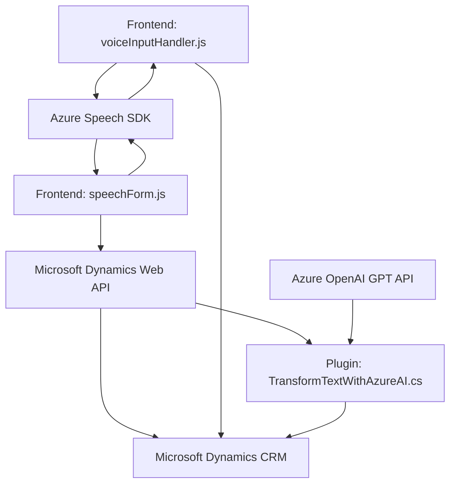

### Breve resumen técnico
El repositorio presenta componentes que interactúan tanto en el frontend como en el backend con **Microsoft Dynamics CRM** potenciado por el **Azure Speech SDK** y **Azure OpenAI GPT-4**. Se generan soluciones relacionadas con reconocimiento de voz, síntesis de entrada, transformación de texto y manipulación dinámica de formularios en el CRM. Está basado en una arquitectura modular con una fuerte dependencia de servicios externos.

---

### Descripción de arquitectura
#### Tipo de solución:
- Principalmente es una **integration architecture** entre un CRM (Microsoft Dynamics) e Inteligencias Artificiales como **Azure OpenAI GPT** y **Azure Speech SDK**.
- Contiene partes tanto frontales como backend que interactúan entre sí, apoyadas en patrones de programación modular.
  
El **frontend** utiliza una arquitectura basada en JavaScript para manipular formularios y ofrecer funcionalidades como reconocimiento de voz y síntesis de texto hablado.

El **backend** implementa una arquitectura de **plugins** basada en estándares del **Dynamics CRM SDK**. Estos plugins se comunican con servicios de terceros (Azure APIs) y procesan mediante peticiones asíncronas.

#### Arquitectura general:
- **Frontend:** Modular, basada en eventos, centrada en la interacción del cliente.
- **Backend:** Plugin architecture (para Dynamics CRM).
- **Patrones de integración:** Se utilizan integraciones externas para consumo de servicios remotos (SDKs y APIs) que habilitan capacidades avanzadas como procesamiento natural del lenguaje (NLP) y reconocimiento de voz.

#### Tecnologías y frameworks:
1. **Frontend:**
   - Lenguaje: JavaScript.
   - SDK: **Azure Speech SDK**.
   - Utilización de Dynamics CRM Form APIs mediante `formContext`.
   - Promesas y programación asíncrona para manejar solicitudes HTTP.
2. **Backend:**
   - Lenguaje: C#.
   - Framework: **Microsoft Dynamics CRM SDK**.
   - Servicio externo: **Azure OpenAI GPT-4**.
   - JSON manipulación: **Newtonsoft.Json** para procesar y estructurar la respuesta.
3. **General:**
   - Dependencias comúnmente cargadas dinámicamente en frontend y backend.
  
#### Dependencias externas:
1. **Azure Speech SDK:** Reconocimiento de voz y síntesis de texto en el frontend.
2. **Azure OpenAI API:** Procesamiento de texto mediante GPT-4 en el backend.
3. **Microsoft Dynamics Web API:** Interacción directa con formularios y datos del sistema CRM.
4. **Other external libraries:**  
   - `Newtonsoft.Json` (para manejar datos JSON).
   - `HttpClient` (para solicitudes en el backend).

---

### Diagrama **Mermaid** válido para GitHub

---

### Conclusión final:
1. **Solución tipo:** Se trata de una integración de componentes frontend y backend diseñados para interactuar con un sistema CRM (Dynamics) extendiendo sus capacidades mediante SDKs y APIs poderosos, como Azure Speech y OpenAI GPT.
2. **Arquitectura:** Modular (principalmente en el frontend) y basada en plugins (en el backend) para las extensiones en Dynamics CRM.
3. **Ventajas clave:** Optimización mediante inteligencia artificial en tareas de procesamiento de texto y comandos, reconocimiento/síntesis de voz, y transformación dinámica de formularios.
4. **Escalabilidad:** La arquitectura actual es escalable, pero el uso de SDKs cargados dinámicamente y dependencias no desacopladas podría limitar la reutilización en otros entornos.

