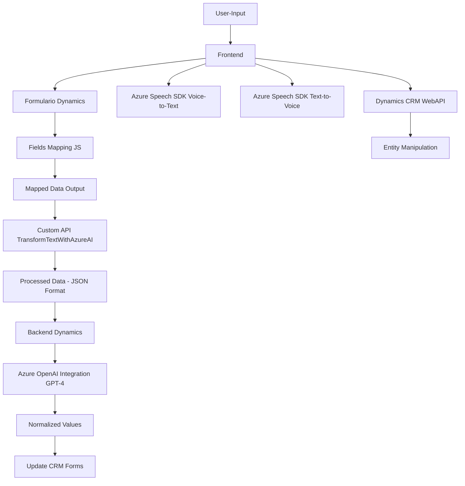

# Breve resumen técnico:
El repositorio analizado contiene archivos que forman parte de un sistema integrado diseñado para trabajar con **Dynamics CRM / 365**. El enfoque principal del sistema es la manipulación de datos en formularios del CRM, integrando servicios avanzados de inteligencia artificial y reconocimiento de voz con la plataforma de Microsoft, utilizando **Azure Speech SDK** y **Azure OpenAI GPT-4**.

---

# Descripción de arquitectura:
La solución combina capacidades **frontend** y **backend** en líneas específicas:
1. **Frontend:** Se encarga de la interacción con formularios del usuario, específicamente la lectura y síntesis de texto a voz, y la transcripción de voz a texto.
   - El frontend usa un modelo modular basado en funciones para realizar la gestión y procesamiento en la interfaz.
   - Integra servicios externos en tiempo de ejecución (SDK de Azure Speech y API personalizada).
2. **Backend:** Contiene un **plugin** para Dynamics CRM que se integra con **Azure OpenAI (GPT-4)** para realizar transformaciones de texto bajo normas particulares. Este plugin sigue un enfoque clásico de integración de servicios en la nube/CMS.
3. **Arquitectura de capas:** En general, la solución está diseñada como una arquitectura de **n capas**, aunque con características de integración externa y extensibilidad de microservicios (uso de Azure APIs) en algunos componentes.

---

# Tecnologías usadas:
1. **Frontend:** 
   - **JavaScript:** Base para las funciones y la lógica de manipulación del DOM/formulario.
   - **Azure Speech SDK:** Para reconocimiento de voz y síntesis de texto a voz.
   - **Dynamics CRM WebAPI:** Para interactuar con datos y formularios en el CRM (XRM).
2. **Backend:**
   - **C#**: Implementación de los plugins en Dynamics CRM.
   - **Microsoft.Xrm.Sdk:** Para trabajar con el ecosistema CRM.
   - **Azure OpenAI GPT-4:** Procesamiento avanzado de textos con inteligencia artificial.
   - **System.Net.Http:** Comunicación con APIs externas.
   - **System.Text.Json y Newtonsoft.Json.Linq:** Procesamiento JSON.
3. **Frameworks/patrones:**
   - **Facades:** Abstracción de SDK y WebAPI para simplificar integraciones.
   - **Delegate/Callback Pattern:** Presentado en el manejo asíncrono del Azure Speech SDK.
   - **Plugin Pattern:** Implementación en el backend con la integración CRM.
   - **Data Mapping:** En el frontend y plugins para mapeo entre datos del formulario y estructuras procesadas.

---

# Diagrama Mermaid:

---

# Conclusión final:
1. **Tipo de solución:** La implementación está diseñada para integrar una capa frontend que gestiona formularios del CRM utilizando **Azure Speech SDK** para reconocimiento/síntesis de voz y funcionalidades adicionales proporcionadas por una API personalizada y un plugin de **Dynamics CRM**. Por lo tanto, es una combinación de una aplicación **frontend con funciones avanzadas y backend en forma de plugin**.

2. **Modelo arquitectónico:** Aunque la solución parece ser un monolito en su integración, se detectan características de **n capas (frontend-backend)** y uso extensivo de **microservicios externos** (Azure APIs).

3. **Consideraciones de seguridad:** Se debe garantizar el manejo seguro de las claves API de Azure, evitar incrustarlas directamente en el código fuente, y utilizar mecanismos como variables de entorno o servicios de gestión de secretos.

Este diseño muestra un enfoque moderno hacia la combinación de sistemas CRM tradicionales con capacidades de IA y reconocimiento de voz, destacando la extensibilidad y modularidad del sistema.

