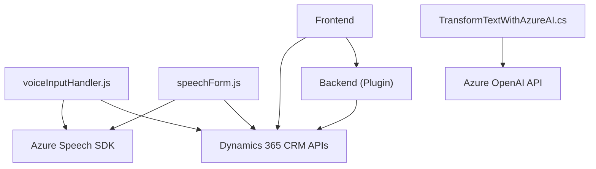

### Breve resumen técnico
El repositorio representa una solución orientada a formularios en Dynamics CRM que utiliza funcionalidades avanzadas de reconocimiento y síntesis de voz junto con IA (Mediante Azure Speech SDK y Azure OpenAI). La arquitectura se basa en la integración de servicios externos y se estructura en archivos que manejan de manera modular toda la lógica del frontend y los plugins del backend.

---

### Descripción de arquitectura
La solución tiene una estructura **modular y orientada a servicios**, donde cada archivo cumple un propósito específico y se comunica directa o indirectamente con APIs externas. La arquitectura general podría clasificarse como **n capas**, con una separación entre:
1. **Frontend**: JavaScript para capturar voz, sintetizarla, convertirla en datos y procesarla en formularios.
2. **Backend**: Plugins en C# que interactúan con Dynamics CRM mediante llamadas a APIs y servicios de Azure.

### Tecnologías usadas
1. **Frontend**:
   - **JavaScript**: Lógica de procesamiento de voz y manipulación de formularios.
   - **Azure Speech SDK**: Para reconocimiento y síntesis de voz.
   - **APIs de Dynamics CRM**: Para interacción con formularios dinámicos y datos relacionados.
   - **Event-driven programming**: Uso de callbacks y promesas.
   - **Data Mapper**: Transformación y mapeo de transcripciones en datos de formulario.

2. **Backend (Plugins)**:
   - **C#**: Desarrollo de la lógica del plugin.
   - **Microsoft.Xrm.Sdk**: Para integración con Dynamics CRM.
   - **Azure OpenAI API**: Transformación avanzada de texto.
   - **Newtonsoft.Json** / **System.Text.Json**: Manejo de objetos JSON.

### Dependencias y componentes externos
1. **Azure Speech SDK**: Reconocimiento de voz y síntesis Text-to-Speech.
2. **Azure OpenAI API**: Transformación semántica de texto.
3. **Dynamics 365 CRM APIs**: Gestión y actualización de datos de formularios.
4. **HTTP Client Libraries (e.g., System.Net.Http)**: Para interacción con servicios externos.
5. **JSON Parsers**: Para serializar/deserializar datos JSON.

---

### Diagrama Mermaid válido para GitHub

---

### Conclusión final
Este repositorio implementa una solución integrada para la interacción dinámica con formularios en Dynamics CRM, utilizando tecnologías avanzadas de voz (Azure Speech SDK) y procesamiento de texto (Azure OpenAI). La arquitectura en capas permite una división clara entre frontend (captura/síntesis de datos) y backend (transformación avanzada y almacenamiento). Gracias a su modularidad y uso de APIs externas, sigue principios de **event-driven programming** y es capaz de escalar, integrar microservicios y extender funcionalidades según sea necesario, siendo ideal para aplicaciones empresariales.