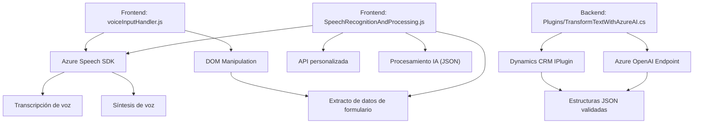

### Breve resumen técnico:
El repositorio dado implementa un sistema para interactuar con formularios mediante entrada de voz y procesamiento de audio. También utiliza servicios externos como Azure Speech SDK y Azure OpenAI para sintetizar y transcribir voz, así como para transformar texto en formatos estructurados compatibles con APIs y formularios en Dynamics 365. Está integrado como plugins y scripts para ampliar funcionalidades en un entorno CRM.

---

### Descripción de la arquitectura:
La arquitectura es principalmente modular con separación de responsabilidades, integrada en una **n capas** dentro del entorno de Dynamics CRM. El frontend maneja la interfaz con el usuario, procesando entradas y síntesis de voz, mientras que los plugins en el backend procesan transformaciones avanzadas mediante inteligencia artificial. Los servicios de Azure agregan capacidades de voz y procesamiento remoto de texto.

#### Características arquitectónicas:
1. **Multicapa**:
   - **Frontend**: Scripts JavaScript interactúan con la interfaz del usuario y asocian dinámicamente SDKs para transcripción de voz o síntesis.
   - **Backend**: Plugins .NET extienden la funcionalidad del CRM para manejar datos JSON y procesar texto mediante Azure OpenAI.
   
2. **Integración de servicios externos**: Azure Speech SDK y Azure OpenAI son usados para capacidades avanzadas como síntesis de voz y procesamiento de texto.

3. **Dinamismo y modularidad**: Dinámica en la carga y ejecución del SDK mediante JavaScript, y modulación del comportamiento según lo requiera el contexto del formulario.

---

### Tecnologías usadas:
1. **Frontend (JavaScript)**:
   - Azure Speech SDK: Para transcripción y síntesis de voz.
   - APIs de Dynamics CRM: Para manipulación dinámica de formularios.
   - DOM y APIs del navegador: En scripts para formularios y entrada de voz.

2. **Backend (.NET)**:
   - Microsoft Dynamics CRM SDK: Para configuración de plugins y manejo de contexto de ejecución.
   - Azure OpenAI: Para transformar texto en estructuras JSON.
   - Newtonsoft.Json: Para parseo y creación de estructuras JSON.

3. **Servicios externos**:
   - Azure Speech SDK (https://aka.ms/csspeech/jsbrowserpackageraw): Servicio dinámico de transcripciones y síntesis.
   - Azure OpenAI: Modelos GPT para transformación avanzada de textos.

---

### Diagrama Mermaid válido para GitHub:

---

### Conclusión final:
Este sistema está diseñado para mejorar la experiencia en entornos CRM aprovechando capacidades avanzadas de voz y procesamiento de texto. La arquitectura modular distribuida, que utiliza servicios externos como Azure Speech SDK y OpenAI, permite integrar interacción por voz y análisis automatizado en formularios dinámicos.

#### Principales características y puntos de mejora:
1. **Integración eficiente**: Usa servicios de Azure de forma dinámica para resolver problemas de entrada de datos y validación.
2. **Flexibilidad**: Admite tanto usuarios que interactúan por voz como aquellos que utilizan formularios tradicionales.
3. **Modularidad**: Cada pieza tiene responsabilidades claras, aunque podría mejorarse con una estructura de módulos para mejorar la reutilización.
4. **Desafíos**: La carga dinámica del SDK y las operaciones asíncronas pueden generar latencias en tiempo real.
   
En general, es una solución bien integrada para entornos CRM con capacidades modernas basadas en inteligencia artificial y procesamiento de voz.