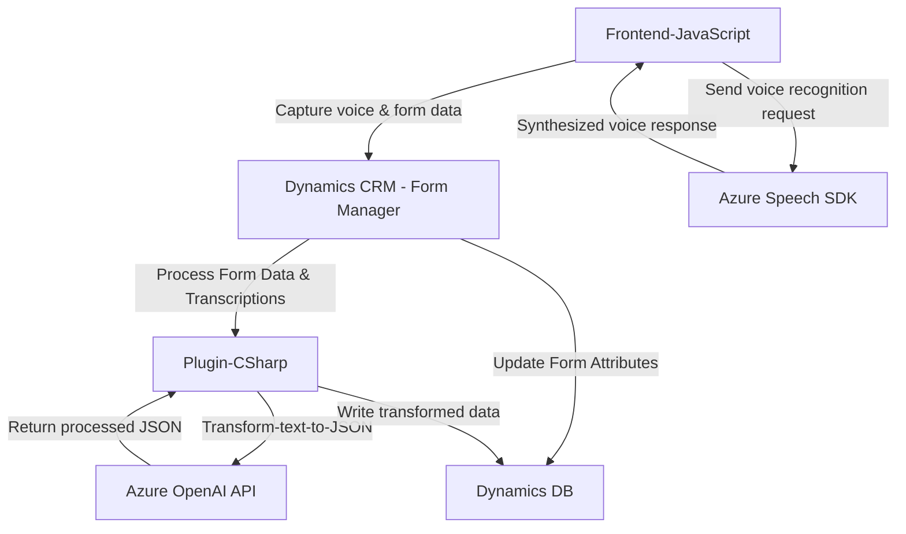

### Breve Resumen Técnico

Este repositorio contiene una solución basada en Microsoft Dynamics CRM y Azure, que combina entrada y síntesis de voz, un controlador de formularios para la transcripción de voz a texto y un plugin para transformar texto en JSON estructurado usando Azure OpenAI. La arquitectura se centra en integración de servicios externos y la manipulación de datos en Dynamics CRM.

---

### Descripción de la arquitectura

#### Tipo de Solución
Principalmente es una solución híbrida que combina un **Frontend** (JavaScript para la interacción con el usuario) e integración con Dynamics CRM para crear y gestionar datos, junto con un **backend basado en plugin** desarrollado en C# para procesar datos mediante Azure OpenAI. Además, utiliza servicios de **Azure Speech SDK** y **Azure OpenAI** para proporcionar funcionalidades avanzadas de reconocimiento y síntesis de voz, además de generación de textos estructurados.

#### Arquitectura
La solución sigue los principios de una **arquitectura orientada a servicios (SOA)**, donde la aplicación se divide en funcionalidades específicas que interactúan mediante servicios web y SDK. La parte del plugin utiliza el patrón **n capas**, típico de las implementaciones en Dynamics CRM. Las capas son:

- **Presentación**: Interfaz frontend basada en JavaScript para capturar datos de formularios y manejar voz.
- **Negocios (Lógica)**: Plugins en C# para procesamiento, validación y transformación de datos.
- **Integración de Servicios Externos**: Azure Speech SDK para reconocimiento y síntesis de voz, y Azure OpenAI para transformación de datos.

El diseño proporciona un flujo cohesivo entre la interfaz de usuario en Dynamics CRM y los servicios basados en Azure para funciones inteligentes como reconocimiento de voz e interprete de datos. También usa estándares como el **Plugin Pattern** de Dynamics y API REST para dinamismo e interacción externa.

---

### Tecnologías Usadas

#### Frontend:
1. **JavaScript**: Para la captura y manejo de formularios.
2. **Azure Speech SDK**: Reconocimiento de voz y síntesis de texto.

#### Backend:
1. **C# y .NET Framework**: Desarrollo de plugins de Dynamics CRM.
2. **Microsoft Dynamics SDK**: Interacción con el CRM para manipulación de datos.
3. **Azure OpenAI API**: Transformación de texto en JSON con estándares predefinidos.

#### Otros:
1. **CDN para SDKs externos**: Carga dinámica de herramientas como Azure Speech SDK.
2. **HTTP API**: Llamadas a endpoints externos (Azure).
3. Protocolos REST para servicios.
4. JSON para transferencia estructurada de datos.

---

### Dependencias Externas
1. **Azure Speech SDK** (Speech recognition y synthesis).
2. **Azure OpenAI API** (Generación de texto JSON estructurado).
3. **Microsoft Dynamics CRM SDK**.
4. **CDN para Speech SDK y otros recursos remotos**.
5. **.NET Framework** para ejecutar los plugins del CRM.
6. **Xrm.WebApi**: Proporciona servicios out-of-the-box para acceder dinámicamente a los datos y ejecutar APIs personalizadas.

---

### Diagrama Mermaid

Un diagrama simplificado de la solución es el siguiente:

---

### Conclusión Final
Esta solución se presenta como un complemento avanzado para automatización de formularios y procesamiento de voz/textos en sistemas Microsoft Dynamics CRM. La arquitectura destaca por su modularidad, integración con servicios avanzados de Microsoft Azure, y por emplear patrones de diseño adecuados como el Plugin Pattern, SOA e integración mediante SDKs y APIs externas. Sin embargo, una consideración de seguridad es la gestión cuidadosa de las claves de acceso a servicios de Azure, evitando que queden expuestas en el cliente mediante JavaScript y optando por mecanismos más seguros como env variables en plugins.