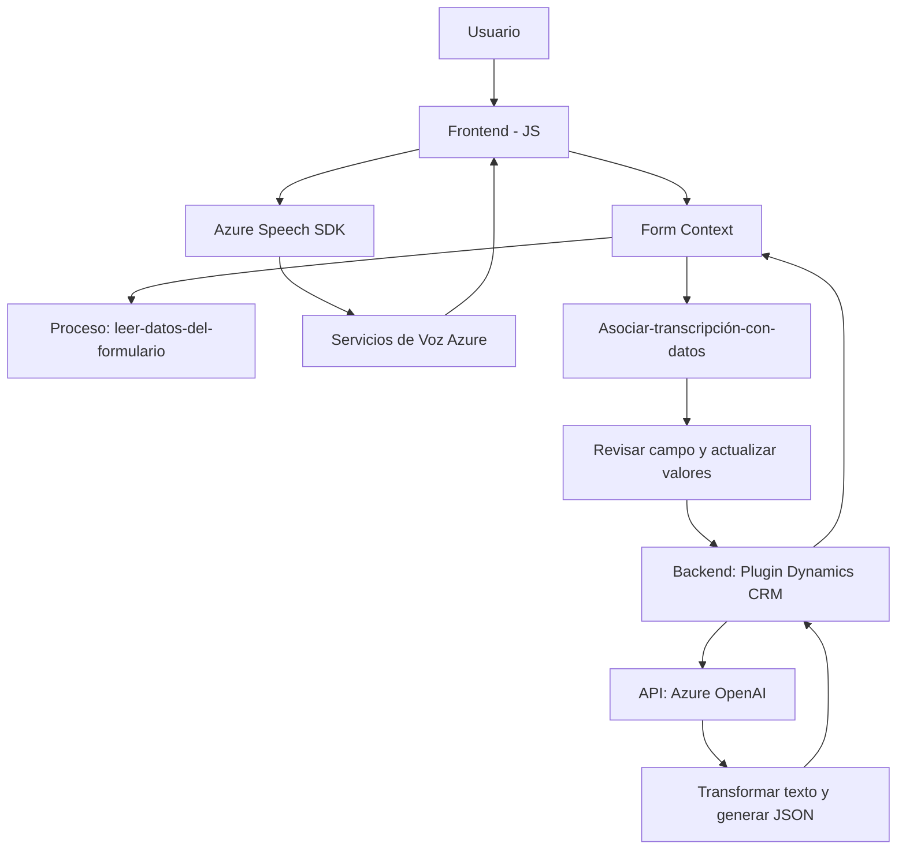

### Breve resumen técnico
El repositorio contiene tres principales archivos o módulos que integran tecnologías externas (especialmente servicios de Microsoft Azure) para la conversión y manipulación de datos mediante voz y texto en un escenario que parece basado en Microsoft Dynamics CRM. La solución combina un frontend (`SpeechIntegration.js`, `SpeechRecognitionHandler.js`) y un plugin de backend (`TransformTextWithAzureAI.cs`) para procesar datos de manera inteligente usando APIs de Azure.

---

### Descripción de arquitectura
La solución utiliza una **arquitectura n-capas** con separación clara de frontend y backend. El frontend interactúa con el usuario, procesando datos de formularios y utilizando API (Azure Speech y OpenAI) para generar síntesis y reconocimiento de voz. El backend, mediante un plugin en Dynamics CRM, implementa un patrón de **Service-Oriented Architecture (SOA)** para invocar la API de Azure OpenAI y realizar transformaciones automatizadas en los datos.

Este esquema favorece la modularidad al separar responsabilidades, donde cada capa tiene lógica específica:
1. La capa de presentación: incluye interfaces de usuario y eventos basados en JavaScript.
2. Capa de integración: conecta Azure Speech SDK y OpenAI API para el procesamiento de voz y texto.
3. Capa de negocios en el backend: utiliza el plugin `TransformTextWithAzureAI.cs` para extender capacidades de Dynamics CRM con lógica personalizada.

---

### Tecnologías usadas
1. **Frontend**:
   - **Javascript** con funciones separadas para modularizar tareas (lectura/escritura en formularios, integración de SDK).
   - **Azure Speech SDK**: Usado para síntesis y reconocimiento de voz.
2. **Backend**:
   - **C#**, utilizando el patrón Plugin de Dynamics CRM y librerías como `Microsoft.Xrm.Sdk` y `Newtonsoft.Json`.
   - **Azure OpenAI API**: Permite la transformación de textos mediante modelos de IA de procesamiento de lenguaje natural.
3. **Dependencias externas**:
   - Servicios de Azure: Azure Speech SDK y OpenAI.
   - Clases de soporte para interacciones HTTP (`HttpClient`) y manipulación de datos JSON.

---

### Diagrama Mermaid compatible con GitHub Markdown

---

### Conclusión final
Esta solución sobresale por su integración de servicios en la nube (Azure) con un ecosistema local basado en Microsoft Dynamics CRM. Utiliza un enfoque modular que permite que el frontend procese datos y voz de manera interactiva, mientras que el backend se ocupa de transformar datos textuales con IA para su uso en sistemas empresariales. Idealmente usada en escenarios de gestión dinámica de formularios, esta arquitectura destaca por su capacidad de automatización y adaptabilidad a diferentes dominios comerciales. Sin embargo, se percibe una alta dependencia de servicios externos y varias configuraciones en la nube, lo que puede significar sobrecostos o riesgos ligados al ecosistema Azure.