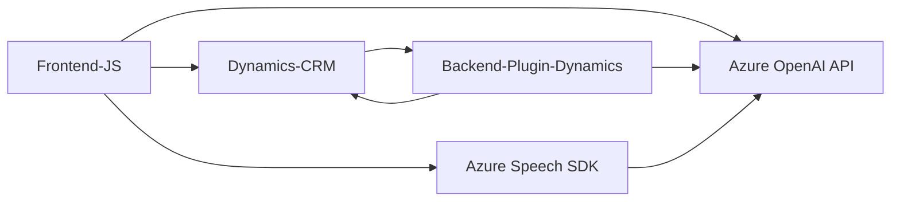

## Breve resumen técnico
El repositorio tiene una combinación de archivos que implementan funcionalidades centradas en la interacción con un sistema CRM (presumiblemente Dynamics 365) y servicios en la nube de Microsoft Azure. Las principales características incluyen el control de formularios (entrada y salida de datos) y el uso de tecnologías avanzadas para síntesis y reconocimiento de voz, además de la integración con un modelo de IA alojado en Azure OpenAI.

## Descripción de arquitectura
La solución utiliza una arquitectura **modular** que organiza el código en diferentes roles, combinada con una **arquitectura orientada a servicios**. Aunque no implementa una arquitectura estrictamente hexagonal o n capas, las responsabilidades están bien separadas:
- El **frontend** gestiona la entrada y salida de voz para interactuar directamente con el usuario.
- La **interfaz API** de Dynamics y los plugins amplían las funcionalidades del CRM.
- El **uso de servicios externos** como Azure Speech SDK y Azure OpenAI implica una integración con **microservicios en la nube**, aunque en el contexto de un sistema CRM personalizado dentro de Dynamics.

## Tecnologías usadas
1. **Frontend (JavaScript):**
   - **Azure Speech SDK:** Sintetizador de voz y reconocimiento de voz.
   - **Dynamics CRM JavaScript API:** (`Xrm.Page.data.entity`) para interactuar con formularios del CRM.
   - **JSON:** Almacenamiento y procesamiento de datos estructurados.
   - **Callback/Event-Driven Pattern:** Gestión de eventos en la interacción de SDK o interfaz del usuario.
   - **Dynamic Dependency Loading:** Carga de Azure Speech SDK en tiempo de ejecución.

2. **Backend Plugin (.NET):**
   - **Microsoft.Xrm.Sdk:** Interacción con Dynamics CRM.
   - **Azure OpenAI API:** Procesamiento avanzado de texto mediante GPT-4.
   - **Newtonsoft.Json:** Para manipulación avanzada de JSON.
   - **System.Net.Http:** Para invocar el servicio web de OpenAI.
   - **Plugin-based architecture (IPlugin):** Gestión del ciclo de ejecución del plugin.

## Dependencias o componentes externos
1. **Azure Speech SDK:** Voz sintetizada y reconocimiento de voz.
2. **Azure OpenAI API (GPT-4):** Transformación de texto a través de normas predefinidas.
3. **Dynamics 365 CRM APIs (Xrm.WebApi):** Manejo de formularios y datos relacionados.
4. **Newtonsoft.Json:** Manejo de objetos JSON.
5. **Authentication services:** Clave del SDK y API almacenadas en un sistema de gestión de secretos.

## Diagrama Mermaid compatible con GitHub Markdown

## Conclusión final
La solución integra un conjunto de tecnologías orientadas a mejorar la interacción con los formularios de un sistema CRM mediante entrada/salida en voz y un procesamiento avanzado basado en IA. Su arquitectura combina características de sistemas **orientados a servicios** con la modularidad propia de aplicaciones distribuidas. El uso de tecnologías externas como **Azure Speech SDK** y **Azure OpenAI API** potencia la funcionalidad del sistema, brindando una experiencia avanzada en términos de accesibilidad y procesamiento de datos dinámicos. En general, este repositorio muestra un diseño técnico robusto, adecuado para escenarios de automatización y sistemas empresariales integrados.