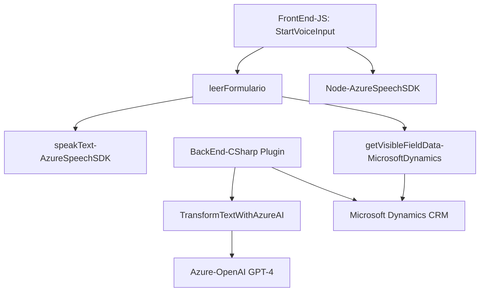

### Breve resumen técnico:
El repositorio contiene varios archivos que integran tecnologías de transcripción de voz, procesamiento de datos de formularios y transformación de texto con inteligencia artificial a través de servicios de Microsoft Dynamics y Azure Cloud. La solución combina un frontend en JavaScript, un módulo de procesamiento de voz y un plugin en .NET para extender funcionalidades dentro de Dynamics CRM.

---

### Descripción de arquitectura:
La arquitectura de este sistema es **modular, basada en arquitectura de servicios** y se encuentra distribuida en capas:
1. **Frontend**: Implementa lógica en JavaScript para procesar los datos de formularios mediante Azure Speech SDK. Se enfoca en manipular y sintetizar datos del cliente para luego enviarlos al backend.
2. **Backend en .NET**: Un plugin que actúa como intermediario entre Dynamics CRM y Azure OpenAI, procesando texto recibido y transformándolo en respuestas estructuradas en formato JSON.
3. **Integración con servicios externos**: La arquitectura hace uso extensivo de servicios de plataforma (Microsoft Dynamics y Azure para IA y SDK de voz) siguiendo un modelo de integración cliente-servidor.

La solución muestra rasgos de arquitectura **de n capas**:
- **Capa de presentación** (JavaScript frontend): interfaz y procesamiento del cliente (formularios y speech processing).
- **Capa de lógica**: procesamiento del texto y voz, y reglas empresariales (plugin en .NET).
- **Capa de datos**: interacción con Dynamics CRM y servicios en la nube como Azure OpenAI.

---

### Tecnologías utilizadas:
1. **Frontend**:
   - **JavaScript**: Lenguaje principal para la manipulación del DOM y procesamiento de datos en formularios.
   - **Azure Speech SDK**: Integrado dinámicamente para sintetizar texto y manejar comandos de voz.
   - **Microsoft Dynamics API**: Utilizada para gestionar el formulario y sus datos visibles.

2. **Backend**:
   - **C# y .NET Framework**: Código compilado para utilizarse como plugin incrustado en Microsoft Dynamics.
   - **Azure OpenAI GPT-4**: Utilizado para transformación de lenguaje natural y procesamiento complejo de texto.
   - **System.Text.Json** y **Newtonsoft.Json.Linq**: Serialización y deserialización de datos en formato JSON.
   - **HTTP client libraries (System.Net.Http)**: Comunicación API entre el plugin y el servicio OpenAI en Azure.

3. **Servicios y dependencias externas**:
   - Microsoft Dynamics CRM y Context API: Gestión y manipulación de formularios empresariales.
   - Azure Speech SDK: Servicio para la síntesis de voz.
   - Azure OpenAI: Generación de texto según modelos preentrenados de OpenAI.

---

### Diagrama Mermaid válido para GitHub:

---

### Conclusión final:
La solución está diseñada para proporcionar una experiencia interactiva de voz y procesamiento de datos para formularios en Microsoft Dynamics CRM. La arquitectura distribuida se encuentra segmentada en capas bien definidas, y hace uso de servicios avanzados ofrecidos por Microsoft Azure y Dynamics para garantizar modularidad, escalabilidad e integración con inteligencia artificial. La implementación se alinea con patrones de diseño modernos, como la carga dinámica de dependencias y modularización funcional, asegurando una estructura optimizada que permite extensibilidad y mantenimiento.