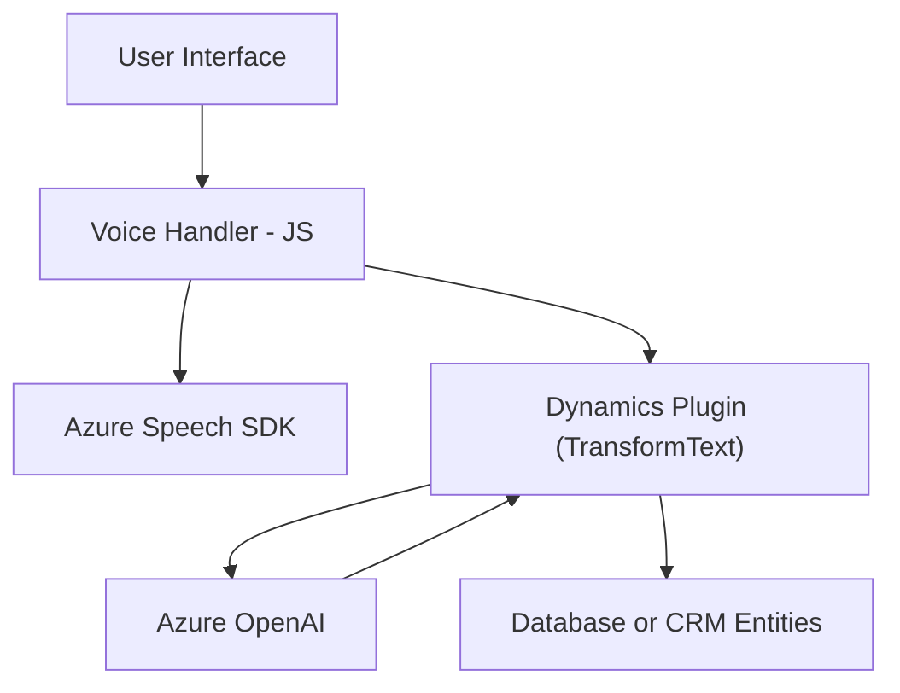

### Breve Resumen Técnico:
El repositorio parece estar orientado a la integración entre la interfaz de usuario (Frontend) y servicios externos, específicamente en torno al manejo de entrada y salida de voz sobre formularios, utilizando tecnologías de Azure. Además, cuenta con un componente backend integrado en Dynamics CRM que procesa texto mediante un plugin, haciendo llamadas al servicio Azure OpenAI.

---

### Descripción de Arquitectura:
1. **Tipo de solución:**  
   a) **Frontend:** Funciona como una interfaz vinculada a formularios para la entrada y salida de voz.  
   b) **Backend:** Plugin en Dynamics CRM que procesa texto estructurado y lo transforma con Azure OpenAI.

2. **Tipo de arquitectura:**  
   Es una arquitectura **n capas** con separaciones claras:  
   - **Capa de presentación (Frontend):** Funciones JavaScript que interactúan con el usuario y SDKs como Azure Speech.  
   - **Capa de servicios:** Backend dentro de Dynamics CRM encapsulado en un plugin que interactúa directamente con Azure OpenAI mediante HTTP.  
   - **Capa de integración:** SDKs y APIs (Azure Speech/API personalizada/Azure OpenAI) conforman una capa externa para procesamiento avanzado.

---

### Tecnologías Usadas:
- **Frontend (JavaScript):**  
  - **Azure Speech SDK:** Para manejo de Text-to-Speech y Speech-to-Text.  
  - Manejo de Promesas y Callback, mostrando un patrón asíncrono.  
  - Modularidad (funciones independientes).
  
- **Backend (C# en Dynamics CRM Plugin):**  
  - **Azure OpenAI (GPT):** Para transformar texto.  
  - **Dynamics SDK:** Explota `Microsoft.Xrm.Sdk` para manejar entidades y contexto del sistema.  
  - Arquitectura Plugin con **patrón de microservicio** en la interacción con Azure.

---

### Dependencias y Componentes Externos:
1. **Azure Speech SDK:**  
   Usado en el frontend para entrada (transcripción de voz) y salida (text-to-speech).  
   
2. **Azure OpenAI (GPT):**  
   Utilizado en backend para procesamiento de texto y transformación.

3. **Dynamics API:**  
   Ayuda a ejecutar plugins para eventos específicos dentro de formularios de Dynamics.

---

### Diagrama Mermaid 100 % compatible con GitHub Markdown:

---

### Conclusión Final:
El repositorio representa una solución integradora enfocada en formularios dinámicos utilizando capacidades de reconocimiento de voz y procesamiento avanzado de texto. Su implementación combina Frontend interactivo, SDKs de voz en Azure, y plugins backend en Dynamics CRM. Adopta una arquitectura modular y n capas, con dependencias externas claramente definidas (Azure Speech y OpenAI). Esto permite construir una experiencia de usuario optimizada, rica en funcionalidades de transcripción, síntesis de voz y transformación de texto en integración directa con sistemas empresariales como Dynamics CRM.