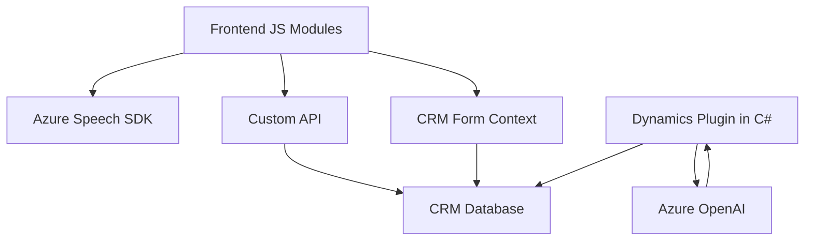

### Breve Resumen Técnico
El repositorio parece estar relacionado con un sistema integrador que funciona mediante interacción de voz para formularios dinámicos en un entorno CRM (probablemente Dynamics 365), utilizando servicios de Azure Speech SDK y Azure OpenAI.

**Componentes principales:**
1. **Frontend listado:** `readForm.js` y `speechForm.js`, ambos en JavaScript, configuran módulos para la entrada/salida de voz. Trabajan como integradores entre el cliente CRM y servicios de Azure Speech y APIs personalizadas.
2. **Backend/plugin listado:** `TransformTextWithAzureAI.cs`, que implementa un plugin en C# para procesar textos mediante la API de Azure OpenAI y transformar datos en el CRM.

---

### Descripción de Arquitectura
La arquitectura general del sistema podría clasificarse como un **sistema híbrido modular orientado a servicios**, compuesto por:
1. **Frontend:** Uso de módulos pensados para sintetizar voz, procesar datos del formulario y enviar estructuras JSON a través de API (monolíticos dentro del navegador o cliente CRM).
2. **Backend/plugin:** Complementa la lógica de negocio avanzada mediante un plugin dentro del CRM, utilizando servicios externos de API (Azure OpenAI) para enriquecer los datos.

Aunque la estructura no muestra múltiples microservicios, sí ilustra principios de modularidad con integración entre frontend, servicios externos y CRM. 

Podríamos clasificar esta solución como una arquitectura **n-capas**, en donde:
- **Capa de presentación:** Módulos JavaScript que se ejecutan en el cliente (en el CRM o navegador).
- **Capa lógica:** Plugin en C# que ejecuta reglas de negocio avanzadas.
- **Capa de datos:** Formulario basado en atributos del CRM y con procesamiento de datos en estructuras JSON para APIs externas.

---

### Tecnologías Usadas
1. **Frontend:**
   - **JavaScript:** Scripts para extracción y procesamiento de datos del frontend (form context en CRM).
   - **Microsoft Dynamics SDK:** Integración directa con formularios del CRM (`Xrm.WebApi`).
   - **Azure Speech SDK:** Reconocimiento/síntesis de voz mediante servicios Azure.
2. **Backend:**
   - **C#:** Lógica en plugins (dentro de Dynamics 365 CRM).
   - **Azure OpenAI:** Procesamiento de texto con modelos GPT 4 en Dynamics CRM.
   - **HTTP y JSON libraries:** Manejo de solicitudes REST y estructuras de datos asociadas.
3. **Otros:** Azure Speech y Dynamics CRM están claramente presentes como dependencias externas relevantes.

---

### Componentes Externos
1. **Azure Speech SDK:** Para síntesis de voz o integración de voz a texto.
2. **Azure OpenAI:** Usado por el plugin para modelos GPT y procesamiento de texto.
3. **Dynamics CRM SDK:** (`IPlugin`, `Xrm.WebApi`) permite integrar datos del CRM directamente en el sistema.

---

### Mermaid Diagram
A continuación, un diagrama simplificado que muestra cómo los componentes interactúan entre sí.

---

### Conclusión Final
Este proyecto integra tecnología de voz (Azure Speech SDK) y procesamiento avanzado con IA (Azure OpenAI) dentro de un sistema CRM basado en formularios dinámicos (Dynamics 365). La solución sigue una arquitectura de n capas, organizando lógica entre frontend y dinamismo avanzado en un backend/plugin. Aunque modular, se podría mejorar mediante el uso explícito de principios de hexagonal o desacoplar plugins y lógicas externas en microservicios.

En general, la estructura está optimizada para interacción directa usuario-sistemas con tecnologías modernas, siendo escalable y extensible.