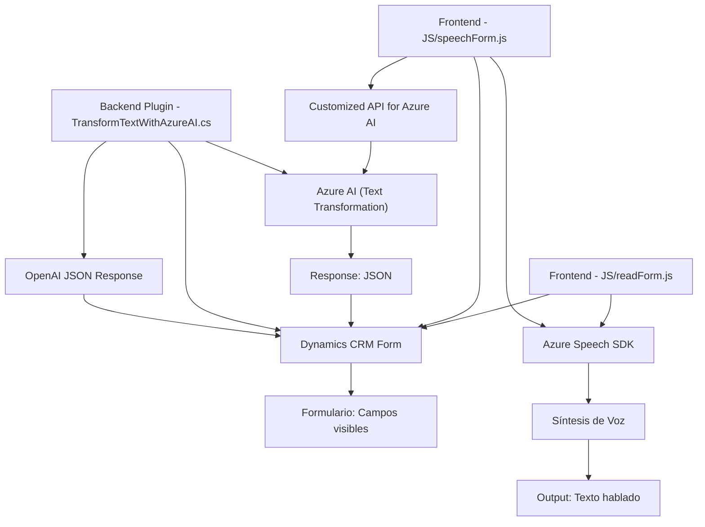

## Breve Resumen Técnico

La descripción del código y los archivos presentados conforman una solución de integración entre formularios en Dynamics 365 y servicios de Azure (Speech SDK y OpenAI). La funcionalidad principal es automatizar la entrada y salida de datos mediante voz, así como transformar texto en JSON utilizando inteligencia artificial, aplicándolo a formularios en Dynamics. El enfoque gira en torno a la interacción con servicios externos (Azure APIs y Dynamics 365).

---

## Descripción de la Arquitectura

La arquitectura general del proyecto parece estar orientada hacia **microservicios** y usa un modelo distribuido basado en la nube. 

- El frontend (`readForm.js` y `speechForm.js`) se interactúa directamente con servicios externos (Azure Speech SDK) y procesan información para transformarla y consumir APIs.
- El backend (plugin `TransformTextWithAzureAI.cs`) actúa como un **intermediario inteligente** para Dynamics CRM, utilizando Azure OpenAI para estructurar texto de entrada.
- El sistema aprovecha patrones de carga dinámica, modularidad, y promesas para asincronía en la comunicación.
- Aunque no se menciona explícitamente si se usa algún modelo de integración avanzada (como hexagonal), la arquitectura parece orientada hacia servicios independientes (microservicio para OpenAI y Speech SDK) que se integran con Dynamics CRM, que es modular en sí.

Es probable que el proyecto se base en el patrón de integración de servicios distribuidos sobre una infraestructura cloud-first.

---

## Tecnologías Usadas

### Frontend
- **JavaScript:** Para la lógica de lectura de formulario, síntesis de voz, integración con APIs.
- **Azure Speech SDK:** Para la síntesis y reconocimiento de voz.
- **API personalizada:** Transformación de texto basada en Azure AI.

### Backend
- **Microsoft Dynamics CRM SDK:** Para el desarrollo del plugin y comunicación con los datos organizacionales.
- **Azure OpenAI:** Procesamiento de texto natural y generación de JSON.
- **Newtonsoft Json y System.Text.Json:** Para los procesos relacionados con la gestión de datos JSON.
- **C# .NET Framework (IPlugin):** Usado para la implementación de plugins en Dynamics CRM.

### Patrones arquitectónicos observados
1. **Carga dinámica:** Dinámico para importar el Speech SDK según la necesidad del entorno del cliente.
2. **Modularidad:** Individualización de funciones en el frontend para procesar diferentes aspectos (lectura, síntesis, entrada).
3. **Microservicios:** Uso de servicios externos (Azure APIs) para separar lógica de negocio (en backend) y funciones transversales.
4. **Plug-in Architecture:** Para la integración con Dynamics CRM.
5. **API Gateway y comunicación REST:** Evidenciado en llamadas hacia Azure Speech, OpenAI y API personalizada en el backend.
6. **Localización:** Configuración de idioma específico ("español" en la síntesis de voz).

---

## Diagrama Mermaid

---

## Conclusión Final

La solución se fundamenta en una integración avanzada entre **Microsoft Dynamics CRM** y **Azure Cloud Services**, aprovechando APIs como **Speech SDK** y **OpenAI**. Muestra elementos de una arquitectura **microservicios** y hace énfasis en modularidad y asincronía, facilitando una experiencia de usuario que incorpora tecnologías modernas como el reconocimiento de voz y procesamiento de lenguaje natural. Además, los plugins y scripts están diseñados siguiendo patrones de integración eficaz con servicios externos, aunque aspectos como la gestión de credenciales y una mayor abstracción de lógica podrían optimizarse.