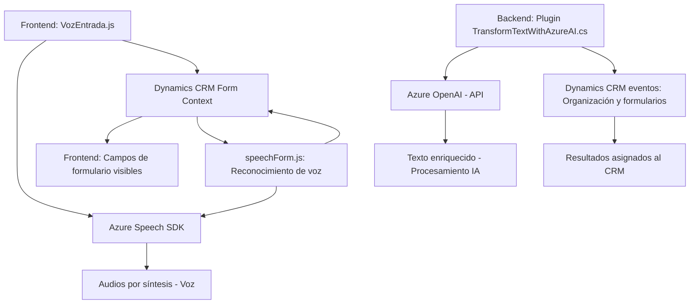

# Breve resumen técnico:
El repositorio describe un sistema vinculado a formularios de **Dynamics CRM**, donde se usan servicios de **Azure Speech SDK** y **Azure AI/OpenAI** para habilitar la interacción por voz y procesamiento de lenguaje natural. Los archivos están divididos entre frontend, lógica de plugins, y servicios integrados para mejorar la funcionalidad del CRM.

---

# Descripción de la arquitectura:
La arquitectura del sistema mezcla un enfoque **en capas** (lógica frontend, backend y plugins integrados) y **event-driven**. Internamente, sigue principios de modularidad al encapsular funcionalidades específicas como el reconocimiento de voz, la síntesis de voz, y la interacción con APIs externas. 

## Características de la arquitectura:
1. **Lógica frontend:** Facilidad para interactuar mediante entrada/salida de comandos por voz desde los formularios. Esto se integra al SDK de Dynamics CRM.
2. **Servicios externos:** Uso intensivo de Azure Speech SDK y Azure OpenAI para funcionalidades avanzadas como reconocimiento de comandos y transformación de texto automatizada.
3. **Dinámica basada en eventos:** Los plugins reaccionan a eventos específicos configurados en Dynamics CRM, como el procesamiento de texto post-creación o actualización de formularios.
4. **Aislamiento funcional:** La lógica de plugins y las interacciones con el SDK están bien encapsuladas en funciones específicas.

---

# Tecnologías usadas:
1. **Frontend**:
   - **JavaScript**: Para lógica de interacción con formularios (incluye funciones de síntesis y reconocimiento de voz).
   - **Azure Speech SDK**: Para entrada/salida de voz con acceso dinámico al servicio en la nube.
   - **Dynamics 365 Web API**: Acceso y modificación de atributos en formularios del CRM.

2. **Backend**:
   - **C# (.NET Framework)**: Usado en la definición de plugins para comunicaciones con Dynamics CRM y Azure OpenAI.
   - **Microsoft.Xrm.Sdk**: Librería del SDK de Dynamics CRM para acceso programático.
   - **Azure OpenAI Service**: Servicio para procesamiento de lenguaje natural y transformación de texto.
   - **HTTP Client (System.Net.Http)**: Para hacer solicitudes REST hacia APIs externas.

3. **Integraciones**:
   - **Azure AI**: Enriquecimiento del sistema con capacidades avanzadas de IA, como transformación de texto y reconocimiento automático del lenguaje hablado.

4. **Patrones empleados**:
   - **Facades Modulares:** Cada archivo implementa funcionalidades aisladas para evitar complejidad del sistema en una única unidad.
   - **Event-driven Design:** Los plugins y sus métodos están diseñados para ejecutarse ante eventos en Dynamics CRM.
   - **Factory Pattern (en Speech SDK):** Utilizado para la creación de configuraciones específicas (`SpeechConfig`, `AudioConfig`).
   - **Plugin Pattern (Backend):** Implementado para interactuar como una extensión dentro del framework CRM.

---

# Diagrama Mermaid válido para GitHub:

---

# Conclusión final:
El sistema descrito es un **sistema/event-driven multi-capa**, que está orientado a la mejora de la interacción con formularios en **Dynamics CRM** mediante entrada/salida de comandos por voz y procesamiento de lenguaje natural. Combina servicios avanzados de **Azure Speech** y **Azure OpenAI**, junto con la lógica del SDK y APIs del CRM. Provee funcionalidades específicas como la síntesis de voz, el reconocimiento de voz en tiempo real, y una capa extendida para el procesamiento de texto mediante IA, con una arquitectura modular que garantiza escalabilidad.