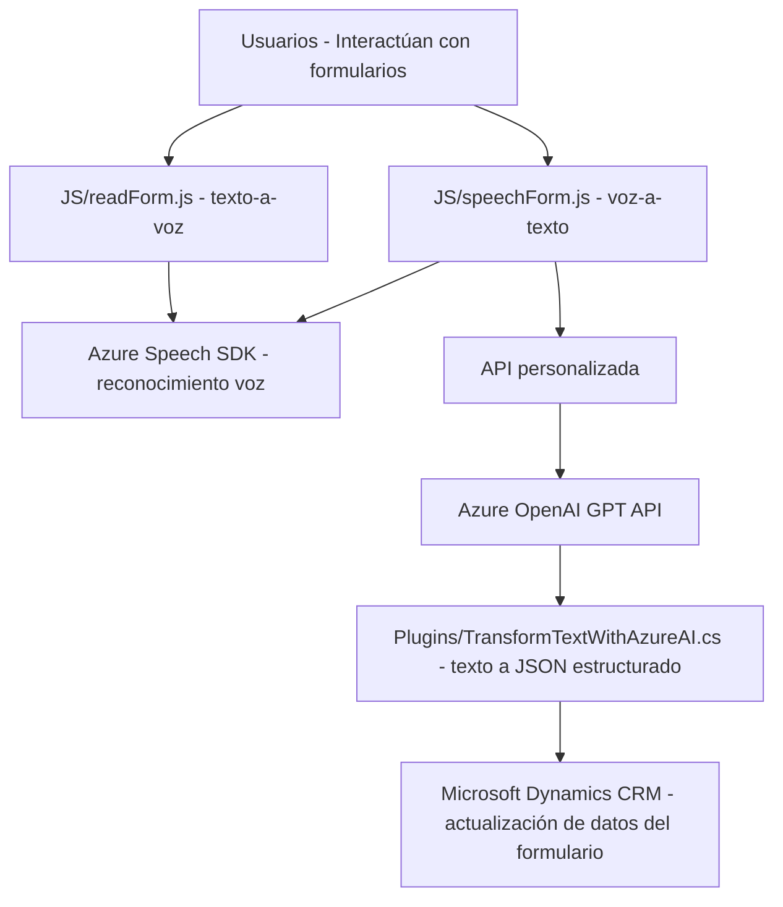

### Breve Resumen Técnico:
El repositorio contiene tres archivos que implementan funcionalidades avanzadas de voz y texto en un entorno relacionado con Microsoft Dynamics CRM y Azure. Cada archivo está diseñado para cumplir una tarea específica:
1. **JS/readForm.js**: Sintetiza texto a voz basado en datos visibles en formularios dinámicos.
2. **JS/speechForm.js**: Convierte voz a texto utilizando Azure Speech SDK y actualiza formularios dinámicos según las transcripciones.
3. **Plugins/TransformTextWithAzureAI.cs**: Define un plugin de Dynamics CRM que transforma texto en un JSON estructurado utilizando Azure OpenAI GPT.

---

### Descripción de Arquitectura:
El sistema utiliza una **arquitectura cliente-servidor** con componentes distribuidos:
- Los archivos de JavaScript actúan como un **cliente frontend** que interactúa con formularios dinámicos en Microsoft Dynamics CRM y servicios externos (Azure Speech SDK y APIs).  
- El archivo C# implementa un **plugin backend** para Dynamics CRM, que extiende su funcionalidad mediante la comunicación con Azure OpenAI GPT APIs.  

Desde una perspectiva conceptual más amplia, se observa una **arquitectura hexagonal** para conectar los distintos niveles de interacción (usuario, formulario dinámico, SDKs y APIs externas) manteniendo una separación modular entre lógica de negocio, interacción de usuario y servicios externos.

---

### Tecnologías Utilizadas:
1. **JavaScript**:
   - Tecnologías: Azure Speech SDK, Promesas y funciones asíncronas.
   - Capacidad: Interacción con formularios y síntesis de voz (para el lado cliente).  
   
2. **C# (.NET)**:
   - Frameworks: Dynamics CRM SDK, Newtonsoft.Json, System.Text.Json.
   - Capacidad: Extensibilidad de Microsoft Dynamics mediante un plugin que interactúa con Azure OpenAI GPT.

3. **APIs y SDKs**:
   - **Azure Speech SDK**: Servicios de voz y reconocimiento de texto.
   - **Azure OpenAI GPT Service**: Transformación avanzada de texto a JSON.
   - **Microsoft Dynamics API**: Interacción bidireccional con formularios dinámicos CRM.

4. **Patrones Utilizados**:
   - Modularidad de funciones/clases.
   - Cliente-Servidor.
   - Promises y manejo del contexto de ejecución.
   - Separación `Frontend` (JS) y `Backend` (C# Plugin).

---

### Diagrama Mermaid:

---

### Conclusión Final:
El repositorio implementa un **solución integral de interacción con voz y texto**, optimizada para **Microsoft Dynamics CRM**. La **arquitectura cliente-servidor** utilizada combina tecnología moderna como **Azure Speech SDK y OpenAI GPT** con posibilidades de extensibilidad a través de plugins en **Dynamics CRM**.

**Fortalezas**:
- Uso de servicios escalables de Azure para síntesis de voz y procesamiento de texto.
- Modularidad clara entre funcionalidades (texto-a-voz, voz-a-texto, plugin de texto a JSON).
- Gestión asíncrona y robusta de dependencias SDK/APIs en el lado cliente.

**Puntos de mejora**:
- Dependencia en servicios específicos de Azure lo que puede limitar migración a otros entornos.
- Complejidad añadida debido al manejo de múltiples dependencias externas.