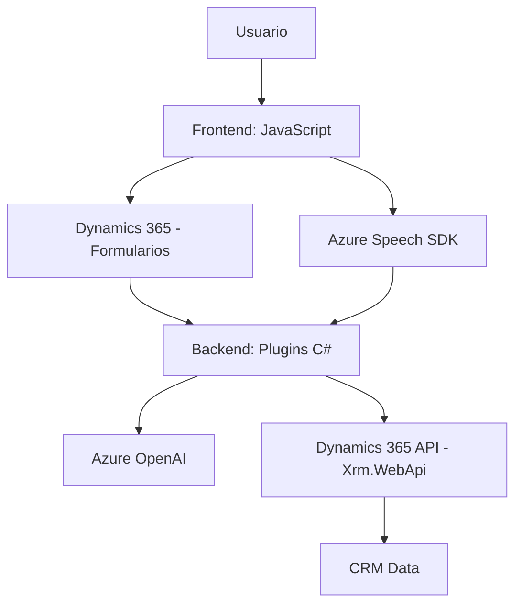

### Breve resumen técnico
Este repositorio contiene módulos, scripts y un plugin para la implementación de funcionalidades avanzadas en **Microsoft Dynamics 365**, integrando características relacionadas con reconocimiento de voz, síntesis de voz, mapeo de campos en formularios y funcionalidades de inteligencia artificial basada en **Azure Speech SDK** y **Azure OpenAI**. El enfoque principal está en la accesibilidad mediante reconocimiento de voz y transformación inteligente de datos en el contexto de una arquitectura orientada a servicios.

---

### Descripción de arquitectura
1. **Solución**  
   - La solución es una mezcla de **front-end** mediante JavaScript y **backend plugins** (C#) integrados con Dynamics 365. Su finalidad es proporcionar servicios específicos como entrada y salida por voz, conectividad a APIs externas, y procesamiento de texto con inteligencia artificial para personalizar y mapeo dinámico de datos en los formularios del CRM.

2. **Arquitectura**  
   - La arquitectura del sistema sigue el patrón de **n capas**:
      - **Capa de presentación**: Scripts de JavaScript para el reconocimiento de voz y síntesis implementados en el navegador del usuario. Principal interacción con Dynamics 365 a través del entorno `executionContext` de formularios. 
      - **Capa lógica de negocio**: Plugins en C# que proveen la lógica avanzada, como transformación AI y procesamiento en CRM.
      - **Capa de integración/servicios**: Uso explícito de servicios externos como `Azure Speech SDK` y `Azure OpenAI` mediante APIs. Comunicación con Dynamics 365 se canaliza usando el SDK (`Xrm.WebApi`).
   - En este contexto, también se observa un patrón de **Hybrid cloud architecture**, dado que combina procesamiento local de la interfaz con soportes externos en la nube.

3. **Patrones de diseño**  
   - **Modularización**: Cada script y clase tiene una responsabilidad clara y encapsulada.
   - **Dynamic Resource Loading**: Verificación de la carga y uso de bibliotecas externas en tiempo de ejecución.
   - **API Integration**: Consumo masivo de servicios de Azure mediante apis y consumidores de servicios (con registros JSON representados como entrada y salida).
   - **Separation of Concerns**: Las responsabilidades están separadas entre captación/interacción, procesamiento, mapeo de datos y comunicación con el servidor.

---

### Tecnologías usadas
1. **Front-end**:  
   - **JavaScript** para desarrollo de scripts interactivos.
2. **Backend**:  
   - **C#** y **Microsoft Dynamics CRM plugins** para lógica de negocio específica.
3. **Servicios externos**:  
   - **Azure Speech SDK**: Para reconocimiento y síntesis de voz.
   - **Azure OpenAI (GPT-4)**: Para generación de texto en formato JSON.
4. **Frameworks/Librerías**:
   - `Xrm.WebApi` para interacción con Dynamics 365 APIs.
   - `Microsoft.Xrm.Sdk` para implementación de plugins.
   - `Newtonsoft.Json` para manipulación de JSON.
5. **Infraestructura**:  
   - **Dynamics 365** como ecosistema principal.
   - **Azure** servicios integrados.

---

### Dependencias o componentes externos
1. **Azure Speech SDK**:  
   - Implementado dinámicamente en los scripts para reconocimiento y conversión de texto a voz. Provee sintetización basada en datos recibidos por formularios.
2. **Dynamics 365 API**:  
   - Elemento fundamental para gestionar datos y campos en la capa lógica del CRM.
3. **Azure OpenAI (GPT-4)**:  
   - Integrado en el backend para transformar texto en JSON formatado según reglas específicas.
4. **Plugins en C#**:  
   - Funcionan como conectores para el procesamiento avanzado y son dependientes de `Azure` y `Dynamics SDK`.

---

### Diagrama Mermaid válido para GitHub Markdown

---

### Conclusión final
La solución presentada es una implementación técnica avanzada para accesibilidad y procesamiento de datos mediante el ecosistema de Microsoft Dynamics 365. Al combinar tecnologías de reconocimiento de voz (Azure Speech SDK), inteligencia artificial (Azure OpenAI), y una lógica personalizada mediante plugins en C#, se logra una arquitectura de **n capas** que habilita interacciones naturales y personalizadas en un sistema CRM. Este diseño puede ser expandido para incluir más funcionalidades en el futuro y se beneficia de la integración con servicios modernos de la nube como Azure.