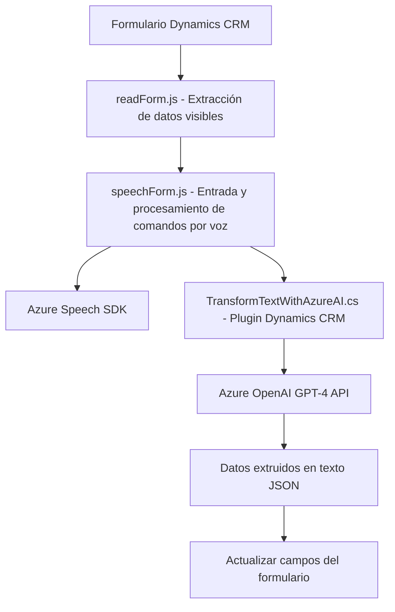

### Breve Resumen Técnico

El repositorio contiene tres archivos clave relacionados con la interacción entre la entrada de voz, la síntesis de texto y el procesamiento de datos en un formulario de Dynamics CRM utilizando tecnologías de Azure, incluyendo Speech SDK y OpenAI. 

1. **`readForm.js` y `speechForm.js`**: Implementan funcionalidades de entrada y salida de voz para formularios.
2. **`TransformTextWithAzureAI.cs`**: Un plugin para Dynamics CRM que transforma texto usando Azure OpenAI.

---

### Descripción de Arquitectura

La solución tiene una arquitectura **modular orientada a servicios**:
1. **Front-end JavaScript**: Encapsulación mediante funciones específicas (e.g., extracción de campos visibles, entrada/salida de voz, llamado a servicios externos).
2. **Microsoft Dynamics CRM Plugin**: Extiende las capacidades del CRM mediante la interfaz de plugins. Integra servicios externos como Azure OpenAI para lógica avanzada.
3. **Patrones Observados**:
   - **Modularidad**: Archivos estructurados en funciones independientes.
   - **Integración de servicios externos**: Usando Azure APIs (Speech SDK y OpenAI).
   - **Domain-Driven Design (DDD)**: Los datos y acciones están acoplados al contexto del formulario dentro de Dynamics CRM.

Esta solución puede ser considerada una **arquitectura n-capas**, donde:
- La capa de presentación comprende los scripts de JavaScript que interactúan directamente con el formulario y el usuario.
- La capa de negocio corresponde al plugin que realiza la lógica avanzada con AI.
- Una capa de integración de servicios externos involucra llamadas REST hacia Azure OpenAI y Speech SDK.

---

### Tecnologías Usadas
1. **Front-End**:
   - JavaScript para interacción con el formulario y servicios de voz.
   - Dynamics CRM APIs (`formContext.data.entity.attributes`) para acceder y manipular los datos del formulario.

2. **Back-End**:
   - **Microsoft Dynamics CRM Plugins**: Extiende el CRM con lógica personalizada mediante `IPlugin`.
   - **Azure Speech SDK**: Procesamiento de entradas/salidas de voz.
   - **Azure OpenAI**: Uso de GPT-4 para transformación avanzada de texto vía API REST.
   - **HTTP Client**: Consumo de servicios mediante JSON/REST.
   - **System.Text.Json y Newtonsoft.Json.Linq**: Serialización y manejo de datos JSON.

---

### Diagrama Mermaid

---

### Conclusión Final

La solución está diseñada para permitir la automatización inteligente en el contexto de Dynamics CRM, integrando capacidades avanzadas como interacción por voz y procesamiento IA basado en Azure. La arquitectura modular orientada a servicios hace que cada componente sea fácilmente extensible y de bajo acoplamiento, facilitando el mantenimiento y la escalabilidad.

Este repositorio representa una integración eficaz entre tecnologías frontend, backend y servicios externos en una solución especializada para formularios CRM.