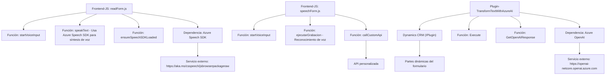

### Breve resumen técnico
El repositorio tiene tres archivos principales:  
1. **readForm.js** y **speechForm.js** para manipulación de formularios desde un frontend en JavaScript, integrando funciones de lectura/síntesis de voz (Azure Speech SDK).  
2. **TransformTextWithAzureAI.cs** como un plugin .NET para Microsoft Dynamics CRM, que interactúa con Azure OpenAI para transformar texto con normas definidas.  

Está orientado a una solución integrativa que utiliza servicios en la nube de Azure para mejorar la interacción y procesamiento de datos desde formularios dinámicos.

---

### Descripción de arquitectura
La solución refleja una arquitectura basada en **modularidad y eventos**.  
1. **Frontend:** Scripts en JavaScript diseñados bajo un modelo modular. Utilizan funciones separadas para lectura, procesamiento y síntesis de voz con Azure Speech SDK.  
2. **Backend/plugin:** Cada archivo está orientado a una tarea específica. El plugin aplica el patrón *Api Gateway* para interactuar con servicios externos como Azure OpenAI.  
3. **Arquitectura global:**  
   - **Front:** Segregación funcional del cliente (navegador) bajo el flujo de eventos orientado a DOM y dependencias.  
   - **Backend:** Usa el patrón de extensión de Dynamics CRM con una capa que actúa como middleware entre el CRM y Azure.  

---

### Tecnologías usadas
1. **JavaScript y Front-End:**
   - Azure Speech SDK.
   - Manejo dinámico de DOM y formularios en contexto (posiblemente bajo Dynamics 365 o aplicaciones similares).  
2. **Backend/Plugin (C#):**  
   - Microsoft Dynamics SDK (`IPlugin`).
   - Azure OpenAI GPT.
   - .NET estándar para manejo de dependencias y servicios HTTP (HttpClient).
3. **Patrones:**
   - *Carga dinámica de SDK*: Los scripts cargan recursos solo cuando son necesarios (por ejemplo, SDK de Speech en el frontend).  
   - *Api Gateway*: El plugin actúa como intermediario entre Dynamics CRM y OpenAI.  
   - Modularidad y delegación: Las funciones dentro de los scripts son específicas y separan responsabilidades.

---

### Diagrama Mermaid válido para GitHub

---

### Conclusión final
La solución presentada se divide en una capa de frontend (manipulación de formularios y síntesis de voz) y un backend/plugin avanzado acoplado a Dynamics CRM. Aprovecha servicios de Azure (Speech SDK y OpenAI), mostrando alta integración y dependencia de infraestructura en la nube. La arquitectura es modular, lo que facilitaría su mantenimiento y extensión. Sin embargo, requerirá una configuración robusta de credenciales y acceso a servicios API en ambientes productivos.

