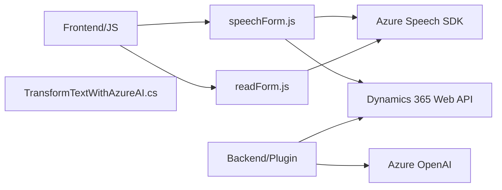

### Breve Resumen Técnico

El repositorio incluye módulos orientados al uso de voz para accesibilidad en formularios y procesamiento de texto inteligente, además de un plugin para Dynamics CRM. Se integran servicios de Azure Speech SDK y Azure OpenAI para funcionalidades avanzadas de síntesis y entrada de voz, y para estructuración de texto en JSON.

### Descripción de Arquitectura

La solución tiene un enfoque modular y está orientada a servicios. Cada componente gestiona aspectos específicos del proceso: los módulos frontend (JavaScript) interactúan con formularios en tiempo real para síntesis de voz y entrada de texto vía voz. El componente backend (C# plugin) complementa esta solución encargándose del procesamiento avanzado del texto mediante Azure OpenAI desde Dynamics CRM.

Con base en los análisis de los archivos, la arquitectura se considera híbrida, con las siguientes características:
- **Frontend JavaScript**: Modular, sigue un patrón de diseño basado en eventos y utiliza integración con servicios externos.
- **Backend Plugin**: Modular mediante `IPlugin`, alineado a una arquitectura de N capas.
- **Servicios Externos**: Dependen fuertemente de servicios remotos como Azure Speech SDK y Azure OpenAI, siguiendo el patrón de **microservicio**.

### Tecnologías Usadas

1. **Frontend/JavaScript:**
   - **Azure Speech SDK**: Lógica de síntesis y reconocimiento de voz.
   - **Microsoft Dynamics 365 Web API**: Actualización de campos formularios y consumo de APIs personalizadas.
   - **Patrones**: Event-Driven y modularización de funciones.

2. **Backend/C#:**
   - **Microsoft Dynamics SDK**: Para implementación del plugin.
   - **Azure OpenAI**: Aplicación de procesamiento de texto basado en lenguaje natural.
   - **Newtonsoft.Json** y **System.Text.Json**: Manipulación de datos JSON.

### Diagrama Mermaid válido para GitHub

### Conclusión Final

Este repositorio implementa una solución accesible e inteligente para manejo de formularios usando tecnologías modernas como Azure Speech SDK y Azure OpenAI API. La arquitectura es principalmente modular, separando responsabilidades entre frontend (manejo de eventos, acceso API) y backend (procesamiento avanzado de textos vía plugin). El uso de servicios externos como Azure permite una integración robusta con capacidades de inteligencia artificial y accesibilidad vocal, mientras se optimizan los recursos.