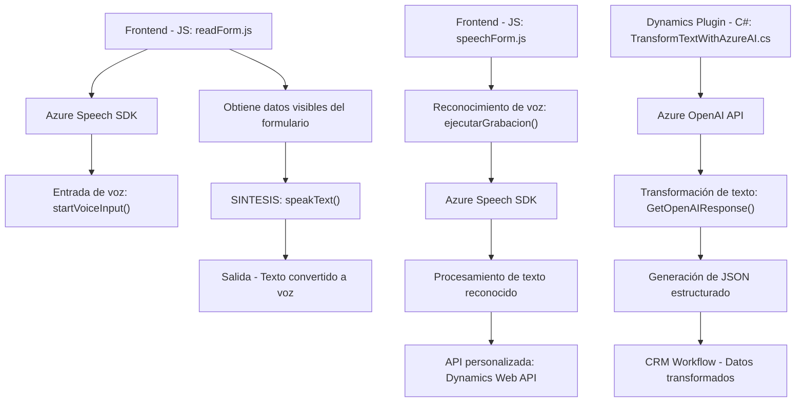

### **Breve resumen técnico**
La solución analizada es un sistema que combina funcionalidad de frontend web con procesamiento de datos en formularios de Dynamics CRM (MS Dynamics) y se integra con servicios externos de Microsoft Azure. Incluye generación de voz a partir de texto, reconocimiento de voz y lógica de transformación de texto mediante Azure OpenAI.

---

### **Descripción de arquitectura**
La solución presenta una **arquitectura híbrida basada en capas**:
1. **Frontend (JavaScript)**: Implementa interacción con formularios y funcionalidad de reconocimiento/síntesis de voz mediante SDKs de Azure.
2. **Runtime Dynamics Plugin (C#)**: Extiende la funcionalidad en Dynamics CRM con un plugin personalizado que transforma texto usando Azure AI.
3. **Servicios externos**: Integración con Azure Speech SDK y Azure OpenAI (API REST) para funciones de síntesis y transformación de datos.

Este diseño claramente utiliza principios de **arquitectura n-capas**:
- **Capa de presentación:** Interfaz y comportamiento en frontend basado en formularios web.
- **Capa lógica:** Procesamiento de datos (speech-to-text, text-to-speech, API personalizada, mapeo/formateo de campos).
- **Capa de acceso a datos:** Llamadas a Web APIs y procesamiento de formularios CRM.

---

### **Tecnologías usadas**
1. **Frontend (JavaScript):**
   - **Azure Speech SDK**: Reconocimiento y síntesis de voz.
   - **DOM y eventos**: Manipulación de formulario dinámico.
   - **Web APIs**: Comunicación con servicios externos.

2. **Dynamics Plugin (C#):**
   - **Microsoft Dynamics SDK** (`Microsoft.Xrm.Sdk`): Acceso al modelo y eventos de Dynamics.
   - **Azure OpenAI API**: Transformación de datos mediante IA.
   - **Newtonsoft.Json**: Procesamiento robusto de JSON.

3. **Arquitectural Patterns:**
   - **Integración con APIs externas**: Comunicación REST para AI y servicios de voz.
   - **Callback pattern**: Manejo de eventos y dependencias cargadas en tiempo de ejecución.
   - **Composición modular**: Lógica independiente para síntesis, reconocimiento y transformación.

4. **Dependencias externas:**
   - Azure Speech SDK.
   - Azure OpenAI API.
   - APIs personalizadas en Dynamics CRM.
   - HTTP Client para comunicación REST.

---

### **Diagrama Mermaid**

---

### **Conclusión final**
La solución representa un sistema enfocado en la integración de tecnologías avanzadas para enriquecer la experiencia en formularios de Dynamics CRM. Combina funcionalidad de frontend, aliada con servicios externos (synth-text-to-speech, speech-to-text) y procesamiento backend mediante plugins y APIs personalizadas.

**Ventajas:**
- Modularidad: Cada módulo tiene responsabilidades bien definidas, lo que facilita la escalabilidad.
- Potente integración con Azure: Aprovecha Speech SDK y OpenAI usando APIs REST.
- Uso de arquitectura n-capas: Separación clara entre presentación, lógica y acceso a datos.

**Consideraciones:**
- La dependencia en servicios externos como Azure implica costos y tiempo de respuesta asociados.
- Agregación de lógica IA en Dynamics CRM requiere ajustar la configuración y escalabilidad del entorno.