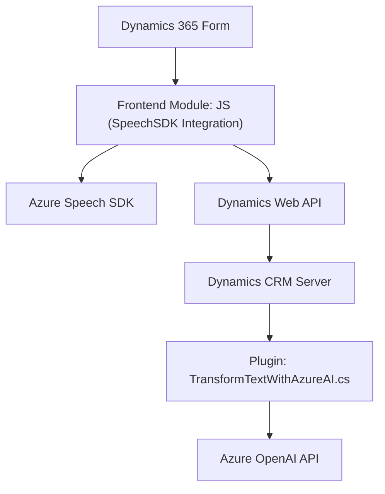

### **Breve Resumen técnico**
El repositorio dado implementa una solución integrada que conecta formularios de Dynamics 365 con capacidades avanzadas de Microsoft Azure, incluidos **Azure Speech SDK** para reconocimiento y síntesis de voz, así como **Azure OpenAI** para el procesamiento de texto basado en IA. Implica tres principales componentes: un módulo de frontend en JavaScript para la interacción dinámica con el usuario, un backend .NET para el procesamiento de texto mediante un plugin de Dynamics CRM, y dependencias externas para integraciones avanzadas.

---

### **Descripción de Arquitectura**
La solución emplea una arquitectura **n capas** con los siguientes componentes principales:
1. **Frontend** (JavaScript):
   - Implementa funciones para leer datos de formularios de Dynamics 365, reconocer voz y sintetizar texto en voz.
   - Se apoya en el SDK de **Azure Speech** como servicio externo.
2. **Backend Plugin** (.NET):
   - Implementa un plugin de **Dynamics CRM** para la integración con **Azure OpenAI** y transforma texto mediante procesamiento externo utilizando reglas de negocio.
   - Pattern: extensibilidad mediante `IPlugin`.

La arquitectura mantiene un claro enfoque de separación de responsabilidades:
- **Frontend** para interacción UX.
- **Backend** para lógica avanzada y reglas de negocio integradas con Dynamics CRM.
- Uso de servicios externos (Azure Speech SDK y Azure OpenAI).

---

### **Tecnologías usadas**
1. **Frontend**:
   - **JavaScript**: Core de las funciones y métodos para síntesis y reconocimiento de voz.
   - **Azure Speech SDK**: Para convertir texto a voz y lograr reconocimiento de voz.

2. **Backend**:
   - **Microsoft Dynamics CRM SDK** (`Microsoft.Xrm.Sdk`, `IPlugin`): Extensión del CRM mediante plugins desarrollados en C#.
   - **ASP.NET Core C#**: Implementación del plugin como aplicación servidor para procesamiento de lógica de negocio.
   - **Azure OpenAI API**: Para transformar texto utilizando modelos GPT.

3. **Frameworks/Librerías**:
   - `System.Net.Http` y `Newtonsoft.Json` para manejo de API HTTP en el backend.
   - `Dynamics Web API` para gestión de formularios desde frontend.

---

### **Diagrama Mermaid válido (sintaxis GitHub)**

---

### **Conclusión Final**
1. **Tipo de Solución:** Una solución híbrida personalizada que combina funcionalidades de frontend con herramientas de procesamiento avanzadas del backend para formularios dinámicos en Dynamics 365.
2. **Tecnologías:** La integración de Azure Speech SDK y Azure OpenAI provistos por Microsoft aportan capacidades de inteligencia artificial vocal y textual. El uso del framework nativo de Dynamics CRM SDK garantiza que el plugin se ajuste a los estándares requeridos.
3. **Arquitectura:** Destaca una arquitectura **n capas**, separando responsabilidades del frontend que interactúa con el usuario y el backend que realiza la lógica de negocio y las integraciones externas.

Este sistema está sólido para casos de uso orientados a la automatización de flujos de trabajo en formularios CRM y mejora de la accesibilidad, pero podría beneficiarse de un mayor uso de abstracción para mejorar la reutilización del código en el backend y la extensibilidad hacia otros sistemas.