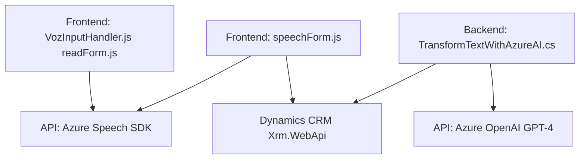

### Resumen técnico
El repositorio expone una solución híbrida basada en integración de tecnologías frontend (JavaScript) y backend (.NET). Combina capacidades dinámicas de interfaz gráfica con procesamiento avanzado utilizando APIs externas (Azure Speech SDK y Azure OpenAI).

### Descripción de arquitectura
La arquitectura es una combinación de un sistema de **capas estructurales** y **integraciones externas orientadas a servicios**, apta para escenarios de **microservicios híbridos**:
1. **Frontend**:
   - Uso de módulos JavaScript para lectura y síntesis de voz, reconocimiento de comandos y comunicación con APIs externas.
   - Funciones asincrónicas permiten una ejecución modular basada en eventos.

2. **Backend**:
   - Plugins de Dynamics CRM como punto de entrada para lógica empresarial.
   - Uso de Azure OpenAI API para transformar texto según normas específicas.
   - Integración con Dynamics CRM y Azure enfatiza una **service-oriented approach**.

### Tecnologías usadas
1. **Frontend**:
   - JavaScript ES6 (Funciones asincrónicas, Promesas).
   - Azure Speech SDK (texto a voz y reconocimiento de voz).
   - Dynamics 365 Web API.
2. **Backend**:
   - .NET Framework (Clases y Plugins para Dynamics CRM).
   - Azure OpenAI API (GPT-4).
   - System.Text.Json para serialización/deserialización JSON.
   - HttpClient para solicitudes HTTP.
3. **Otros patrones**:
   - Modularización y separación de responsabilidades.
   - Carga dinámica de SDKs y dependencia en servicios externos.

### Dependencias o componentes externos
1. **Azure Speech SDK**:
   - Necesita configuración `azureKey` y `azureRegion`, carga dinámica desde CDN.
2. **Azure OpenAI API**:
   - Conexión externa para procesamiento avanzado basado en normas.
3. **Dynamics 365**:
   - Dependencia del framework CRM para capturar y manipular datos.
4. **JSON libraries**:
   - Manipulación de datos JSON (System.Text.Json en backend, estructuras en frontend).

### Diagrama Mermaid

### Conclusión final
La solución presentada combina un frontend modular y un backend basado en plugins para extensión de Dynamics CRM, interactuando con APIs de Azure. Su arquitectura flexible favorece la integración de servicios externos como el reconocimiento y procesamiento de voz, y la transformación de texto mediante inteligencia artificial. Ideal para sistemas dinámicos con interactividad y lógica empresarial extensible.