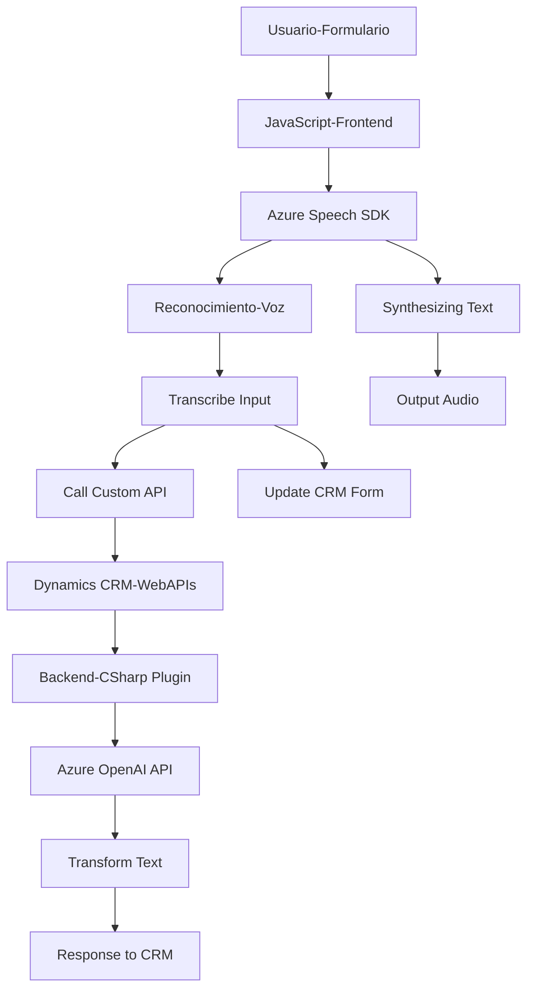

### Breve resumen técnico
El repositorio muestra una solución que combina un frontend accesible con capacidades de síntesis y reconocimiento de voz basadas en Azure Speech SDK, junto con backend en Dynamics CRM que utiliza integración con Azure AI para transformar texto en datos estructurados. Los archivos están organizados como componentes independientes para mejorar la integración entre interfaces de usuario (frontend) y la lógica empresarial (backend).

---

### Descripción de arquitectura
La solución tiene una arquitectura **n-capas**. A nivel funcional:
1. **Frontend (JavaScript)**: Implementación accesible con interacción basada en formularios y voz, utilizando Azure Speech SDK para síntesis y transcripción. Incluye procesamiento y asignación de valores dinámicos en formularios de Dynamics CRM.
2. **Backend (C#)**: Define un plugin basado en Microsoft Dynamics CRM para integrar con Azure OpenAI, estructurando texto transformado según estándares predeterminados.

La lógica está modularizada, el frontend se basa en eventos y en carga dinámica del SDK de voz. El backend sigue un **Service-Oriented Pattern** donde el plugin consume servicios externos y actúa bajo la lógica del contexto de Dynamics CRM.

---

### Tecnologías usadas
1. **Frontend:**
   - **JavaScript**: Para manipulación de formularios y eventos.
   - **Azure Speech SDK**: Synthesizing y reconocimiento de voz.
   - **Dynamics CRM Web APIs**: Para realizar operaciones en formularios dinámicos y atributos.
2. **Backend:**
   - **C#**: Desarrollo del plugin.
   - **Microsoft Dynamics SDK**: Interacción con entidades CRM.
   - **Azure OpenAI API** (GPT-4): Transformación de texto en datos estructurados.
   - **Newtonsoft.Json**: Manejo y serialización de JSON.
3. **Patrones y estructura del código:**
   - **Carga dinámica de recursos** (JavaScript).
   - **Event-driven** programación en frontend.
   - **Service-Oriented Pattern** en el plugin de backend.
   - **Single Responsibility Principle** aplicado tanto en frontend como backend.

---

### Diagrama **Mermaid**

---

### Conclusión final
La solución combina accesibilidad y procesamiento inteligente a través de integración con Azure SDK (Speech y OpenAI) y APIs de Dynamics. Su enfoque de **n-capas** permite desacoplar la interacción del usuario (frontend) de la lógica empresarial (backend) para mayor escalabilidad y mantenibilidad. Es ideal para entornos empresariales que requieran interfaces de usuario accesibles y transformación avanzada de datos con servicios basados en IA.