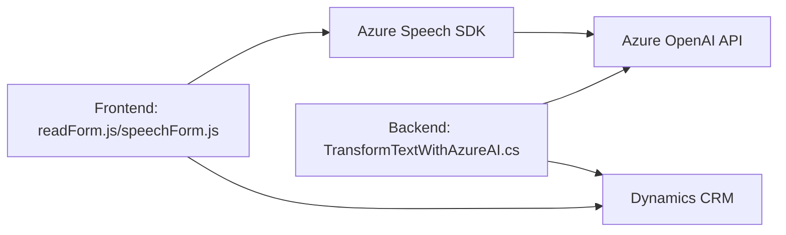

**Breve resumen técnico:**
El repositorio contiene un conjunto de archivos enfocados en la integración de funcionalidades de texto y voz con Microsoft Dynamics CRM y servicios de Azure, como Azure Speech SDK y Azure OpenAI. Incluye componentes para frontend (JavaScript), procesamiento de voz (Speech SDK) y un plugin backend en .NET (C#) para transformar texto con IA.

---

### **Descripción de arquitectura:**
La solución utiliza una **arquitectura de múltiples capas** que combina:
1. **Frontend:** Archivos de JavaScript (`readForm.js`, `speechForm.js`) para capturar y procesar datos de formularios, así como para reconocer y sintetizar voz. Integra SDK de Azure Speech para estas operaciones.
2. **Backend Plugin:** Código .NET (`TransformTextWithAzureAI.cs`) que extiende Microsoft Dynamics CRM mediante un plugin, integrando servicio de Azure OpenAI para la transformación avanzada de texto.
3. **Dependencias Externas:** Uso extensivo de APIs y SDK externos, como Azure Speech SDK y OpenAI para comunicación con servicios de IA y procesamiento de datos.

La arquitectura implementa una mezcla entre:
- **Cliente-Servidor estándar:** Repartición de tareas entre frontend y el backend.
- **SOA (arquitectura orientada a servicios):** Uso de APIs externas para tareas especializadas (e.g., reconocimiento de voz o OpenAI).

--- 

### **Tecnologías usadas:**
1. **Frontend:**  
   - **JavaScript (ES6+):** Crear funciones modulares para síntesis de voz y reconocimiento mediante Azure Speech SDK.  
   - **Dynamics CRM context:** Configuración de formularios y manipulación de datos del cliente.
   - **Azure Speech SDK:** Reconocimiento y síntesis de voz.
   - **AJAX/Promise:** Para llamadas API asíncronas.

2. **Backend Plugin:**
   - **Microsoft Dynamics CRM SDK:** Desarrollo de extensiones como plugins.
   - **ASP.NET (C#):** Plugin para ejecución de lógica empresarial personalizada en Dynamics.
   - **Azure OpenAI API:** Procesamiento avanzado de texto.
   - **Librerías .NET internas:** Inclusión de HttpClient, Newtonsoft.Json para operaciones HTTP y JSON.

3. **Patrones arquitectónicos:**  
   - **Modularidad:** Cada componente tiene una responsabilidad específica (e.g., lectura de datos, síntesis de voz, transformación de texto).  
   - **Adaptador:** Mapeo de datos transcritos a campos de formularios CRM.  
   - **Carga dinámica:** Azure Speech SDK se carga de forma dinámica en el frontend.  
   - **Promesas y asincronía:** Uso de promesas para interacción con APIs externas.  
   - **Inyección de dependencias:** En el backend plugin (.NET).  
   - **SoA (Service Oriented Architecture):** Acceso a servicios externos, como Speech SDK y OpenAI.

---

### **Dependencias o componentes externos:**
1. **Servicios de Azure:**
   - **Azure Speech SDK:** Reconocimiento y síntesis de voz.  
     - Frontend: `https://aka.ms/csspeech/jsbrowserpackageraw`
   - **Azure OpenAI API:** Procesamiento avanzado de texto con modelos GPT.
2. **Microsoft Dynamics CRM:**
   - Contexto de formularios para manipulación de datos y actualización de campos.
   - Uso del SDK de Dynamics para interacción con bases de datos y entidades.
3. **Librerías adicionales:**
   - `Newtonsoft.Json` para manipulación JSON en el backend.
   - `HttpClient` para invocar APIs externas.

---

### **Diagrama Mermaid:**

---

### **Conclusión final:**
La solución es un ejemplo excelente de integración entre frontend y backend con APIs y SDK externos. Utiliza tecnologías de Azure para reconocimiento de voz, síntesis y procesamiento avanzado de texto, integrándolo con Microsoft Dynamics CRM. La arquitectura modular y su enfoque orientado a servicios aseguran separación de preocupaciones y escalabilidad.