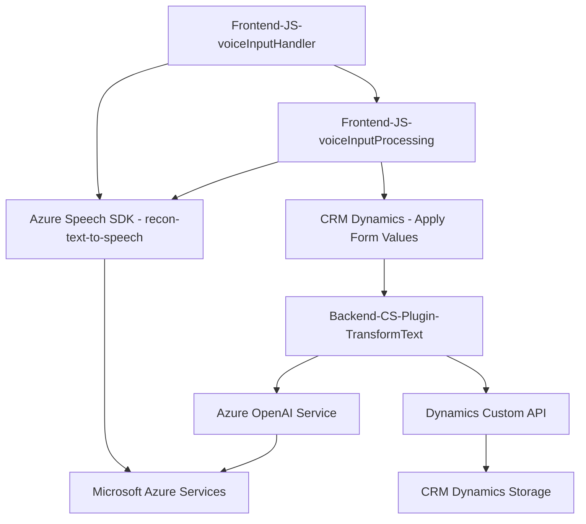

### Breve resumen técnico

El código y estructura descritos en los archivos corresponden a una **solución modular para integraciones avanzadas con servicios de Microsoft Azure**, aplicable a **CRM Dynamics 365**. La solución se especializa en procesamiento de voz y texto a través de **Azure Speech SDK**, **Azure OpenAI** y la manipulación de formularios mediante Dynamics APIs.

### Descripción de arquitectura

La arquitectura se organiza en capas y módulos enfocados en la interacción entre **frontend**, **backend** y servicios externos. Esto incluye:
1. **Frontend:** Archivos en JavaScript que manejan lógica de reconocimiento de voz y síntesis de texto mediante **Azure Speech SDK**.
2. **Plugins:** Código backend mediante **Dynamics CRM SDK**, diseñado para invocar servicios externos como **Azure OpenAI**.
   
Se sigue un enfoque **n capas**, donde cada capa tiene una responsabilidad específica: presentación (frontend), lógica del negocio (plugins), y almacenamiento/interacción externa (Azure Speech/OpenAI/Dynamics CRM).

### Tecnologías y patrones usados

#### Tecnologías
1. **Frontend**: 
   - JavaScript para manejo de eventos y lógica del cliente.
   - Azure Speech SDK.
2. **Backend/Plugins**:
   - .NET Framework (C#).
   - Dynamics CRM SDK.
   - Azure OpenAI API para procesamiento de texto.
3. **APIs externas:**
   - **Azure Speech SDK**: Reconocimiento de voz y síntesis de texto.
   - **Azure OpenAI**: Procesamiento y transformación de texto.
   - **Dynamics CRM**: Gestión y modificación de datos de formularios.

#### Patrones observados
1. **Modularidad**: Los archivos están diseñados para cumplir funciones específicas y desacopladas.
2. **Plugin Architecture**: El backend en C# implementa el patrón de plugins típicos de Dynamics CRM.
3. **Asynchronous programming**: Uso extensivo de operaciones asincrónicas tanto en JavaScript como en C# para manejar SDKs y APIs.
4. **Cargador dinámico**: Tanto en frontend como en backend se utilizan estrategias para cargar dependencias bajo demanda.

### Dependencias o componentes externos

1. **Azure Speech SDK**: Para lectura de voz y síntesis de texto.
2. **Azure OpenAI**: Para el procesamiento avanzado de texto (ej.: transformación y predicciones).
3. **Dynamics CRM SDK**: Para integración directa con formularios y APIs del sistema CRM.
4. **Microsoft SQL Server**: Documentado como dependencia en el plugin pero no claramente usado.
5. **DOM APIs de JavaScript**: Para manipulación y acceso dinámico al contenido de formularios.

---

### Diagrama Mermaid

---

### Conclusión Final

La solución está diseñada para enriquecer la interacción en sistemas CRM (como Dynamics) mediante **procesamiento inteligente de voz y texto**, integrándose eficientemente con **Microsoft Azure Services** y APIs externas. Su arquitectura en capas y uso de patrones como modularidad y cargador dinámico garantizan escalabilidad y facilidad de mantenimiento.

Sin embargo, se detectan áreas de mejora:
1. Gestión segura de credenciales (clave API de Azure expuesta).
2. Falta de robustez en manejo de errores en operaciones asincrónicas.
3. Mejor estructuración documental y control sobre la carga de dependencias dinámicas.

En todos los aspectos técnicos, es una solución sólida con potencial para aplicaciones empresariales avanzadas.