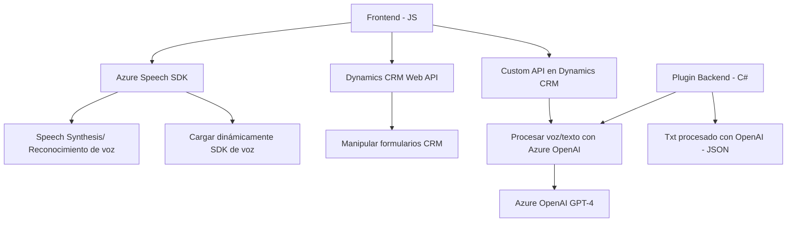

### Análisis técnico detallado

#### Breve resumen técnico:
El repositorio está orientado a cumplir con diversas integraciones entre Microsoft Dynamics CRM, Azure Speech SDK y Azure OpenAI GPT-4, para implementar funcionalidades avanzadas relacionadas con texto y voz en formularios. La solución incluye una combinación de frontend en JavaScript y plugins en backend (C#) que trabajan como un sistema fusionado.

#### Descripción de la arquitectura:
La arquitectura tiene las siguientes características:
1. **Frontend JS**:
   - Procesa formularios dinámicos en el cliente y permite tanto la conversión de contenido visual a voz como reconocimiento de voz para transcribir y automatizar acciones de formularios.
   - Está estructurado de manera modular, con funciones pequeñas, enfocadas, y reutilizables.
   - Interactúa con APIs como el SDK de Azure Speech para síntesis de voz y reconocimiento, además de llamadas API REST personalizadas.

2. **Plugin Backend (Dynamics CRM)**:
   - Implementado como un plugin para Microsoft Dynamics CRM (en C#).
   - Interactúa directamente con el servicio de Azure OpenAI GPT-4 mediante solicitudes HTTP REST, procesando texto según reglas predefinidas.
   - Actúa como un microservicio que realiza una tarea específica y derivada de eventos generados dentro del CRM.

3. **Arquitectura general**:
   - **N Capas**: El sistema es una relación de capas clásicas entre frontend (JS), integración con APIs externas (Azure SDK) y backend/plugin C# en Dynamics CRM.
   - **Modular y desacoplado**:
     - La separación de responsabilidades entre frontend y backend disminuye la dependencia directa.
     - Los servicios externos (Azure Speech y Azure OpenAI) son utilizados como componentes externos a través de patrones bien definidos (Request-Handler, Delegate).

#### Tecnologías, frameworks y patrones usados:
1. **Frontend (JavaScript)**:
   - **Frameworks:** Azure Speech SDK.
   - **Patrones usados**:
     - Delegate para cargar dinámicamente dependencias como el SDK de Azure.
     - Modularidad para funciones específicas.
     - Facade para simplificar la interacción con servicios externos.

2. **Backend (C#, Plugins en Dynamics CRM)**:
   - **Frameworks:** Dynamics CRM SDK, System.Text.Json / Newtonsoft.Json.
   - **Dependencias usadas**:
     - Azure OpenAI GPT-4 para procesamiento de texto por IA.
     - HTTP Client para solicitudes REST.
   - **Patrones usados**:
     - Plugin Pattern: Para interacción estructurada con Dynamics CRM.
     - Request-Handler: En la función dedicada a manejar comunicación con Azure OpenAI.

#### Dependencias potenciales:
1. **Externas**:
   - **Azure Speech SDK**: Para reconocimiento y síntesis de voz en el frontend.
   - **Azure OpenAI GPT-4**: Para transformación de texto en el backend.
   - **Dynamics CRM Web API**: Para manipulación de registros, integración de formularios y lógica empresarial centralizada.
   - **HTTP Client** para comunicación REST.
2. **Internas**:
   - Integración de componentes del CRM (`formContext`, `Xrm.WebApi`, etc.) para manejar lógica de actualización de formularios y entidades.

### Diagrama Mermaid **(totalmente compatible con GitHub Markdown)**:

### Conclusión final:
La solución está orientada a ofrecer funcionalidades avanzadas que combinan procesamiento de voz e inteligencia artificial con tareas empresariales en Microsoft Dynamics CRM. La implementación está dividida cuidadosamente entre el frontend (modular y centrado en la integración de voz) y el backend (plugin integrado al CRM). La arquitectura es de tipo **N capas**, con elementos descentralizados gracias al uso extensivo de servicios externos como Azure Speech SDK y Azure OpenAI GPT-4. Esto permite mantener el sistema ligero y adaptable a futuros cambios en los componentes. La implementación sigue buenas prácticas de diseño, mostrando un enfoque claro hacia modularidad y desacoplamiento en su integración con tecnología cloud.