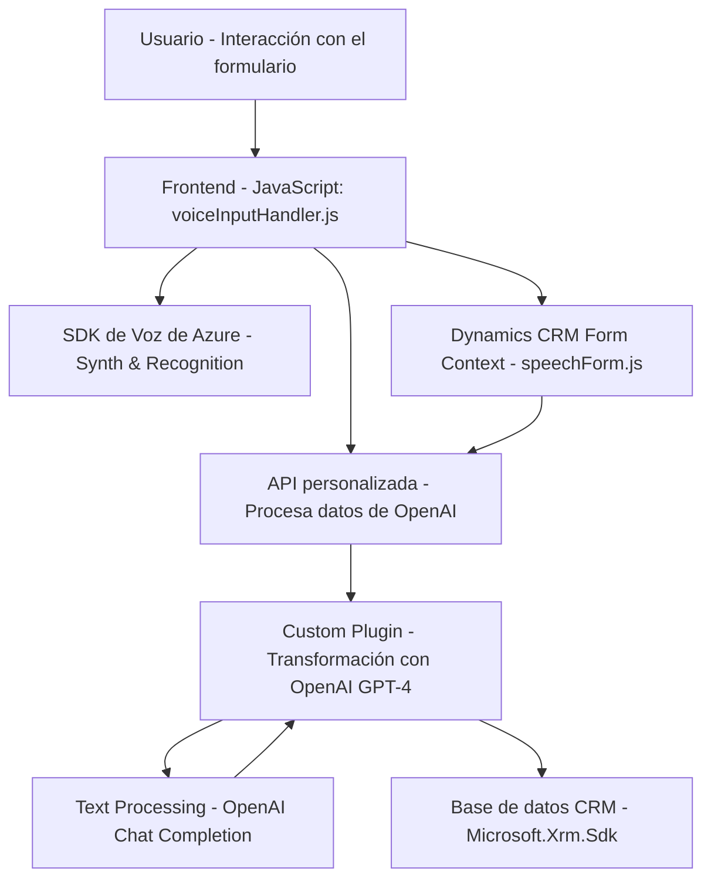

### Resumen técnico

El conjunto del repositorio parece incluir **módulos frontend y backend**, con la funcionalidad principal de integración de servicios externos como **Azure Speech SDK** y **Azure OpenAI API**. La solución está diseñada para procesar entradas, tanto visuales como auditivas, mediante generación y reconocimiento de voz, y transformar texto utilizando inteligencia artificial dentro del contexto de Microsoft Dynamics CRM.

---

### Descripción de arquitectura

**Tipo de solución:**  
- La solución se compone de una arquitectura híbrida, donde está claro el uso del frontend y de la integración de un backend basado en plugins de Dynamics CRM. Esto sugiere una combinación de **microservicios especializados** con un frontend altamente dependiente de servicios externos, creando una interfaz para una aplicación empresarial.

**Arquitectura:**  
Adopta varios patrones:
1. **Frontend:** Tiene características de una arquitectura **modular**, lo que significa que cada archivo implementa una funcionalidad específica (procesamiento de voz, síntesis o transformación de texto).
2. **Backend:** Mediante el uso de **plugins basados en eventos de Dynamics CRM** y la integración con **Azure OpenAI API**, refleja una lógica basada en **microservicios desacoplados**, que se comunican con otros componentes externos para realizar tareas específicas.
3. **Dependencia de servicios en la nube:** Azure Speech SDK y Azure OpenAI API constituyen servicios externos que alimentan las funcionalidades principales.

---

### Tecnologías usadas

**Tecnologías en el Frontend:**
1. **JavaScript:** Lenguaje de scripting para funcionalidades de procesado de voz y manejo de datos del frontend.
2. **Azure Speech SDK:** Para habilitar la síntesis y el reconocimiento de voz.
3. **REST APIs:** Para comunicación con servicios como Azure AI y Dynamics CRM.

**Tecnologías en el Backend:**
1. **Dynamics CRM Plugins (C#):** Extensiones personalizadas que interactúan con los eventos y la base de datos del sistema CRM.
2. **Azure OpenAI API:** Para transformar texto utilizando inteligencia artificial avanzada.
3. **Newtonsoft.Json:** Para parseo y manipulación de datos JSON.
4. **C#:** Como núcleo para escribir plugins y manejar operaciones asíncronas.

**Patrones arquitectónicos:**
1. **Event-driven Architecture:** Carga del Speech SDK en respuesta a eventos específicos del frontend.
2. **Lazy Loading:** Técnica para minimizar la carga inicial al cargar dinámicamente el SDK.
3. **Adapter Pattern:** Transformación y ajuste de datos para interactuar con servicios externos como Azure.

---

### Diagrama Mermaid válido para Github

---

### Conclusión final

La solución presenta un enfoque moderno y modular para el manejo de voz y texto en el contexto de aplicaciones empresariales interactivas. Con una fuerte dependencia de servicios de **nube inteligente** (Azure Speech y OpenAI), proporciona una framework escalable pero con limitaciones como la utilización directa de las claves API (potencialmente vulnerables). Es importante destacar que el backend, representado por los plugins de Dynamics CRM, utiliza una arquitectura basada en eventos y microsistemas para garantizar flexibilidad y escalabilidad.

Para mejorar la escalabilidad y robustez del sistema en entornos de producción, se recomienda:
1. **Migrar las configuraciones sensibles (como API Keys) a un vault seguro.**
2. Explorar avanzar hacia una arquitectura aún más desacoplada basada exclusivamente en microservicios o aplicar patrones de **hexagonal architecture** para un diseño limpio.

Finalmente, la solución es efectiva para escenarios empresariales donde la interacción verbal y la transformación inteligente de texto son fundamentales.