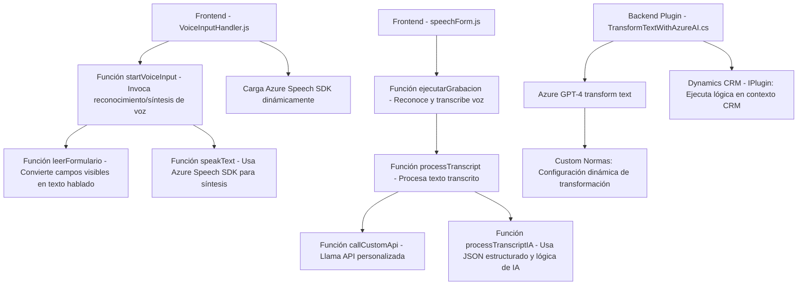

## Breve resumen técnico

La solución presentada es un sistema híbrido compuesto por un **frontend con capacidades de reconocimiento y síntesis de voz**, acompañado de un **plugin en Dynamics CRM** que utiliza servicios de **Azure AI** y **OpenAI GPT-4** para la transformación de datos. Este enfoque combina tecnologías web y de extensibilidad en plataformas empresariales.

---

## Descripción de arquitectura

1. **Frontend**:
   - Utiliza JavaScript para la integración con el **Azure Speech SDK**, permitiendo:
     - Síntesis de texto a voz.
     - Entrada por voz con reconocimiento e integración mediante manipulación de formularios.
   - Modularidad notable: funciones separadas y altamente especializadas como el manejo de campos visibles en formularios, transcripción por voz y llamadas a APIs externas.
   - Desacoplamiento de dependencias: El **Azure Speech SDK** se carga dinámicamente, reduciendo el tamaño estático del proyecto y permitiendo independencia de versiones (patrón de delegación).

2. **Plugin en Dynamics CRM**:
   - Usa el **patrón Command** mediante la interfaz `IPlugin`, ejecutándose en el contexto CRM.
   - Integra una arquitectura Gateway para conectarse al servicio **Azure OpenAI GPT-4** con un flujo de transformación de texto estructurado en JSON.
   - Encapsula toda lógica dentro de métodos estáticos e interactúa mediante APIs HTTP.

Arquitectura general:
   - **Frontend:** Modular funcional + integración dinámica con APIs externas (Azure Speech).
   - **Backend Plugin:** Hexagonal/lógica basada en servicios (Dynamics CRM plugin con interacción externa).

---

## Tecnologías usadas

1. **Frontend**:
   - **JavaScript:** Lenguaje base para la lógica del frontend.
   - **Azure Speech SDK:** Para entrada de voz y síntesis de texto a voz.
   - **HTTP WebAPI:** Llamadas a servicios externos como Custom API.

2. **Plugin Backend**:
   - **C# (.NET Framework o Core):** Desarrollo del plugin CRM.
   - **Azure OpenAI GPT-4:** Procesamiento avanzado de texto con IA.
   - **System.Net.Http:** Manejo de solicitudes HTTP.
   - Dependencias JSON: `Newtonsoft.Json`, `System.Text.Json`.

---

## Dependencias o componentes externos

1. **Frontend:**
   - **Azure Speech SDK:** Dependencia dinámica interactuando directamente con el navegador.
   - **API personalizada en CustomApi:** Existen métodos que centralizan la transformación de texto vía lógica predefinida.
   - **Form Context CRM APIs:** Métodos como `Xrm.WebApi.online` sugieren interacción directa con Dynamics CRM desde el cliente.

2. **Backend Plugin:**
   - **Microsoft Dynamics CRM SDK Interfaces:** Integración en el sistema CRM como plugin.
   - **Azure OpenAI GPT-4:** Externo para transformación de texto (requiere autenticación por clave API).

---

## Diagrama Mermaid válido para GitHub Markdown

---

## Conclusión final

El sistema presenta una **integración robusta de servicios de inteligencia artificial, reconocimiento de voz y síntesis de texto**, aplicados para mejorar la experiencia del usuario y facilitar las interacciones en un entorno CRM. Se usa una **arquitectura modular y extensible** tanto en el frontend como en el plugin del backend, lo que permite alta escalabilidad, mantenimiento y claridad en el flujo funcional.

La solución combina características modernas como la carga dinámica de dependencias, procesamiento de voz y APIs avanzadas (Azure-based AI), con eficiencia en la manipulación contextual de un sistema CRM. Sin embargo, se recomienda revisar prácticas de seguridad, específicamente en la gestión de credenciales como el API Key en el plugin.