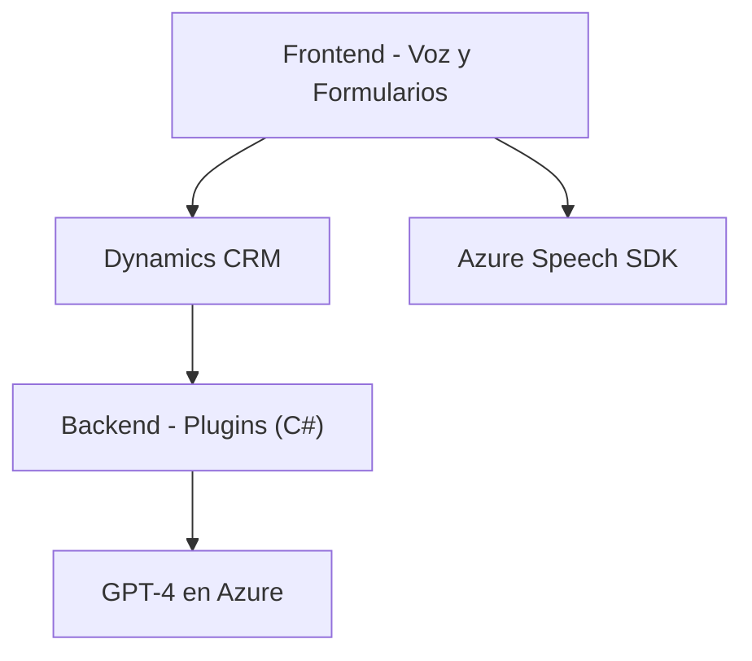

### Breve resumen técnico
El repositorio parece ser parte de una solución basada en la plataforma **Dynamics CRM** extendida con funcionalidades de reconocimiento de voz, procesamiento de formularios y procesamiento de texto mediante tecnologías de IA alojadas en Azure.

### Descripción de arquitectura
La solución sigue una **arquitectura modular** que encapsula varias responsabilidades en archivos o componentes bien definidos:
1. **Frontend (JavaScript)**: Archivos que manejan el reconocimiento de voz y la interacción con formularios en Dynamics CRM, utilizando **Azure Speech SDK**.
2. **Plugins (C#)**: Extensiones personalizadas para Dynamics CRM, implementadas como **plugins** que integran servicios de Azure (como OpenAI).
3. **Gestión híbrida**: Algunas funciones se procesan localmente en el cliente (JavaScript) y otras delegan la tarea a servicios externos de Azure o Dynamics CRM.

### Tecnologías usadas
1. **Frontend**:
   - **JavaScript**: Principal lenguaje para la interacción con formularios y reconocimiento de voz.
   - **Azure Speech SDK**: Reconocimiento de voz y síntesis de texto a voz en español (cargado dinámicamente).
   - **DOM**: Manipulación de elementos necesarios para cargar el SDK y para obtener los datos visibles de los formularios.
   
2. **Backend**:
   - **C# (.NET Framework)**: Utilizado para desarrollar plugins en Dynamics CRM.
   - **Microsoft.Xrm.Sdk**: Para interactuar con los elementos del modelo de Dynamics CRM.
   - **Azure OpenAI Service (GPT-4 API)**: Procesamiento de texto avanzado.
   - **Json Libraries**: `Newtonsoft.Json` y `System.Text.Json` para manejar datos en formato JSON.
   - **System.Net.Http**: Para integrarse con el servicio externo (Azure OpenAI API).

#### Patrones utilizados
- **Modularización**: Los archivos están diseñados para dividir sus responsabilidades (lectura de formularios, reconocimiento de voz, transformación mediante IA) en funciones especializadas.
- **Callback-based**: Uso de funciones de devolución para manejar tareas asincrónicas en el frontend (ejemplo: carga dinámica del Azure Speech SDK).
- **Proxy Service**: Se observa un patrón de proxy en el backend con Azure OpenAI Service, donde el plugin actúa como intermediario entre Dynamics CRM y la API de IA.
- **Plugin de extensibilidad**: Integración directa dentro de Dynamics CRM para extender su funcionalidad mediante plugins.

### Diagrama Mermaid

### Conclusión final
El repositorio parece ser parte de una solución extendida para **Dynamics CRM**, diseñada para potenciar la interacción mediante reconocimiento de voz y procesamiento inteligente de IA. El uso de **Azure Speech SDK** en el frontend y plugins en el backend reflejan una dependencia fuerte hacia servicios de Azure. El diseño modular facilita la separación de responsabilidades, mientras que el patrón de integración híbrida entre servicios locales y remotos optimiza la funcionalidad.