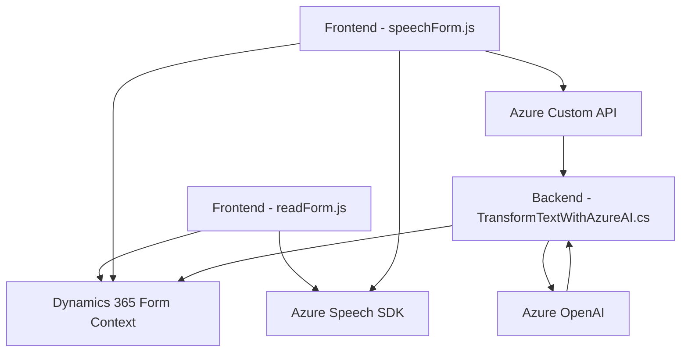

### Breve resumen técnico
La solución combina un frontend desarrollado en JavaScript con un plugin backend basado en C#. Integra servicios de Microsoft Dynamics 365 CRM y utiliza tecnologías como Azure Speech SDK y Azure OpenAI. Su función principal es proporcionar interfaces para interacción por texto y voz, procesar datos mediante reconocimiento de voz y aplicar transformaciones asistidas por IA en formularios dinámicos.

---

### Descripción de arquitectura
La solución exhibe características de una arquitectura **n-capas**:
- **Frontend:** Procesa la entrada de voz, transforma datos y gestiona la interacción del usuario con los formularios CRM.
- **Backend:** Realiza transformaciones estructuradas mediante un plugin en Dynamics CRM y comunica con Azure OpenAI API para proveer Inteligencia Artificial en la manipulación del texto de entrada.
- **Servicios externos:** Azure Speech SDK y Azure OpenAI son componentes clave que habilitan funcionalidades avanzadas a través de APIs externas.

El sistema también refleja características de **arquitectura orientada a servicios (SaaS)** por su dependencia de los servicios de Azure, y **modularidad** en la organización del código.

---

### Tecnologías usadas
1. **Frontend:**
   - JavaScript + DOM API: Para manejar los eventos y manipulación dinámica de formularios.
   - Azure Speech SDK: Reconocimiento y síntesis de voz.
   - Interaction with Dynamics 365 forms and APIs.

2. **Backend:**
   - C# + .NET Framework: Plugin para Dynamics CRM.
   - Azure OpenAI: Procesamiento mediante IA.
   - Newtonsoft.Json.Linq y System.Text.Json: Manipulación y transformación de JSON.
   - System.Net.Http: Comunicación con servicios web.

3. **Plataformas externas:**
   - Dynamics 365 CRM.
   - Azure (Speech SDK y OpenAI).

---

### Diagrama Mermaid válido para GitHub

---

### Conclusión final
La solución se clasifica como una **aplicación basada en cliente-servidor** integrada con servicios SaaS. Utiliza una arquitectura **n-capas** con un frontend modular en JavaScript y un backend de plugins desarrollado en C#. Las dependencias con Azure Speech SDK y Azure OpenAI demuestran un fuerte enfoque en la habilitación de funciones avanzadas de reconocimiento de voz e inteligencia artificial. 

Recomendaciones:
1. **Seguridad:** Externalizar credenciales para integraciones Azure.
2. **Testing:** Expandir las pruebas en la interacción entre servicios externos (SDK/API/CRM).
3. **Escalabilidad:** Adoptar contenedores o funciones basadas en Cloud (e.g., Azure Functions) para la ejecución más eficiente del plugin.