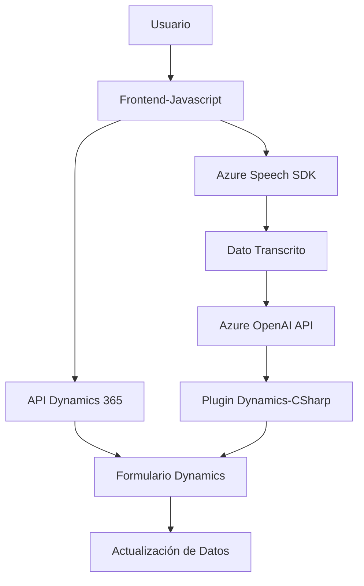

### Análisis Técnico Completo

#### **Breve Resumen Técnico**
El repositorio parece formar parte de una solución que integra procesamiento de texto y comandos de voz con una aplicación CRM, específicamente Dynamics 365. Esta solución combina tecnologías de frontend con JavaScript y un backend basado en un plugin de C#. Utiliza servicios en la nube como Microsoft Azure Speech SDK para síntesis/reconocimiento de voz y Azure OpenAI para procesamiento de lenguaje. La arquitectura muestra integración entre Dynamics 365, APIs externas y módulos de frontend, ajustándose bien al patrón de una arquitectura de **microservicio orientada a eventos**.

---

#### **Descripción de Arquitectura**
1. **Tipo de Solución**: 
   - Es un **sistema híbrido** con componentes frontend para la interfaz de usuario y lógica dinámica, comunicación con un **API** interna (Dynamics 365 Web API), y un plugin backend basado en **Azure AI vía Azure OpenAI**.
   - Usualmente implementado como un sistema SaaS altamente configurable.

2. **Patrones y Diseño**:
   - **Microservicio**: Uso de servicios externos como Azure Speech y Azure OpenAI API para realizar tareas específicas e independientes.
   - **Callback y manejo asíncrono**: Implementado en módulos de frontend para garantizar que las tareas se procesen en cadena (SDK, APIs).
   - **Orientación al cliente**: Procesamiento de voz/IA enfocado en mejorar la experiencia del usuario en la interacción con formularios Dynamics.
   - **Modularidad y separación de responsabilidades**: Cada archivo cumple una función específica (reconocimiento de voz, procesamiento de texto, integración con Dynamics).

3. **Arquitectura Global**:
   - **Frontend**: Lógica modular con JavaScript que conecta dinámicamente a SDK y APIs de Azure.
   - **Middleware/API Gateway**: Llamadas asíncronas entre frontend, APIs personalizadas de Dynamics y servicios externos de Azure OpenAI.
   - **Backend**: Plugin C# desarrollado como una extensión del contexto de Dynamics 365.

---

#### Tecnologías Usadas
1. **Frontend**:
   - JavaScript: Implementación de funciones modulares.
   - Azure Speech SDK: Procesamiento de síntesis de voz y comandos.
   - Parrilla dinámica de formularios para manejar campos visibles.
   - Manejo de datos estructurados (JSON).

2. **Backend**:
   - C#: Desarrollo de plugins integrados con Dynamics 365.
   - Azure OpenAI API vía `HttpClient`: Procesamiento avanzado de texto/IA.
   - SDK de Dynamics (`Microsoft.Xrm.Sdk`): Acceso y manipulación de datos en el CRM.
   - `Newtonsoft.Json` y `System.Text.Json`: Manejo de operaciones JSON.

3. **Sistema en la Nube**:
   - Integraciones con servicios de Microsoft Azure:
     - Speech SDK: Reconocimiento y síntesis de voz.
     - Azure OpenAI: Procesamiento de texto mediante modelos generativos avanzados.

---

#### Dependencias o Componentes Externos
- **Microsoft Azure Speech SDK**: Focalizado en síntesis de voz y entrada auditiva.
- **Azure OpenAI API**: Procesamiento de texto y respuestas más complejas basadas en IA.
- **Dynamics 365 Web API**: Para comunicación directa con datos del CRM.
- **Libraries**: NuGet paquetes para manipular JSON (Newtonsoft.Json, System.Text.Json).

Estos servicios externos destacan por ser escalables y bien respaldados, optimizando la funcionalidad del sistema en torno a su capacidad cloud-first.

---

#### Diagrama Mermaid

---

### Conclusión Final
El diseño del sistema refleja una arquitectura modular basada en microservicios. Combina funcionalidades frontend dinámicas conectadas a SDKs de síntesis de voz y reconocimiento, mientras que el plugin backend ofrece integración con Dynamics 365 y potencia el procesamiento de datos usando Azure OpenAI. Esta solución es ideal para entornos corporativos que utilizan Dynamics 365 y buscan mejorar la interacción entre usuario y CRM mediante comandos de voz e inteligencia artificial. Sin embargo, el manejo de API keys directamente en el código requiere ser mejorado para garantizar la seguridad del sistema.