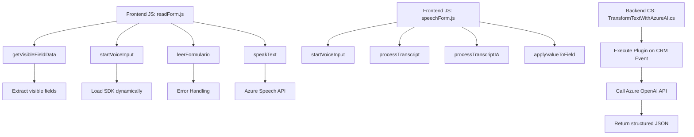

### Breve resumen técnico

El repositorio analiza el uso de integración de voz mediante Azure Speech SDK en aplicaciones frontend y backend conectadas con Microsoft Dynamics CRM. Se divide en tres puntos de interacción:

1. **Frontend**:
   - Archivos para procesamiento de datos del formulario (campos visibles, atributos), reconocimiento de voz y conversión de texto a voz, así como grabación y síntesis en tiempo de ejecución.
   - Uso de SDKs dinámicos para servicios relacionados con Azure Speech, con callbacks y mapeos para transformar y aplicar datos procesados al formulario.

2. **Backend**:
   - Un plugin de Dynamics CRM que implementa lógica para transformar datos textuales mediante la API de Azure OpenAI. El texto proporcionado es procesado según reglas específicas y devuelto como JSON.

---

### Descripción de arquitectura

El sistema puede clasificarse como una **híbrida basada en servicios distribuidos**. Aunque no es un sistema basado completamente en microservicios, utiliza principios de integración externa para dividir las responsabilidades mientras emplea un enfoque modular.

- **Frontend**:
  - Modelo de arquitectura basado en lógica funcional y modularidad. Las funciones están separadas por responsabilidad como "Entrada de voz", "Procesamiento de datos visibles" y "Lectura de texto mediante síntesis de voz".
  - Utiliza dinámicamente una dependencia externa (Azure Speech SDK), lo que proporciona flexibilidad en su diseño a través de la carga condición/reactiva.
  - Puede integrarse como un control de formulario en aplicaciones CRM o Dynamics, funcionando dentro del ecosistema del cliente.

- **Backend**:
  - Utiliza una variante del patrón plugin como extensión a eventos específicos del sistema Dynamics CRM.
  - Arquitectura orientada a servicios (SOA): el backend actúa como intermediario entre el CRM y el servicio de Azure OpenAI.
  - La separación entre lógica de "entrada y salida" del plugin garantiza una integración limpia entre los datos del formulario del CRM y el procesamiento de texto en la nube.

En conjunto, el sistema tiene características de **arquitectura modular** para interacción entre frontend, backend y APIs externas.

---

### Tecnologías, frameworks y patrones usados

#### **Frontend:**
1. **Lenguaje:** JavaScript.
2. **Frameworks/SDKs:**
   - Azure Speech SDK (para síntesis de texto a voz y entrada por reconocimiento de voz).
   - DOM API estándar para manipulación de elementos del formulario.
3. **Patrones:**
   - **Modularidad**: Cada función en archivos JS tiene un único propósito.
   - **Dynamic Dependency Loading**: Azure Speech SDK se carga dinámicamente según necesidad.
   - **Callback Pattern**: Uso de funciones para manejar eventos asíncronos.
   - **Mapper Pattern**: Mapeo de campos visibles a claves internas en formularios.

#### **Backend:**
1. **Lenguaje:** C#.
2. **Frameworks/Librerías:**
   - Microsoft Dynamics SDK (para integrar el plugin),
   - Azure OpenAI API,
   - Newtonsoft.Json para deserialización/serialización de JSON,
   - System.Net.Http para consumo de APIs.
3. **Patrones:**
   - **Plugin para Dynamics**: Extensión de lógica basada en eventos del sistema CRM.
   - **SOA (Service-Oriented Architecture)**: Integración de servicios externos.
   - **Error Handling**: Robustez en gestión de excepciones para manejo de problemas con la API.

---

### Diagrama **Mermaid** compatible con GitHub Markdown

---

### Conclusión final

Este repositorio implementa una solución de **integración dinámica de servicios de nube** en aplicaciones conectadas mediante **Microsoft Dynamics CRM**, con concentraciones de procesamiento en frontend y backend. El uso de Azure Speech y OpenAI para funciones como síntesis de voz, reconocimiento de texto y transformación de información demuestra su enfoque hacia **aplicaciones distribuidas con conexión en tiempo real**.

La estructura general está optimizada para integrarse en entornos de CRM, adoptando una interacción entre **Microcomponentes funcionales** y APIs habilitadas en la nube, manteniendo separación clara de responsabilidades y una arquitectura modular sencilla pero efectiva.