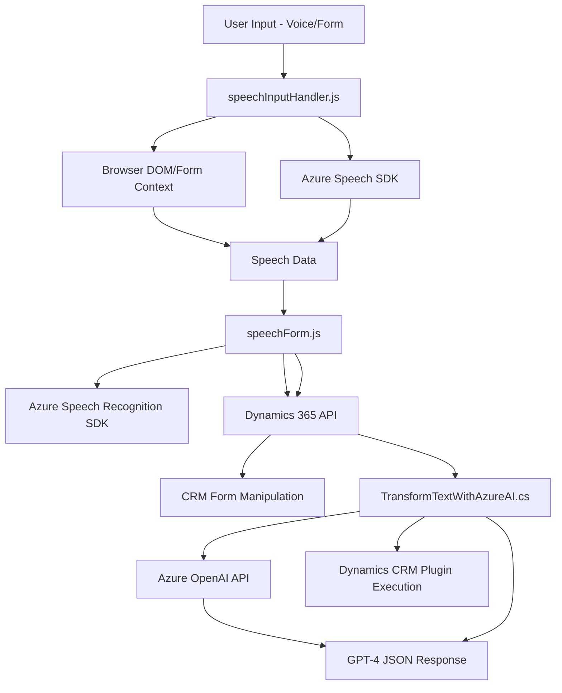

### Breve Resumen Técnico:
Este repositorio parece ser una solución avanzada ligada a la manipulación y automatización de formularios y comandos de voz en Dynamics 365. Utiliza Inteligencia Artificial (Azure OpenAI y Azure Speech SDK) para traducir voz a texto y viceversa, transformando los datos en formatos aplicables directamente al contexto del CRM. La integración se extiende a través de plugins personalizados para la interacción con servicios externos como APIs y modelos de IA.

---

### Descripción de la Arquitectura:
1. **Tipo de Solución**: Esta solución representa un **ecosistema de servicios avanzados**, con:
   - **Frontend dinámico** para manipular datos en formularios basados en voz.
   - **Backend** desarrollado como un **plugin para Dynamics CRM** con interacción directa en la lógica de negocio.
   - **Microservicio** externo integrado mediante API de Azure OpenAI para transformar datos.

2. **Arquitectura General**:
   - **Modular y desacoplada**, con un enfoque de separaciones entre:
     - **Frontend** (gestor de entrada/salida en formularios, voz y manejo DOM).
     - **Servicio de IA** (capacidad extensiva para reconocimiento de voz, transformación mediante Azure Speech y OpenAI).
     - **Plugin Backend CRM** que emplea la interfaz `IPlugin` de Dynamics 365.
   - **Patrón de n capas**: Organizador del flujo entre capas (frontend, servicio AI, y plugin para backend).
   - Hay indicios de principios **hexagonales** al implementar integración basada en dependencias desacopladas y conectores.

3. **Patrones Utilizados**:
   - **Delegación funcional** para el frontend (métodos divididos por funcionalidad específica).
   - **Integración con SDK y APIs externas**: Uso de Azure Speech SDK y OpenAI.
   - **Carga dinámica de dependencias** con el método encargado de garantizar la disponibilidad del SDK.
   - **Event-driven architecture** a través de callbacks y promesas en operaciones asincrónicas (como carga del SDK y procesamiento de respuesta de APIs).

---

### Tecnologías y Frameworks Usados:
1. **Frontend**:
   - **JavaScript**: Incorporación de lógica especializada para voz y gestión de formularios en Dynamics 365.
   - **Azure Speech SDK**: Procesamiento de voz a texto y síntesis de texto como audio.
   - **DOM Manipulation** para obtener y modificar valores en visualización del usuario.

2. **Backend Plugin**:
   - **Dynamics 365 SDK**:
     - `IPlugin` para implementar la lógica en plugins personalizados.
     - Uso de clases de entidades, contexto de ejecución y servicios.
   - **C#**: Lenguaje de backend para la integración con Dynamics CRM.
   - **Azure OpenAI API**: Generación de texto transformado en JSON mediante `model gpt-4`.

3. **Dependencias Externas**:
   - **Newtonsoft.Json**: Manipulación de JSON en el plugin.
   - **System.Net.Http** y **System.Text.Json**: Manejo de solicitudes API en Azure OpenAI.

---

### Diagrama Mermaid:

---

### Conclusión Final:
La solución presentada implementa una arquitectura moderna y avanzada, alineándose con paradigmas de **n capas** y conceptos desacoplados con SDK y APIs externas. La integración entre el frontend, IA de Azure Speech y OpenAI, y el plugin de CRM permite manejar formularios de Dynamics 365 mediante comandos de voz con extensiones automatizadas. Aunque la solución puede ser algo compleja, está optimizada para dar soporte a flujos automatizados de voz y datos en entornos empresariales robustos como Dynamics 365.