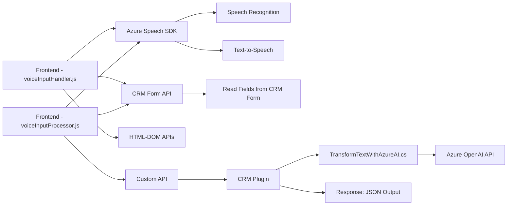

### Breve resumen técnico:
El repositorio incluye funcionalidades para procesamiento de voz (lectura y síntesis) y generación de transcripciones estructuradas usando servicios de Azure (Speech SDK y OpenAI API). Las soluciones están integradas con formularios de un CRM, probablemente Microsoft Dynamics 365. El diseño sigue patrones modulares y aprovecha el uso de SDKs externos para la operación con servicios de inteligencia artificial (IA) en el reconocimiento y transformación de datos.

---

### Descripción de arquitectura:
Esta solución emplea una arquitectura **n capas**. El frontend interactúa con los usuarios y extiende la funcionalidad CRM para grabar voz, asignar transcripciones a formularios y realizar síntesis de voz, mientras que el backend centraliza la lógica de transformación avanzada de datos vía Azure OpenAI API.

1. **Frontend Layer:**
   - Implementado en JavaScript, procesando datos del formulario y manejando el reconocimiento y síntesis de voz.
   - Usa el Azure Speech SDK como dependencia externa.
   - Incluye flujo condicional IA/manual para procesamientos avanzados.

2. **Backend Layer (Plugin para CRM):**
   - Implementado en C# dentro del ecosistema de Microsoft Dynamics CRM.
   - Encapsula lógica de integración con Azure OpenAI API, transformando un texto en JSON estructurado.
   - Usa patrones comunes en el desarrollo de plugins para Dynamics, como validación de inputs y generación de outputs.

---

### Tecnologías usadas:
1. **Frontend layer:**
   - **JavaScript:** Lenguaje base de los clientes para operaciones en el navegador.
   - **Azure Speech SDK:** Para funcionalidades como síntesis de voz y reconocimiento de voz.
   - **HTML/DOM APIs:** Manipulación de formularios visibles en CRM.

2. **Backend layer (Plugin en CRM):**
   - **C# (.NET Framework):** Lenguaje usado para implementar el plugin.
   - **Microsoft Dynamics CRM SDK:** Para manipulación de datos del CRM y contexto de ejecución.
   - **Azure OpenAI API:** Servicio externo para transformar texto con un modelo de inteligencia artificial.
   - **Newtonsoft.Json / System.Text.Json:** Librerías para manejar datos JSON.

---

### Diagrama Mermaid compatible con GitHub Markdown:

---

### Conclusión final:

El repositorio representa una solución **híbrida** basada en la integración eficaz de servicios de inteligencia artificial de **Azure** en un entorno de **Microsoft Dynamics CRM**. 

#### Características principales:
1. **Frontend:** Implementa el reconocimiento y síntesis de voz mediante el Azure Speech SDK, realiza la asignación de datos transcritos en formularios CRM y coordina entre módulos de procesamiento en tiempo real.
2. **Backend Plugin:** Opera como intermediario para la transformación avanzada del texto usando el Azure OpenAI API y responde en formato JSON para uso programático dentro del CRM.

#### Arquitectura:
El diseño general clasifica como **n capas** debido a la diferenciación de tareas entre la interacción de frontend, procesamiento backend en el CRM y servicios externos para IA.

La solución está bien estructurada, pero puede beneficiarse de mejoras en la gestión de errores y validaciones de datos.