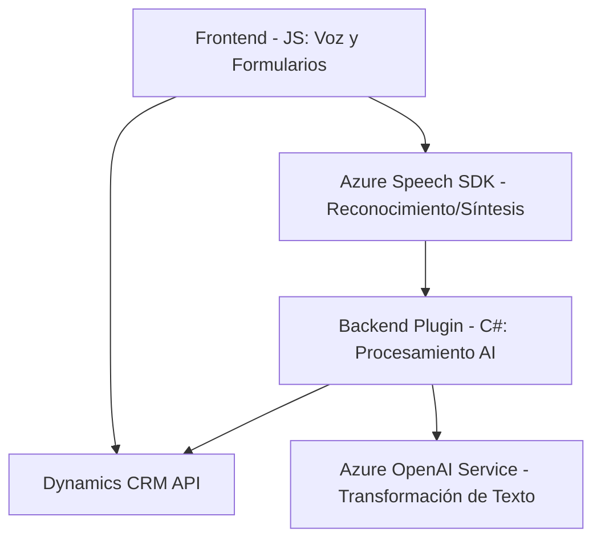

### **Breve Resumen Técnico**
El repositorio contiene módulos para procesar comandos de voz y textos relacionados con formularios en un sistema CRM. Está compuesto por componentes para frontend en JavaScript y un plugin en C# que interactúa con un sistema de backend para integrar servicios de Azure Speech y Azure OpenAI. Se emplea para mejorar la usabilidad mediante entrada y salida de voz, lectura de datos visibles y procesamiento automatizado de texto.

---

### **Descripción de Arquitectura**
La solución está diseñada sobre una arquitectura **híbrida cliente-servidor**. El frontend usa JavaScript para ejecutar la lógica en el navegador del cliente, mientras que el backend utiliza un plugin en C# acoplado al framework de Dynamics CRM. Los componentes están conectados mediante servicios de Azure que implementan reconocimiento de voz (Azure Speech SDK) y procesamiento de texto (Azure OpenAI). Aunque los módulos representan capas independientes, la arquitectura global se alinea con un modelo **n-capas**, separando servicios, lógica de negocio y presentación.

---

### **Tecnologías Usadas**
1. **Frontend:**
   - **JavaScript:** Para lógica de entrada de voz, procesamiento de formularios y texto.
   - **Azure Speech SDK:** Servicio de reconocimiento y síntesis de voz.
   - **Xrm.WebApi:** API nativa de Dynamics CRM para llamadas asincrónicas.

2. **Backend:**
   - **C#:** Para definir plugins en sistemas Dynamics CRM.
   - **Azure OpenAI Service:** Para transformar texto con modelos GPT.
   - **Newtonsoft.Json:** Manejo de estructuras JSON en el plugin.
   - **Framework Dynamics CRM SDK:** Integración directa con el sistema para manipulación de datos.

---

### **Diagrama Mermaid**

---

### **Conclusión Final**
La solución es una integración cliente-servidor que enriquece la funcionalidad de un sistema CRM mediante servicios de voz y procesamiento de texto soportados por Azure. El frontend gestiona interacción directa con los usuarios, mientras que el backend opera transformaciones complejas de datos con servicios externos. La arquitectura emplea capas diferenciadas, modularidad y servicios orientados a eventos, facilitando la extensión y el mantenimiento.