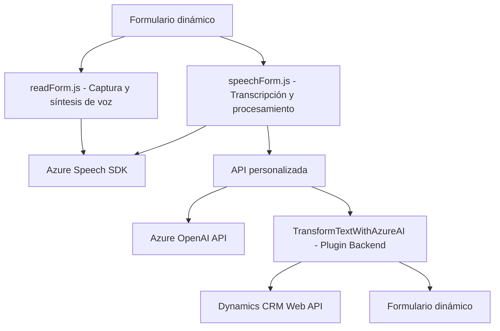

### Breve resumen técnico
El repositorio consiste en una solución híbrida que integra una serie de funcionalidades relacionadas con la manipulación de formularios web, la síntesis de voz, transcripción y procesamiento de texto avanzado mediante Azure AI y Dynamics CRM. Incluye tres tipos de componentes:
1. **Frontend (readForm.js y speechForm.js)**: Implementación en JavaScript para la interacción con formularios dinámicos, síntesis de voz, y transcripción mediante el Azure Speech SDK.
2. **Plugin para Dynamics CRM (.NET)**: Transformación de texto usando la API de Azure OpenAI.
3. **Backend**: Aunque no se detalla, se deduce al menos una dependencia con un servicio API personalizado.

### Descripción de arquitectura
La arquitectura general es **modular basada en n capas**, conformada por un frontend responsable de la interacción con interfaces de usuario y dos componentes independientes: 
1. **Frontend JS** que combina lógica de cliente para captura/síntesis/transcripción de datos y comunicación con APIs externas.
2. **Backend CRM Plugin** como un middleware orientado a eventos para integrar API externa (Azure OpenAI) y extender las capacidades de Dynamics CRM.

Se observa una orientación hacia una arquitectura **event-driven** en el plugin para Dynamics, mientras que el frontend emplea **modularidad y componentes desacoplados**. Sin embargo, no hay evidencia de una verdadera arquitectura de microservicios ni del uso explícito de patrones como hexagonal.

### Tecnologías utilizadas
- **Frontend**:
  - **JavaScript**: Código nativo sin uso de frameworks JS avanzados.
  - **HTML/CSS**: Deducido como el formato base del formulario dinámico.
  - **Azure Speech SDK**: Para captura y síntesis de audio.
  - **Dynamics Form API (`Xrm`)**: Para manipular y acceder a datos del formulario.
  - **REST API**: Para comunicación con el backend personalizado.
  
- **Backend**:
  - **C# (.NET Framework)**: Implementación del plugin.
  - **Microsoft.Xrm.Sdk Library**: Integración con Dynamics CRM.
  - **Newtonsoft.Json / System.Text.Json**: Procesamiento avanzado de JSON.
  - **Azure OpenAI API**: Transformación semántica del texto.

### Dependencias o componentes externos presentes
- **Azure Speech SDK**: Provee las herramientas de síntesis de voz y transcripción.
- **Azure OpenAI API**: Transforma texto en JSON bajo normas específicas.
- **Dynamics CRM APIs**: Manejo del contexto de entidades, controles y eventos del formulario.
- **API personalizada (trial_TransformTextWithAzureAI)**: Procesamiento del texto transcrito hacia una lógica específica de negocio.
- **Web API de Dynamics**: Consultas relacionadas (lookup y entidades principales).

### Diagrama Mermaid 100 % Compatible con GitHub Markdown

### Conclusión final
El repositorio muestra una solución híbrida con módulos frontend que interactúan con formularios dinámicos y tecnologías de voz, mientras el backend se centra en la transformación de texto usando Azure OpenAI y Dynamics CRM. La arquitectura modular basada en **n capas** permite separar las responsabilidades en formularios dinámicos (interfaz), transcripción/síntesis (lógica cliente) y procesamiento avanzado (backend). Sin embargo, hay puntos de mejora:
1. **Seguridad**: Externalizar claves sensibles y adoptar mejores prácticas de gestión de configuraciones.
2. **Escalabilidad**: Mejorar llamadas bloqueantes en el plugin para mayor eficiencia bajo alta carga.
3. **Tráfico optimizado**: Considerar caching en API repetitivas (lookup).

Esta solución es robusta, adaptable y adecuada para entornos dinámicos como CRM y casos de uso orientados a interacción humana avanzada.