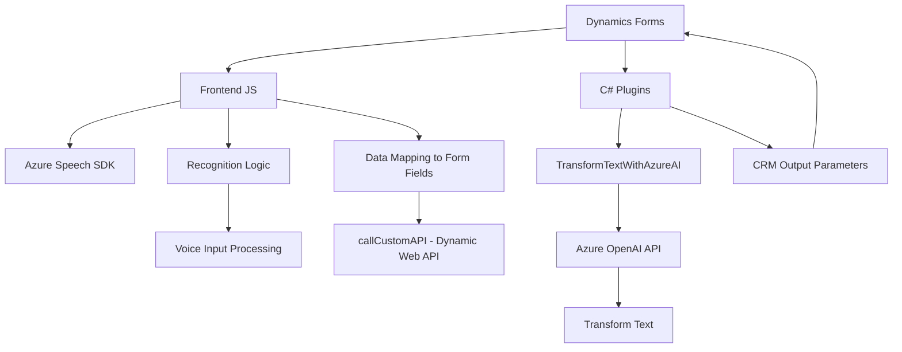

### Breve resumen técnico

El repositorio contiene soluciones relacionadas con la **gestión y procesamiento de datos en formularios**, además de incorporar capacidades avanzadas de **voz e inteligencia artificial** mediante la integración con **Azure Speech SDK** y **Azure OpenAI**. Los archivos están distribuidos en categorías de frontend (JavaScript) y plugins (C#) para extender Dynamics 365, sugiriendo una arquitectura híbrida que combina desarrollo de cliente y extensiones del backoffice.

---

### Descripción de arquitectura

1. **Arquitectura frontend**: 
   - Orientada a la interacción con formularios y la integración de voz mediante **Azure Speech SDK**. La estructura modular y las funciones sugieren una arquitectura basada en responsabilidades específicas para el consumo de APIs externas y procesamiento de datos.

2. **Arquitectura backend** (C#):
   - Utiliza **plugins de Dynamics 365**, lo que implica una arquitectura basada en extensibilidad de CRM. Está integrada con servicios externos como **Azure OpenAI API** para aplicar inteligencia artificial en la transformación de datos.

3. **Patrones**:
   - **Event-Driven**: En el frontend, el flujo está basado en eventos disparados por interacción con formularios y procesamiento de reconocimiento de voz.
   - **Separation of Concerns (SoC)**: Las funcionalidades están divididas en tareas específicas, como procesamiento de datos, integración con APIs externas e interacción con formularios.
   - **Capa de integración externa**: Uso de SDK y API (Azure Speech y OpenAI) para extensibilidad avanzada.

4. **Tipo de arquitectura**:
   - Combina **arquitectura de n-capas** para el frontend (UI) y opciones de servicio externo en el backend con plugins, acercándose a una **arquitectura microfrontend** complementada por extensibilidad de Dynamics utilizando **Microservices** (Azure OpenAI).

---

### Tecnologías usadas

1. **Frontend (JavaScript):**
   - **Azure Speech SDK**: Reconocimiento y síntesis de voz.
   - **Xrm.WebApi**: Para la interacción directa con Dynamics 365.
   - **JavaScript**: Base del cliente para manejar lógica asincrónica y modularidad.

2. **Backend (C# Plugins):**
   - **Microsoft Dynamics 365 Developers Toolkit**: Desarrollo de extensiones para CRM.
   - **Microsoft.Xrm.Sdk**: Interacciones con el modelo de datos de Dynamics.
   - **Newtonsoft.Json**: Manipulación JSON.
   - **System.Net.Http**: Para realizar llamadas REST a APIs externas.
   - **Azure OpenAI API**: Servicio de IA que aplica transformación textual.

---

### Dependencias o componentes externos presentes

- **Azure Speech SDK** (`window.SpeechSDK`): Para reconocimiento y síntesis de voz.
- **Azure OpenAI API**: Interacción externa para procesamiento de datos.
- **Dynamics 365 SDK**: Gestión de extensiones a nivel de CRM y formularios dinámicos.
- **Third-party libraries**:
  - Newtonsoft.Json.Linq: Manipulación robusta de JSON.
  - System.Net.Http: Comunicación HTTP con servicios externos.

---

### Diagrama Mermaid válido para GitHub

---

### Conclusión final

El repositorio presenta una solución con una arquitectura distribuida que combina manejo de frontend (para interacción con formularios y voz) y extensiones backend (para procesamiento avanzado mediante Azure OpenAI). Los patrones utilizados aseguran modularidad, escalabilidad y facilidad de integración con servicios en la nube, como Azure. La integración con Dynamics 365 lo posiciona como una solución adaptable para negocios que requieren automatización e inteligencia en sus operaciones CRM.