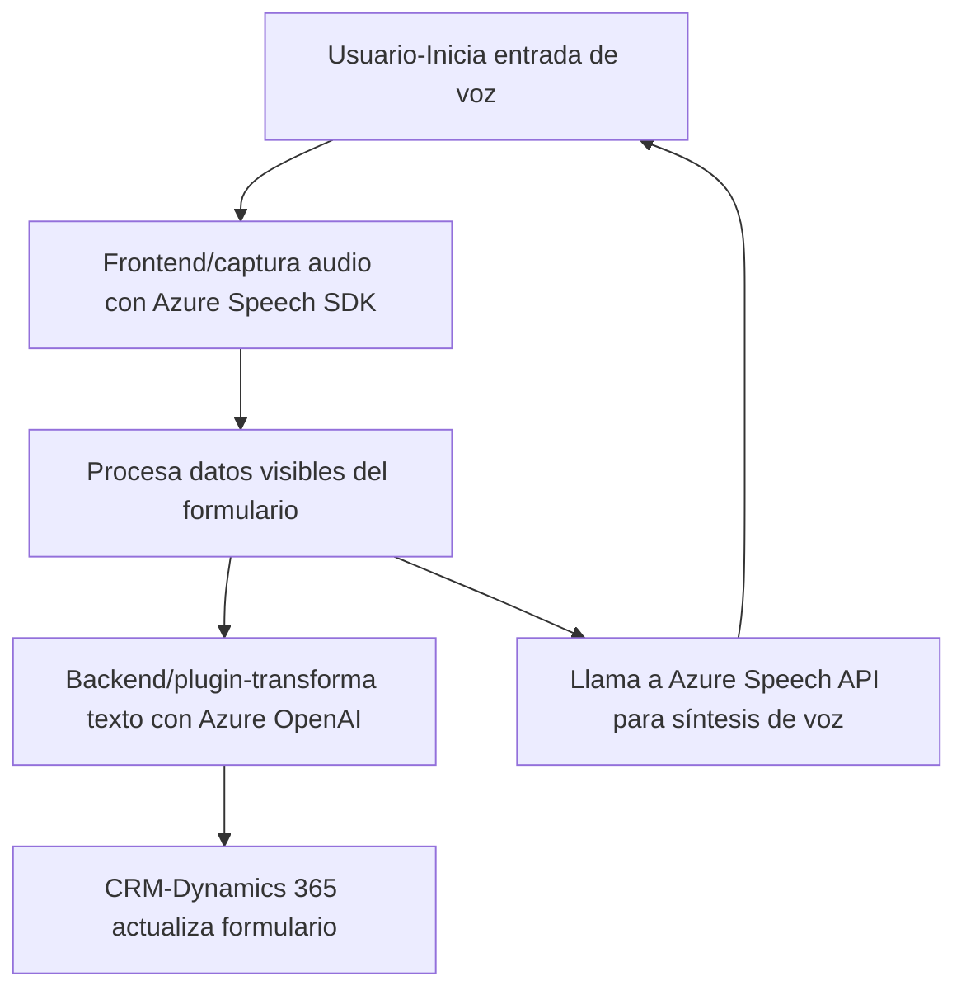

### Breve Resumen Técnico

El repositorio define una solución integrada para Microsoft Dynamics 365 que utiliza múltiples enfoques tecnológicos:
1. **Frontend basado en JavaScript**: Especializado en entrada de voz y lectura de datos en formularios mediante **Azure Speech SDK**.
2. **Plugins (.NET)**: Implementados en C# para procesar y transformar datos utilizando **Azure AI/OpenAI**.
3. **Integración con APIs**: Interacción con servicios Azure para procesamiento de voz, reconocimiento y transformación inteligente de datos.

---

### Descripción de Arquitectura

La solución implementa una combinación de varios enfoques arquitectónicos:
1. **N Capas**: Separación clara entre la capa de presentación (frontend), capa de negocio (lógica de procesamiento en plugins), y capa de integraciones (Azure AI).
2. **Integración de Servicios Externos (SOA)**: Uso de APIs externas como Azure Speech y OpenAI para delegar funcionalidades especializadas.
3. **Event-driven Architecture**: En el frontend, se desencadenan acciones basadas en eventos como el inicio de entrada de voz, la carga del SDK, o el procesamiento de comandos reconocidos.
4. **Modularidad y abstracción**: Cada funcionalidad se organiza en métodos y clases con responsabilidades específicas, lo que facilita su mantenibilidad.

---

### Tecnologías Usadas

1. **Frontend**:
   - Lenguaje: JavaScript.
   - Framework: Microsoft Dynamics 365.
   - SDK: Azure Speech SDK.
   - API: Dynamics Web API, Azure Speech API.

2. **Backend (Plugins)**:
   - Lenguaje: C#.
   - Frameworks y Librerías:
     - `Microsoft.Xrm.Sdk`: Para interacción con Dynamics CRM.
     - `Newtonsoft.Json.Linq`: Procesamiento JSON.
     - `System.Net.Http`: Peticiones HTTP.
     - `System.Text.Json`: Serialización y deserialización de datos.
   - API: Azure OpenAI.

3. **Dependencias externas**:
   - Azure Speech SDK (voz y entrada).
   - Azure OpenAI API (transformación avanzada de texto).

---

### Diagrama Mermaid válido para GitHub

---

### Conclusión Final

La solución presentada evidencia integración robusta con Microsoft Dynamics 365, realizando tareas avanzadas de entrada de voz y transformación de datos mediante APIs de Azure (Speech y OpenAI). Su arquitectura destaca por ser modular y orientada a eventos, con separación escalonada de responsabilidades entre frontend, backend, y servicios externos. Esto asegura alta escalabilidad, reutilización y soporte para casos de procesamiento en tiempo real.