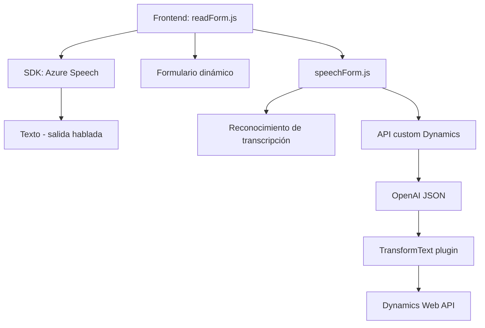

### Breve resumen técnico
La solución presentada utiliza componentes basados en JavaScript y C# para integrar la síntesis y reconocimiento de voz en formularios dinámicos, procesando entrada/salida mediante servicios de **Azure Speech SDK** y **Azure OpenAI**. Se encuentra orientada al trabajo interactivo y basado en IA, con un fuerte enfoque cloud-first.

### Descripción de arquitectura
La arquitectura de esta solución es **n-capas**, pero con integración de servicios externos que aportan capacidades específicas como síntesis de voz y procesamiento de texto estructurado. La interacción con APIs en **Dynamics 365** y **Azure AI** refuerza la modularidad y separación de responsabilidades. Los archivos JS actúan como controladores funcionales en la capa de presentación, mientras que el plugin en C# pertenece a la capa de lógica de negocio (back-end).

### Tecnologías usadas
1. **Frontend/Javascript**:
   - **Azure Speech SDK** para síntesis y transcripción de voz.
   - Manipulación de DOM/formularios con `executionContext`.
   - Promesas/callbacks para gestionar lógica asíncrona.

2. **Back-End/C#**:
   - API de **Azure OpenAI** para estructurar texto con inteligencia artificial.
   - **Dynamics 365 SDK** (`Microsoft.Xrm.Sdk`) para crear plugins integrados con formularios CRM.

3. **Patrones**:
   - **Facade Pattern**: Simplifica interacciones con APIs mediante encapsulación de lógica compleja.
   - **cloud-first**: Todo el procesamiento crítico se delega en servicios externos de Azure.
   - **Observer Pattern**: Uso de eventos/callbacks para gestionar flujos asincrónicos en frontend.
   - **Plugin Pattern**: Implementación de `IPlugin` en Dynamics CRM.

### Dependencias o componentes externos
1. **Azure Speech SDK**:
   - Genera texto hablado y captura/transcripción de voz.
   - Requiere una clave y región configuradas.
   
2. **Azure OpenAI**:
   - Procesa texto libre y devuelve JSON estructurado aplicando reglas específicas.
   
3. **Dynamics 365 API**:
   - Integración directa con API Web y trabajo en la ejecución de plugins en CRM.
   
4. **Bibliotecas .Net**:
   - `Newtonsoft.Json` para manipulación avanzada de JSON.

### Diagrama Mermaid

### Conclusión final
La solución está claramente orientada a **formularios dinámicos con capacidades avanzadas de interacción** para experiencia de usuario mejorada mediante voz y texto, apoyándose en servicios externos (Azure Speech y OpenAI). Su arquitectura modular y patrones de diseño permiten gran flexibilidad, escalabilidad y separación de responsabilidades. Aunque funcionalmente completa, podría mejorarse la gestión de API Key y configuración externa para cumplir mejores prácticas de seguridad.