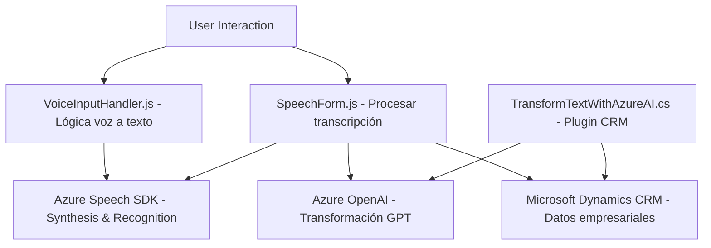

# Análisis Técnico del Repositorio

## Breve Resumen Técnico
El repositorio abarca tres archivos con funcionalidades distintas:
1. **frontend/JS/readForm.js:** Procesa formularios dinámicos y sintetiza texto a voz con Azure Speech SDK.
2. **frontend/JS/speechForm.js:** Vincula transcripción por voz con formularios, manejando procesamiento manual e IA.
3. **Plugins/TransformTextWithAzureAI.cs:** Plugin basado en .NET para Dynamics CRM, conecta OpenAI GPT para transformar texto con normas específicas.

El proyecto integra APIs de Microsoft Azure para Speech y OpenAI, junto con capacidades de Microsoft Dynamics CRM, focalizándose en interacción dinámica con formularios web y consumidores de plugins en sistemas empresariales.

---

## Descripción de Arquitectura
El sistema está diseñado en una **arquitectura de capas en un entorno híbrido**:
- **Frontend:** Implementación de lógica de interfaz basada en interacción con servicios externos (Azure Speech SDK).
- **Backend y Plugins:** Comunicación con **Azure OpenAI API** y manejo de datos dentro del contexto de Microsoft Dynamics CRM.

Cada archivo cumple un propósito bien definido:
- **Lógica en el cliente:** Procesos de interacción por voz y asignación de datos a formularios.
- **Lógica externalizada:** Plugins que extienden funcionalidades de Dynamics CRM integrando servicios de Azure.

### Principales Patrones:
1. **Modularidad:** Cada archivo es independiente, con separación clara de responsabilidades (Frontend vs Plugins).
2. **Desacoplamiento:** Integración de servicios externos mediante SDKs y APIs.
3. **Inicialización dinámica:** Carga del Azure Speech SDK en tiempo de ejecución.
4. **Aplicación multiservicios:** Conexión de múltiples APIs de Microsoft (Dynamics, Azure Speech, Azure OpenAI).

---

## Tecnologías y Frameworks Usados
1. **Frontend:**
   - Lenguaje: JavaScript (ES6).
   - Framework: Integración dinámica con aplicaciones web.
   - Azure Speech SDK: Procesamiento de voz.
   - Dynamics Web API: Para operaciones en formularios y entidades en Dynamics CRM.

2. **Backend/Plugins:**
   - Lenguaje: C# (.NET Framework).
   - Azure OpenAI API: Procesamiento de texto basado en IA.
   - Dynamics SDK: Extensión lógica CRM mediante plugins.
   - REST API: Envío de solicitudes a servicios externos (Azure OpenAI).

---

## Dependencias y Componentes Externos
1. **Azure Speech SDK**:
   - Manejo de síntesis y reconocimiento de voz en el navegador.
   - Claves necesarias: `azureKey` y `azureRegion`.

2. **Azure OpenAI API**:
   - Transformación de texto usando modelos GPT.
   - Claves API y URL necesarias: `https://openai-netcore.openai.azure.com/`.

3. **Dynamics Web API**:
   - Manejo de entidades, atributos y relaciones en bases de datos CRM.

4. **HTTP Libraries**:
   - Utilizadas para integrar servicios externos desde el plugin (`System.Net.Http`, `Newtonsoft.Json.Linq`).

---

## Diagrama **Mermaid**

---

## Conclusión Final
Este repositorio integra un sistema híbrido que conecta:
1. **Servicios de voz y procesamiento de texto:** A través de Azure Speech SDK y OpenAI API.
2. **Backend empresarial:** Plugins personalizados para Microsoft Dynamics CRM que ejecutan lógica avanzada.

Su arquitectura basada en capas y desacoplamiento permite adaptarse fácilmente a entornos empresariales y aplicaciones dinámicas, con funcionalidades centralizadas en interacción por voz y procesamiento inteligente de texto.