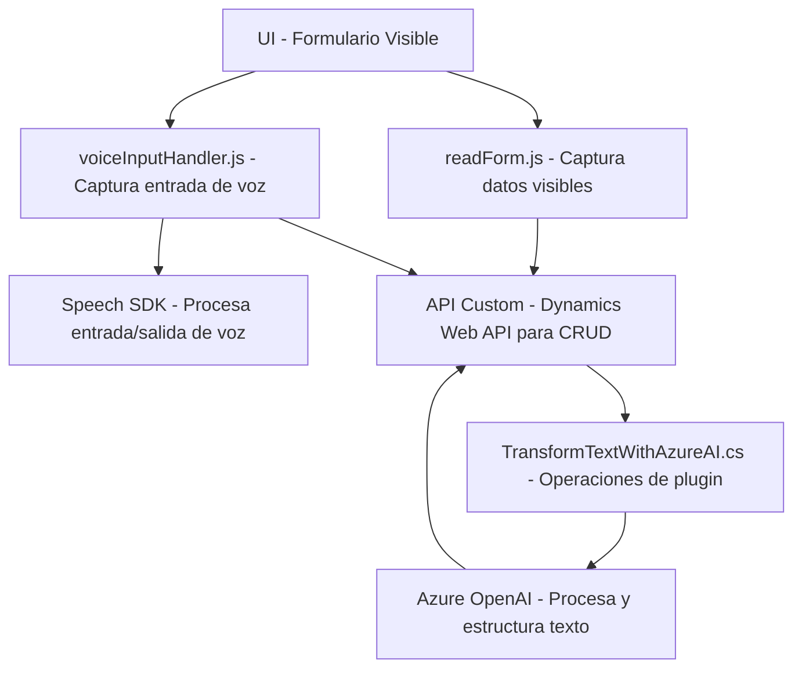

### Breve resumen técnico

El repositorio examinado contiene tres archivos principales enfocados en la interacción de usuarios con formularios mediante tecnologías de reconocimiento de voz (Azure Speech SDK) y procesamiento de texto (Azure OpenAI Service). Todos los archivos integran un entorno basado en Dynamics CRM y servicios externos de Azure. Las funcionalidades principales son la captura de datos visibles o hablados y su transformación en texto estructurado, junto con la posterior actualización de los formularios mediante procesos personalizados.

---

### Descripción de arquitectura

- **Tipo de solución**: Este repositorio implementa varias funcionalidades complementarias para un sistema **backend y frontend orientado a la interacción dinámica de formularios**, con integración de servicios de tercera parte como **Azure Speech SDK** y **Azure OpenAI Service**. Puede definirse como un **microservicio orientado a cliente** combinado con lógica de plugins en Dynamics CRM.
  
- **Arquitectura predominante**: El diseño general tiene una **estructura de n capas**:
  - **Frontend**: Con funciones modulares basadas en JavaScript para capturar datos de formularios y procesar inputs de voz.
  - **Backend**: Un plugin desarrollado en C#, siguiendo la arquitectura de Dynamics CRM Plugins.
  - **Servicios Externos**: Interacción con Azure Speech SDK para la síntesis y análisis de voz y Azure OpenAI para el procesamiento avanzado de texto.
  
- **Patrones**:
  - Modularidad: Cada archivo se organiza en bloques de funciones independientes siguiendo el principio de responsabilidad única.
  - Adapter: La comunicación con servicios externos (como Azure OpenAI y Speech SDK) se encapsula según los principios del patrón Adapter, facilitando su reutilización y desacoplamiento.
  - Integración de Servicios: Se enfoca en integración con APIs como Dynamics 365 Web API y servicios de Azure mediante patrones de consumo asíncrono.

---

### Tecnologías usadas

1. **Frontend (JavaScript)**:
   - **Azure Speech SDK**: Procesamiento de entrada y salida de voz.
   - **APIs DOM**: Manipulación de elementos HTML visibles en formularios.
   - **Servicios de Dynamics CRM**: Acceso a atributos/contextos del formulario usando el objeto `executionContext`.

2. **Backend (C#)**:
   - **Microsoft Dynamics CRM SDK**: Para operaciones internas de entidades y registros dentro del sistema CRM mediante el uso de plugins.
   - **Azure OpenAI Service**: Procesamiento y transformación avanzada de texto utilizando GPT-4.
   - **Bibliotecas estándar**:
     - `System.Net.Http`: Para envío de solicitudes HTTP.
     - `System.Text.Json` y `Newtonsoft.Json.Linq`: Para gestión avanzada de objetos JSON.

3. **Dependencias externas**:
   - Scripts de carga dinámica para el funcionamiento del Azure Speech SDK.
   - Plugins de Dynamics CRM que interactúan con Azure OpenAI API y Web API del CRM.

---

### Diagrama Mermaid válido para GitHub Markdown

---

### Conclusión final

El repositorio presenta una solución robusta diseñada para mejorar la interacción con formularios en Dynamics CRM mediante el uso de tecnologías de reconocimiento de voz y procesamiento de texto en la nube. Su arquitectura modular permite escalar y mantener cada componente independientemente. El enfoque en la integración de terceros como Azure Speech SDK y OpenAI muestra un diseño moderno centrado en aprovechar servicios externos para extender capacidades del sistema interno.

La arquitectura general utiliza un enfoque híbrido de **n capas**, ampliado por funcionalidades específicas de microservicios para el procesamiento de inputs con voz y texto. Esto lo convierte en una solución altamente adaptable y eficiente para aplicaciones empresariales que buscan automatizar tareas mediante inteligencia artificial.