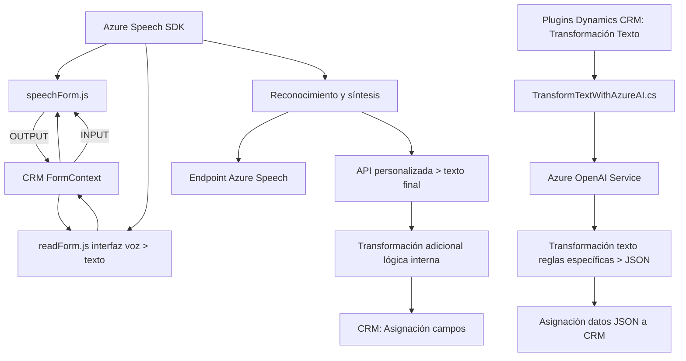

### Breve resumen técnico  
Este repositorio contiene tres componentes principales que integran servicios avanzados basados en Azure (Speech SDK y OpenAI) con sistemas de formularios y CRM Dynamics 365. La solución incluye dos archivos JavaScript para gestionar la entrada y salida de voz desde formularios web y un plugin en C# para transformar texto según reglas específicas usando Azure OpenAI.

---

### Descripción de arquitectura  
La solución adopta una arquitectura **n-capas** con integración de servicios externos. Cada archivo cumple un rol específico:

#### Frontend (JS):
- Gestiona la entrada y salida de voz en formularios mediante el **Azure Speech SDK**.
- Procesa datos en el navegador, transformándolo en texto y asegurando interoperabilidad con CRM Dynamics 365.

#### Plugin (C#):
- Extiende funcionalidad del CRM mediante un **plugin** que conecta con **Azure OpenAI** para transformar texto según reglas definidas.
- Usa un servicio REST para realizar operaciones AI externas.

La solución sigue principios de modularidad y separación de responsabilidades:
- Aislamiento de lógica en funciones específicas (Single-responsibility principle).
- Uso de patrones como **Service Layer** para interactuar con sistemas externos.

---

### Tecnologías usadas  
#### Frontend:
- **JavaScript ES6**: Modularización y uso de promesas para concurrencia.
- **Azure Speech SDK**: Entrada y síntesis de voz.
- **Dynamics 365 interfaces**: Relacionado con formularios y datos.

#### Backend:
- **C#**: Con .NET Framework para desarrollar el plugin.
- **Microsoft.Xrm.Sdk**: Extensibilidad del CRM (interfaces como `IPluginExecutionContext`).
- **Azure OpenAI Services**: Para integrar GPT-4o REST API.
- **System.Net.Http** y JSON parsers: Para realizar peticiones y manejar datos en formato JSON.

---

### Diagrama Mermaid  

---

### Conclusión final  
La solución es una integración híbrida de **frontend** (entrada/salida de voz, Azure Speech SDK) y **backend** (plugin con Azure OpenAI) que opera sobre sistemas de CRM Dynamics 365. Destaca por:
- **Uso avanzado de IA**: Transformación de texto con OpenAI (GPT-4).
- **Eficiencia modular**: División estructurada de responsabilidades entre archivos JS (UI y datos) y plugin C# (procesamiento IA).
- **Servicio externo**: Dependencia clave de Microsoft Azure (Speech SDK y OpenAI), junto con APIs personalizadas.

Esta solución resuelve necesidades específicas para interacción dinámica de voz y transformación de texto en formularios del CRM, manteniendo extensibilidad y escalabilidad mediante servicios externos.