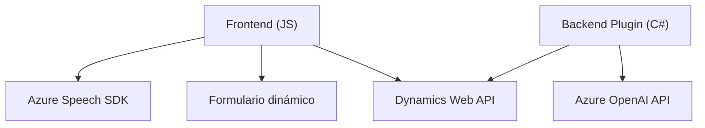

## Resumen técnico
El conjunto de archivos representa una solución integrada que conecta un frontend basado en JavaScript con Microsoft Dynamics CRM y Azure para realizar procesamientos avanzados de entrada y salida de voz/texto (reconocimiento de voz y síntesis). Adicionalmente, utiliza plugins en el backend (.NET) para extender la funcionalidad del CRM mediante el uso de inteligencia artificial de Azure OpenAI.

---

## Descripción de arquitectura
La arquitectura combina estrategias de **integración modular** con servicios cloud y un backend basado en extensibilidad de Dynamics CRM. Los componentes se distribuyen en:
1. **Frontend (JavaScript)**: Proporciona la interacción con usuarios mediante reconocimiento de voz y transformación de texto a audio, utilizando Azure Speech SDK.
2. **Backend (Plugin en .NET)**: Un plugin API de Dynamics 365 procesa datos integrando servicios de Azure OpenAI.
 
### Tipo de arquitectura:
- **Multicapa (n capas)**:
  - Capa 1 (**Frontend**): Interacción del usuario con formularios dinámicos y procesamiento de voz.
  - Capa 2 (**Lógica de negocio**): Plugins de Dynamics 365 que aplican reglas mediante servicios externos.
  - Capa 3 (**Servicios cloud**): Interacción con Azure OpenAI y Azure Speech SDK para procesos de IA y voz.

- **Orientación a servicios**: Uso intensivo de APIs externas como Azure Speech SDK y OpenAI para funcionalidades avanzadas.

---

## Tecnologías usadas
1. **Frontend**:
   - **JavaScript**:
     - Modularización de funciones con responsabilidades claras.
     - Carga dinámica de Azure Speech SDK.
     - Interacción con Microsoft Dynamics CRM mediante `Xrm.WebApi`.

   - **Tecnología**:
     - Azure Speech SDK: Para reconocimiento y síntesis de voz.
     - Microsoft Dynamics 365 API: Integración con formularios y CRM.

   - **Patrones utilizados**:
     - Modularización: las funciones están bien definidas y separadas por responsabilidad.
     - Single Responsibility Principle: cada función cumple una tarea específica (speakText, leerFormulario, etc.).
     - Carga dinámica: `ensureSpeechSDKLoaded` para optimizar el uso de dependencias del SDK.

2. **Backend**:
   - **Microsoft Dynamics CRM Plugins**:
     - Desarrollo basado en eventos del modelo de plugin (`IPlugin`).

   - **Tecnologías utilizadas**:
     - C#: Desarrollo del plugin.
     - Microsoft Dynamics CRM SDK.
     - Azure OpenAI API: Procesamiento avanzado de texto.
     - `Newtonsoft.Json` y `System.Text.Json`: Manejo de JSON para datos procesados.
     - `System.Net.Http`: Realización de solicitudes HTTP al servicio OpenAI.

   - **Patrones utilizados**:
     - Plugin-based architecture: Organización en estructura extendible de Dynamics 365.
     - SRP: Métodos como `GetOpenAIResponse` y `Execute` cumplen roles específicos con separación.

---

## Dependencias o componentes externos
1. **Azure Speech SDK**: Facilita el reconocimiento de voz y la síntesis de texto a voz.
2. **Azure OpenAI API**: Realiza transformaciones avanzadas de texto utilizando inteligencia artificial.
3. **Microsoft Dynamics 365 APIs**: Gestiona interacción con formularios dinámicos y operaciones CRM.
4. **Newtonsoft.Json** y **System.Text.Json**: Paquetes para procesamiento de datos JSON en el backend.
5. **System.Net.Http**: Comunicación con servicios REST como OpenAI.

---

## Diagrama Mermaid

---

## Conclusión final
La solución muestra una arquitectura **modular de capas**, optimizada para interacción con servicios cloud mediante APIs. El frontend se enfocó en la interacción directa con usuarios para reconocimiento y síntesis de voz, mientras que el backend extendió las funcionalidades del CRM utilizando servicios de IA, promoviendo un diseño flexible y escalable. Este enfoque favorece integración sencilla de nuevos servicios y mejora la experiencia del usuario con la tecnología avanzada de Azure.