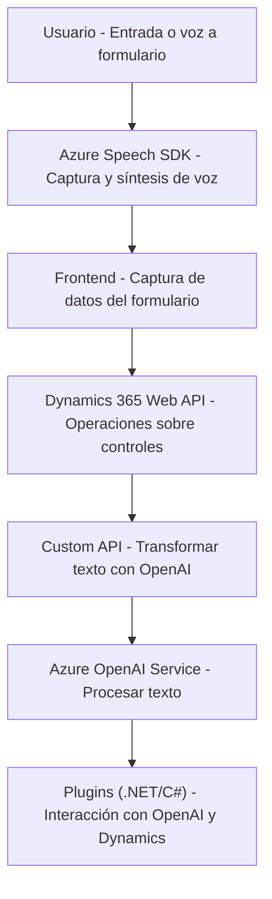

# Análisis técnico de la solución

### Breve resumen técnico
La solución descrita en los archivos del repositorio parece ser una integración que permite capturar datos de formularios mediante reconocimiento de voz usando **Azure Speech SDK** y procesarlos dinamicamente. Los archivos trabajan en conjunto para aumentar las capacidades de entrada/salida de voz, optimizar la interacción con formularios en Dynamics CRM y transformar texto con **Azure OpenAI Service**.

---

### Descripción de arquitectura
La arquitectura general de la solución tiene las siguientes características:
1. **Arquitectura multinivel**:
   - El frontend maneja las interacciones del usuario y la lógica de interfaz (captura y síntesis de voz).
   - El backend en la forma de plugins implementa la lógica de negocio que interactúa con servicios externos (Azure OpenAI) y el API de Dynamics 365.

2. **Arquitectura basada en eventos**:
   - Los archivos frontend dependen de eventos del usuario (como entrada de voz) e interactúan directamente con formularios de Dynamics 365.
   - El plugin actúa como un servicio disparado por eventos en Dynamics CRM, donde procesa texto y envía transformaciones utilizando un microservicio externo.

3. **Patrones usados**:
   - **Callback pattern:** En los archivos del frontend, funciones como `ensureSpeechSDKLoaded` son diseñadas con callbacks para manejar cargas asíncronas.
   - **Service Integration pattern:** Integración de múltiples servicios externos:
     - **Azure Speech SDK** para reconocimiento y síntesis de voz.
     - **Azure OpenAI** para transformación de texto.
     - **Custom APIs en Dynamics 365** para el intercambio de datos.
   - **Modular design:** Los componentes están organizados con funciones específicas, reutilizables y separadas por propósito.

---

### Tecnologías usadas
1. **Frontend**:
   - **JavaScript**
   - **Azure Speech SDK**: Para reconocimiento de voz y conversión de texto en audio.
   - **Dynamics 365 Web API**: Para integración con formularios del sistema CRM.
   - **Custom API**: Para extender funcionalidad de Dynamics CRM mediante solicitud HTTP.

2. **Backend**:
   - **C#/.NET**: Desarrollo del plugin en el framework .NET.
   - **Microsoft Dynamics SDK**: Para escribir plugins y extender la funcionalidad de Dynamics CRM.
   - **Azure OpenAI Service**: Para el procesamiento del texto en el plugin backend.
   - **Newtonsoft.Json** y **System.Text.Json**: Herramientas para trabajar con JSON.
   - **HttpClient**: Para enviar solicitudes HTTP a servicios externos.

---

### Posibles dependencias o componentes externos
- **Azure Speech SDK**: Dependencia crítica en el frontend para funcionalidad de captura de voz y síntesis.
- **Azure OpenAI Service**: Otro servicio crítico utilizado en el backend para transformar textos.
- **Custom API en Dynamics 365**: Puede requerir configuración específica en el entorno de Dynamics CRM.
- **Dynamics 365 Web API**: Para integrar formularios y manejar datos del sistema de CRM.
- Herramientas para la manipulación de datos JSON, como **Newtonsoft.Json** y **System.Text.Json**.

---

### Diagrama Mermaid 100% compatible con **GitHub Markdown**

---

### Conclusión final
La solución descrita en este repositorio parece ser una integración robusta entre un frontend basado en JavaScript y una plataforma backend extendida mediante el modelo de plugins y APIs personalizadas de Dynamics CRM. Aprovecha servicios de Azure para el reconocimiento de voz (Azure Speech SDK) y transformación de texto (Azure OpenAI).

Sin embargo, considerar optimizaciones como el uso de variables de entorno para manejar claves y configuraciones sensibles es esencial para una solución más segura. Además, existen oportunidades para mejorar la abstracción del código y disminuir redundancias en los métodos del frontend y backend.

