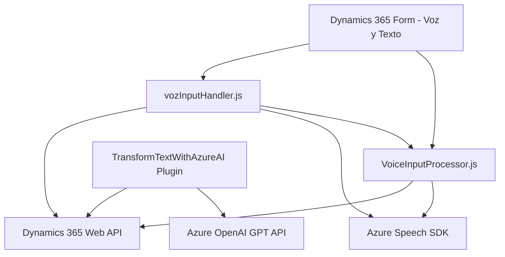

# Análisis técnico general del repositorio

## 1. Breve resumen técnico
El repositorio contiene tres módulos (JavaScript y C#) conectados en el contexto de Microsoft Dynamics CRM. Los archivos presentan una integración entre Dynamics 365 y los servicios en la nube de Microsoft Azure (Speech SDK y OpenAI). La solución incluye la implementación de procesamiento de datos de entrada/salida (voz y texto), comunicación con APIs de terceros y un plugin para ejecutar lógica personalizada en Dynamics CRM con resultados procesados por Azure OpenAI.

---

## 2. Descripción de la arquitectura
La arquitectura del repositorio sigue un modelo de **n capas**:
1. **Capa de presentación**: Los formularios de Dynamics 365 interactúan con los usuarios mediante entrada de voz y resultados sintetizados.
2. **Capa de lógica de negocio**: Implementaciones de JavaScript en los formularios manejan funcionalidades como generación de voz (VoiceInputProcessor.js) y reconocimiento de voz (vozInputHandler.js).
3. **Capa de integración y servicios externos**: Uso del Azure Speech SDK y un plugin en C# para integrarse con servicios de Azure OpenAI para procesamiento avanzado de datos.
4. **Capa de datos (CRM)**: Utiliza la API de Dynamics 365 para almacenar y procesar información directamente en los formularios y entidades.

Este diseño refuerza la interacción entre Dynamics CRM y servicios externos, respaldado por una implementación escalable, aunque centralizada en la plataforma de Microsoft.

---

## 3. Tecnologías y frameworks usados
- **Microsoft Dynamics 365 Web API**: Para la integración directa con datos y operaciones del CRM.
- **Azure Speech SDK**:
  - Reconocimiento de voz.
  - Síntesis de voz.
- **Azure OpenAI GPT API**: Generación de respuestas estructuradas en formato JSON.
- **JavaScript**:
  - Procesamiento de datos locales del cliente (formulario).
  - Integración de dependencias como el SDK de Azure.
  - Lógica de interfaz de usuario y voz en los formularios.
- **C# (Microsoft Dynamic SDK)**:
  - Implementación de plugins personalizados que amplían las capacidades del sistema CRM.
  - Manejo de consultas HTTP para la integración con servicios de Azure.
- **Modularización**:
  - Código organizado en funciones reutilizables.
  - Separación lógica de la responsabilidad entre casos de uso distintos.
- **Patrones usados**:
  - **Carga dinámica**: SDKs externos cargados solo en caso de ser necesarios.
  - **Plugin-Based Architecture**: Extensión nativa de Dynamics CRM.
  - **Builder Pattern**: Configuración de objetos como `speechConfig`, `recognizer`, etc.
  - **SRP**: Métodos con responsabilidades específicas para mayor legibilidad y mantenibilidad.

---

## 4. Posibles dependencias y componentes externos
- **Azure Speech SDK**: Dependencia principal para la funcionalidad de voz.
- **Azure OpenAI GPT API**: Para Chat Completions y procesamiento de texto avanzado.
- **Microsoft Dynamics CRM SDK (`Xrm` Web API)**: Dependencia de la arquitectura de Dynamics.
- **System.Net.Http y Newtonsoft.Json**: Uso en el plugin para comunicación API y serialización JSON.
- **Key Vault o App Settings**: Presencia potencial para almacenar claves y configuraciones (Azure Speech Key, Azure Region, OpenAI Key).
- **Micrófono del cliente**: Interacción directa con hardware para grabación de voz.

---

## 5. Diagrama Mermaid **válido para GitHub**

---

## Conclusión final
El repositorio presenta una solución orientada hacia la integración de servicios en la nube mediante Microsoft Dynamics 365 y Azure. Utiliza una arquitectura orientada a n capas, donde cada capa tiene tareas específicas (presentación, negocio, integración y datos). La interacción con APIs externas (Speech SDK y OpenAI GPT) refuerza la capacidad del sistema para ejecutar tareas avanzadas como reconocimiento de voz y procesamiento de texto estructurado, optimizando la experiencia del usuario en sistemas CRM. El uso de patrones como modularización y carga dinámica aumenta la mantenibilidad del código, y el plugin en C# extiende el potencial de la lógica del sistema Dynamics.