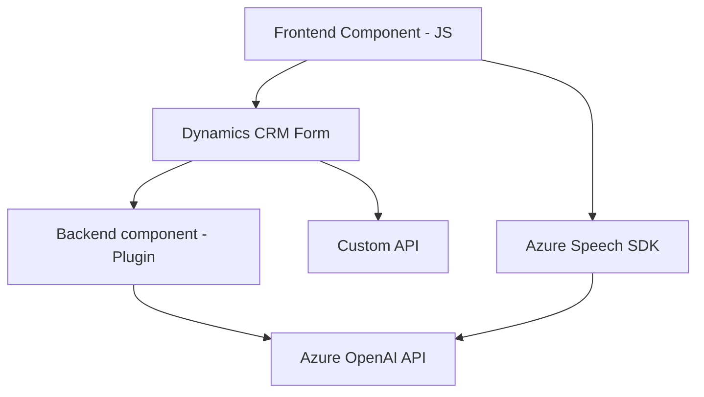

### Breve resumen técnico

El repositorio contiene tres componentes principales que interactúan con Azure Cognitive Services (Azure Speech SDK y Azure OpenAI) y el ecosistema de Dynamics CRM. Estos componentes implementan funciones de reconocimiento y síntesis de voz, transformación de texto mediante Inteligencia Artificial, y relación directa con formularios CRM. El proyecto parece abordar un flujo completo para automatizar interacción con formularios y mejorar la experiencia del usuario mediante voz.

---

### Descripción de arquitectura

El sistema parece configurado con un enfoque **n-capas**, teniendo componentes bien distribuidos:

1. **Frontend**: Scripts procesan entradas de voz y se encargan de interactuar dinámicamente con el SDK de Azure Speech y con formularios de Dynamics CRM.
2. **API Plugins**: Un plugin backend de Dynamics CRM interactúa directamente con la API de Azure OpenAI para transformar texto usando modelos de IA Inteligentes.
3. **Integración externa**: Conexiones controladas mediante dependencias como Azure Speech SDK y Azure OpenAI.

Aunque hay modularidad, la solución no cuenta con microservicios independientes (todo ocurre en conjunto con Dynamics CRM). Esto categoriza la arquitectura como **monolítica n-capas con integración externa**.

---

### Tecnologías usadas

1. **Frontend**:
   - **JavaScript**: Para lógica y procesamiento dinámico.
   - Azure Speech SDK: Manejo de voz en tiempo real.
2. **Backend (Dynamics CRM Plugin)**:
   - **C#**: Desarrollo del plugin.
   - **Microsoft.Xrm.Sdk**: Librería oficial para integración con Dynamics CRM.
   - **Azure OpenAI API**: Transformación de texto en JSON mediante IA.
   - JSON Manipulation:
     - `Newtonsoft.Json.Linq`
     - `System.Text.Json`
   - **REST API**: Comunicación entre el plugin y Azure OpenAI.

3. **Patrones**:
   - **Lazy-loading**: Carga dinámica del Azure Speech SDK en los scripts.
   - **MVC-like**: El frontend maneja datos y los transforma/adapta antes de interactuar con la API.
   - **Plugin-driven architecture**: Implementación en Dynamics CRM conectando eventos específicos del sistema.
   - **Event-driven**: Uso de callbacks asincrónicos y promesas para manejar interacciones de SDK y APIs externas.

---

### Diagrama Mermaid (estructura simplificada)

---

### Conclusión

Este repositorio implementa una solución orientada al procesamiento de voz y textos mediante integración directa con servicios de Azure y un sistema CRM (Dynamics 365). La arquitectura sigue el estándar **n-capas**, con ciertas características de acoplamiento debido a su dependencia del Dynamics CRM. Integra múltiples servicios externos para extender las capacidades de interacción con voz y IA, ofreciendo una interfaz rica, modular y bien escalada en este entorno específico.

Se destacan principios de modularidad y escalabilidad: el repositorio organiza la lógica en capas independientes, aunque depende de monolitos CRM y SDK que limitan la flexibilidad para migrar o integrar a otras tecnologías sin sobresfuerzo.