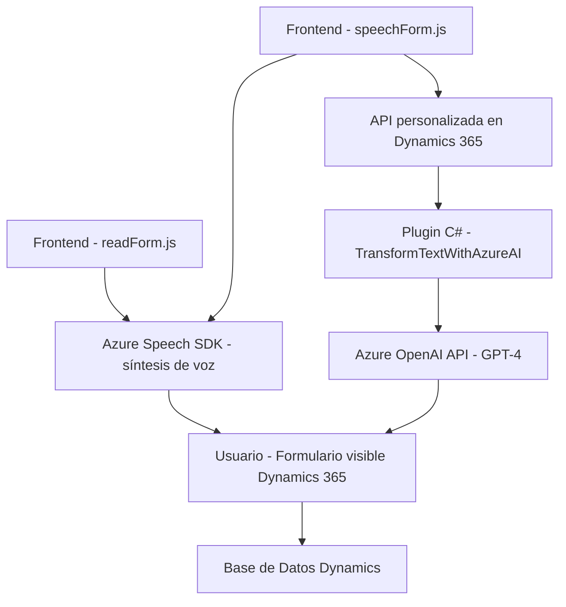

# Breve resumen técnico
El repositorio describe una solución multifacética que integra capacidades de reconocimiento y síntesis de voz (JavaScript en el frontend) para interactuar con formularios de Dynamics 365 visuales. Además, emplea un plugin en C# para generar transformaciones inteligentes de texto mediante Azure OpenAI. La solución se apoya en tecnologías de Microsoft como Dynamics 365 y Azure para crear una experiencia de usuario rica y funcionalidades extendidas con IA.

---

# Descripción de la arquitectura
La arquitectura está centrada en la interacción de dos componentes principales:
1. **Frontend (JavaScript):**
   - Maneja formularios dinámicos y la integración de entrada/salida de voz usando Azure Speech SDK.
   - Permite la lectura de campos visibles de un formulario y actualización basada en comandos de voz.
   
2. **Backend (Dynamics 365 Plugin con C#):**
   - Funciona como middleware entre Dynamics CRM y Azure OpenAI para procesar texto y enviar respuestas estructuradas en JSON.

### Patrón observado:
- **Event-driven Architecture:** Los componentes reaccionan a eventos de usuario (voz, acciones en el formulario) y eventos del sistema (bases de datos, llamadas de API).
- **Modularización:** Código dividido en funciones pequeñas y reutilizables con responsabilidades claras.
- **Hexagonal (Ports & Adapters):** El plugin de Dynamics CRM actúa como un adaptador para interactuar de forma desacoplada con Azure OpenAI.

---

# Tecnologías usadas
1. **Frontend:**
   - Lenguaje: JavaScript.
   - Frameworks: Azure Speech SDK para integrar entrada/salida de voz.
   - APIs internas: Manejo de formularios visuales en Dynamics 365.

2. **Backend:**
   - Lenguaje: C#.
   - Framework: Plugins de Dynamics CRM.
   - Dependencia: Microsoft Azure OpenAI para capacidades avanzadas de análisis basado en GPT-4.

---

# Dependencias o componentes externos
1. **Microsoft Dynamics 365 SDK:**
   - Manipulación y actualización de formularios en Dynamics CRM.
2. **Azure Speech SDK:**
   - Reconocimiento y síntesis de voz en el frontend.
3. **Azure OpenAI API (GPT-4):**
   - Procesamiento inteligente de texto para transformar comandos de voz o entrada textual.
4. **Newtonsoft.Json (C#):**
   - Manejo de JSON para comunicación entre el sistema y OpenAI API.

---

# Diagrama Mermaid compatible con GitHub Markdown

---

# Conclusión final
La solución combina tecnologías modernas para crear una experiencia fluida. Aprovecha la integración con Azure Speech SDK en el frontend para realizar síntesis y reconocimiento de voz, conectando directamente con Dynamics 365 para la manipulación visual de formularios. En el backend, extiende las capacidades de Dynamics CRM con un plugin que utiliza Azure OpenAI para transformar texto hablado, procesar comandos y generar datos estructurados.

La arquitectura puede ser clasificada como híbrida, combinando elementos de la arquitectura hexagonal con integración de microservicios (Azure Speech SDK y OpenAI API). Es adecuada para escalar, podría agregar más capacidades IA integrando componentes similares para otras áreas de trabajo.