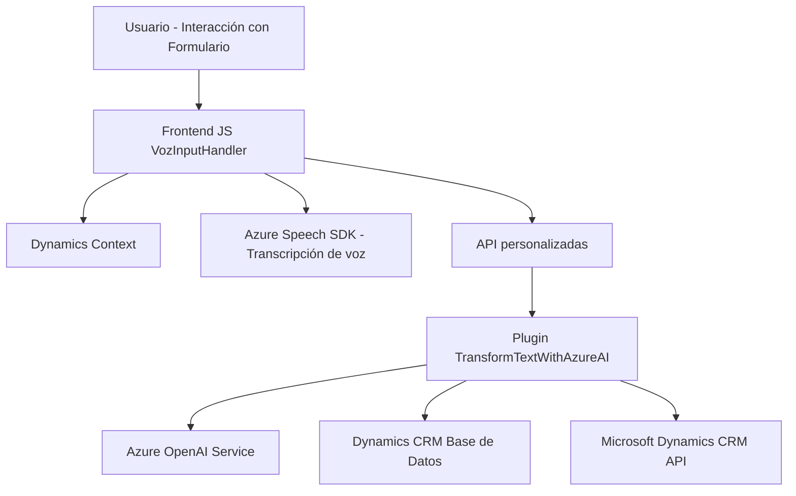

### Breve resumen técnico

Este repositorio contiene los recursos para una solución tecnológica que combina los siguientes componentes:
- Un **frontend** en JavaScript que interactúa con un formulario en Dynamics 365. Este utiliza **Azure Speech SDK** para sintetizar texto a voz y transcripción de entrada de voz.
- Un **plugin server-side** para **Microsoft Dynamics CRM**, que utiliza el servicio **Azure OpenAI** para transformar texto según reglas definidas, retornando un objeto JSON para aplicar en formularios de Dynamics 365.

### Descripción de arquitectura

La solución sigue una arquitectura **de n capas** con una separación clara de responsabilidades:
- **Frontend:** Se encarga de interactuar con el cliente, tomando inputs de formularios, realizando síntesis y transcripción de voz (directamente en el navegador) usando el Azure Speech SDK.
- **Backend (plugin):** Aquí se implementa la lógica de negocio que interactúa con el servicio Azure OpenAI a través de HTTP para proporcionar un procesamiento avanzado y retornar los datos transformados.
- **Datastore:** Aunque no está en el código compartido, se supone que utiliza la base de datos estándar de Microsoft Dynamics CRM para almacenar y gestionar datos que se manejan en los formularios.
- **Azure Services:** La solución se apoya en productos de Azure (Speech SDK y Azure OpenAI) para proporcionar funcionalidades avanzadas como procesamiento de voz y transformación de texto mediante modelos de AI.

### Tecnologías usadas

- **Frontend:**
  - **JavaScript**
  - **Azure Speech SDK** para síntesis de voz, transcripción de entrada de voz.
  - **Microsoft Dynamics 365** context API, usada para interactuar con formularios y campos en un entorno CRM.
  
- **Backend:**
  - **C#**, **Microsoft Dynamics Plugin Framework** (interfaz `IPlugin`).
  - **Azure OpenAI Service** para procesamiento y transformación de texto.
  - Librerías como `Newtonsoft.Json.Linq` para manejo de JSON y `System.Net.Http` para realizar solicitudes HTTP.

### Diagrama Mermaid

### Conclusión final

La solución presentada es una combinación de un **frontend accesible** y un backend en forma de **plugin** para optimizar la interacción del usuario con formularios mediante transcripción de voz y procesamiento de datos transformados. La integración de servicios de Azure (Speech SDK y OpenAI) mejora la experiencia del usuario al proporcionar accesibilidad (voz a texto y texto a voz) y automatización de reglas de negocio.

La arquitectura de **n capas** es una elección adecuada para esta solución, ya que se logra la separación de responsabilidades y la flexibilidad para escalar cada componente de manera independiente. La tecnología está centrada en la nube y aprovecha servicios avanzados de IA y procesamiento de texto modernos a través de Azure. Sin embargo, sería beneficioso considerar una implementación más robusta de manejo de errores y seguridad, especialmente en el consumo de APIs externas y almacenamiento de secretos como las claves de Azure.