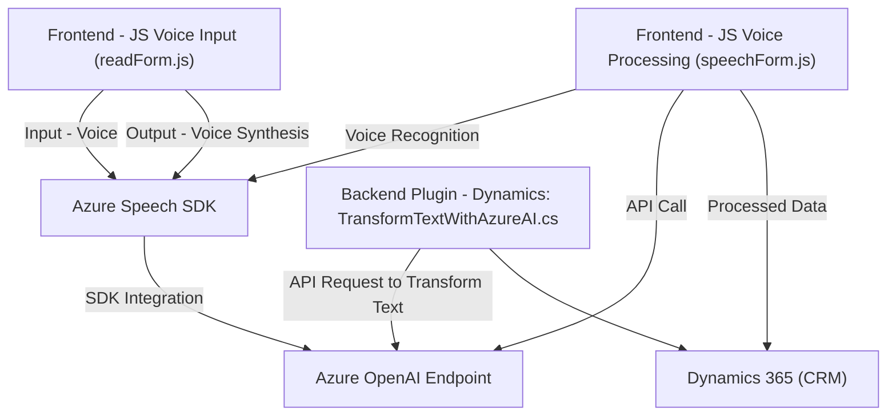

### Breve Resumen Técnico
El repositorio está orientado a soluciones para formularios dinámicos que integran entrada y salida por voz, inteligencia artificial (IA) y procesamiento avanzado. Define scripts para gestión de formularios en un frontend con entrada de voz, APIs para procesar y transformar datos, y un plugin compatible con Dynamics 365 que implementa servicios de IA mediante Azure OpenAI.

---

### Descripción de Arquitectura
El sistema utiliza una arquitectura **n capas modular**, con las siguientes capas identificadas:
1. **Frontend (JS):** Proporciona la lógica de captura, procesamiento y síntesis de voz, interactuando con los usuarios.
2. **Backend (Plugin en C#):** Extensión del sistema Dynamics 365 para integrar servicios de IA de Azure OpenAI para transformar y estructurar datos.
3. **Servicios Externos:** Interacción con **Azure Speech SDK** para reconocimiento y síntesis de voz, y **Azure OpenAI Endpoint** para transformación avanzada de texto.

El diseño utiliza patrones como **encapsulación**, **modularidad**, y **API Gateway** para delegar operaciones específicas relacionadas con IA y procesamiento de voz. Aunque la arquitectura es modular, el sistema parece un **monolito extendido** porque las funcionalidades se integran hacia un único sistema (Dynamics 365) con dependencias externas.

---

### Tecnologías Usadas
1. **Lenguajes:**
   - **JavaScript:** Para el frontend y manejo de formularios.
   - **C#:** Para el backend mediante plugins en Dynamics 365.
2. **Frameworks y SDKs:**
   - **Azure Speech SDK:** Gestión de entrada/salida de voz en frontend.
   - **Azure OpenAI:** Servicios para IA y transformación de texto.
   - **Dynamics 365 SDK:** Backend con integración de plugins.
3. **Depencencias Adicionales:**
   - **Newtonsoft.Json:** Manejo y estructura de objetos JSON en el backend C#.
   - **Microsoft Libraries (Xrm SDK, System.Net.Http, etc.)**: Funcionalidades específicas relacionadas con Dynamics y comunicación HTTP.

---

### Diagrama Mermaid

---

### Conclusión Final
Este repositorio implementa una solución que extiende Dynamics 365 mediante integración avanzada con servicios de IA y SDKs de Azure. Está diseñado para manejar operaciones por voz y adaptar campos de formularios dinámicos, alineándose con una arquitectura modular que utiliza n capas de responsabilidad: frontend interactivo y un backend con integración de IA.

El uso de Azure Speech SDK y Azure OpenAI permite abordar problemas complejos de entrada y procesamiento de datos mediante herramientas modernas de IA. Este enfoque es flexible y extensible, ideal para entornos corporativos que requieren formularios dinámicos y capacidad de interacción vocal con los usuarios.