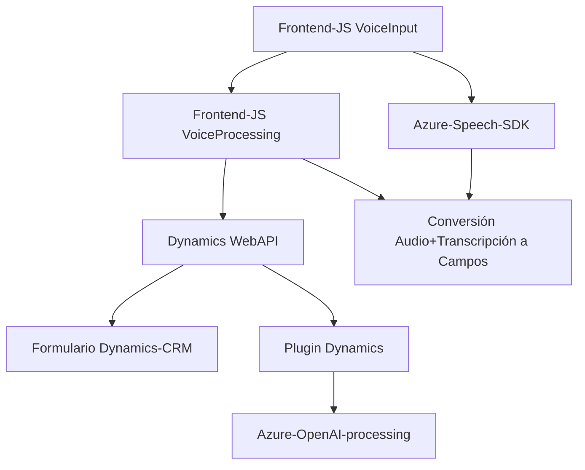

### Breve Resumen Técnico
El repositorio contiene una solución que integra **Azure Speech SDK** y **Azure OpenAI** para funcionalidades avanzadas de entrada y salida de voz, reconocimiento de voz y procesamiento basado en inteligencia artificial. Se utiliza principalmente en el contexto de Microsoft Dynamics CRM para manipular formularios y realizar tareas con servicios de Azure.

---

### Descripción de Arquitectura
La arquitectura es **modular** y está orientada a integrar servicios externos con Microsoft Dynamics CRM mediante archivos JavaScript y plugins en .NET/C#. Cada archivo organiza las funciones para cumplir con responsabilidades específicas, y el diseño general parece estar dividido en capas:
1. **Capa de Presentación**: Archivos JavaScript para interacción con el usuario.
2. **Capa de Lógica de Aplicación**: Plugins (.NET/C#) que integran servicios de IA y transforman datos en formatos específicos.
3. **Capa de Servicio**: Uso de servicios externos (Azure Speech y Azure OpenAI) y APIs de Dynamics CRM para ejecutar tareas de procesamiento y síntesis de voz.

---

### Tecnologías Usadas
1. **Frontend**:
   - **JavaScript**:
     - Manipulación DOM, SDK dinámico.
   - **Dependency**:
     - Azure Speech SDK (JavaScript).

2. **Backend/Plugins**:
   - **C# (.NET)**:
     - Microsoft Dynamics CRM SDK.
     - .NET HTTP Client para invocación de REST APIs.
     - JSON libraries: `System.Text.Json` and `Newtonsoft.Json`.

3. **Servicios Externos**:
   - **Azure Speech SDK**: Para conversión texto-voz y voz-texto.
   - **Azure OpenAI**: Para procesamiento de texto basado en IA.

4. **Design Patterns**:
   - **Callback Pattern**: Usado para manejar la carga de SDK dinámico.
   - **Promesas**: Manejadas en operaciones asíncronas con APIs externas.
   - **Plugin Pattern**: Usado en la arquitectura de Dynamics CRM.

---

### Dependencias o Componentes Externos
1. **Azure Speech SDK**:
   - Entrada por voz → texto | texto → síntesis por voz.
   - Dinámicamente cargado desde un endpoint (`https://aka.ms/csspeech/...`).
2. **Azure OpenAI**:
   - Proceso de transformación de texto basado en GPT modelos (e.g., GPT-4).
3. **API de Dynamics CRM**:
   - Manipulación de `formContext` y atributos.
   - Operaciones relacionadas con los datos CRM (e.g., consultas, actualizaciones).
4. **Bibliotecas .NET**:
   - `System.Net.Http`, `Newtonsoft.Json`, etc.

---

### Diagrama Mermaid

---

### Conclusión Final
El repositorio implementa una solución híbrida basada en API para interacción entre el **frontend** (JavaScript) y el **backend** (Dynamics CRM Plugin). Combina tecnologías de **Azure Speech SDK** y **Azure OpenAI** para ofrecer integración avanzada de entrada/salida de voz, reconocimiento de datos vocales, transcripción y procesamiento de texto en el modelo de Dynamics CRM.

Aunque el código sigue una arquitectura basada en capas, está estrechamente acoplado a Dynamics CRM específico, lo que dificulta su reutilización fuera del dominio del CRM. Sin embargo, la modularización dentro del código muestra prácticas sólidas de organización.