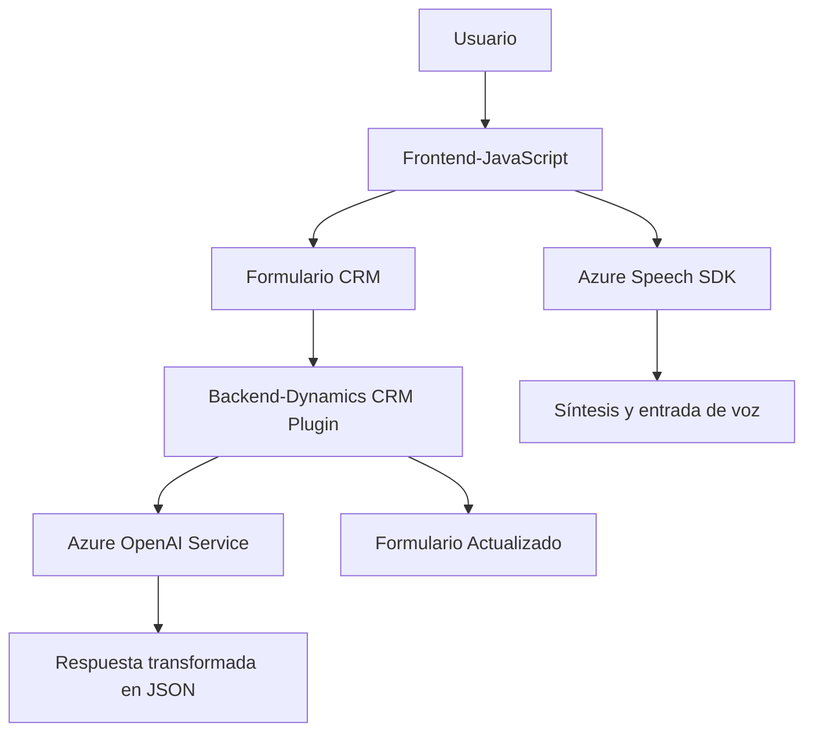

## Breve resumen técnico:
La solución es una integración de frontend y backend que instrumenta la entrada/salida de datos de formularios (usando voz y texto) en Dynamics CRM, mediante el uso combinado de Azure Speech SDK y Azure OpenAI Service. El frontend interactúa con formularios CRM, mientras que un plugin backend para Dynamics procesa y transforma datos utilizando modelos de inteligencia artificial del servicio OpenAI API.

---

## Descripción de arquitectura:
### Arquitectura General:
- **Frontend**:
  - Construido en JavaScript, contiene funciones para interacción por voz, reconocimiento y conversión de texto, y procesamiento de formularios.
  - Promueve modularidad y separación de responsabilidades mediante funciones específicas para cada tarea: lectura de datos, transformación y síntesis de voz con Azure Speech SDK.

- **Backend**:
  - Implementa una arquitectura de plugins basada en la interfaz `IPlugin` de Dynamics CRM.
  - Un plugin que corre en el servidor de Dynamics CRM, accediendo y transformando el contenido de los formularios usando Azure OpenAI Service.

### Tipo de Arquitectura:
Este diseño refleja un **arquitectura de n capas**, con separación clara entre:
1. **Presentación** (Frontend en JavaScript).
2. **Aplicación** (interacción del plugin con Dynamics CRM).
3. **Infraestructura/Servicios** (dependencia de Azure Speech SDK y Azure OpenAI Service).

Adicionalmente:
- El frontend utiliza principios **event-driven** para ejecutar acciones en respuesta a eventos de voz.
- El backend sigue un enfoque **Service-Oriented**, interactuando con un servicio REST externo (Azure OpenAI) para transformar datos.

---

## Tecnologías usadas:
1. **Frontend**:
   - **HTML y JavaScript** para manejar la vista y lógica de usuarios.
   - **Azure Speech SDK** para interacción de voz (reconocimiento y síntesis).
   - Puede extenderse por bibliotecas adicionales para UI y procesamiento.

2. **Backend**:
   - Plugins `.NET` integrados con **Microsoft Dynamics CRM** para extensibilidad personalizada.
   - **Azure OpenAI Service** con modelo GPT para procesamiento de texto semántico.
   - **.NET Framework** y namespaces como `System.Net.Http`, `System.Text.Json` para realizar solicitudes HTTP y manejar estructuras JSON.

---

## Diagrama **Mermaid** válido para GitHub Markdown:

---

## Conclusión final:
### Observaciones y Sugerencias:
La solución combina capacidades avanzadas de procesamiento de voz y texto con integración profunda en Dynamics CRM, consecuencia de un enfoque centrado en servicios y modularidad. Sin embargo:
1. **Problemas de seguridad**: Existe riesgo debido a la hardcode de la clave API en el backend del plugin. Esto debe ser reemplazado por una configuración encriptada o un servicio de gestión de secretos como Azure Key Vault.
2. **Optimización estructural**: El backend podría beneficiarse de un manejo más robusto de errores y abstracción mediante patrones como Wrapper o Factory en la interacción con servicios externos.
3. **Ampliabilidad limitada**: La solución parece específica a Dynamics CRM y Azure servicios. Si se desea generalizar a otros ecosistemas empresariales, pueden requerirse cambios profundos en la estructura.

### Evaluación arquitectónica:
El diseño actual es sólido para su propósito en un entorno de Dynamics CRM con un enfoque sobre modularidad y capacidad de integrar servicios avanzados de IA. Sin embargo, el uso directo de claves sensibles y falta de abstracción en el backend representan oportunidades claras de mejora.

