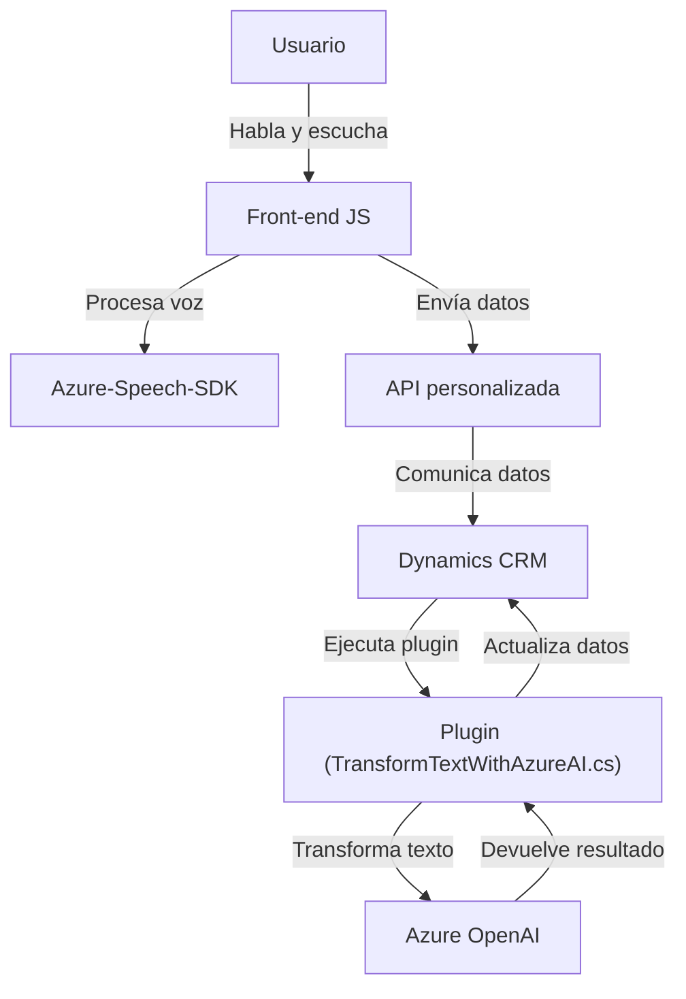

### Breve resumen técnico
Este repositorio parece centrarse en una solución que integra Azure Cognitive Services y Dynamics 365 para manejar la entrada de datos de formulario a través de reconocimiento de voz y texto hablado. Adicionalmente, se utiliza un servicio externo de Azure OpenAI para transformar texto en tiempo real dentro de un contexto CRM. La solución combina funcionalidades frontend con servicios backend.

---

### Descripción de arquitectura
1. **Tipo de solución**:
   - La solución implementa una **integración front-to-back** donde el frontend maneja la entrada de voz mediante JavaScript y el backend utiliza plugins en Dynamics CRM conectados a servicios externos de Azure.

2. **Arquitectura**:
   - **Modelo de capas**:
     - **Frontend**: Maneja el reconocimiento y síntesis de voz con Azure Speech SDK.
     - **Servicios/backend**: El backend actúa como una capa de procesamiento donde los plugins de Dynamics CRM interactúan con APIs de Azure para enriquecer datos procesados.
   - El frontend interactúa con APIs y con el contexto del formulario de Dynamics para dinamizar la visualización y entrada de datos.
   - **Modularidad y desacoplamiento**: Cada componente cumple una responsabilidad específica (reconocimiento de voz, síntesis de texto a voz, integración vía API).

---

### Tecnologías usadas
1. **Frontend**:
   - **JavaScript (ES6)**: Lógica para procesar datos en el navegador.
   - **Azure Speech SDK**: Reconocimiento de voz y síntesis de voz.
   - Integración con **Xrm.WebApi** (Dynamics).

2. **Backend**:
   - **C# con Dynamics CRM SDK**: Plugins para procesamiento de datos en Dynamics CRM.
   - **Azure OpenAI Services**: Usado en los plugins para transformar texto.
   - **Newtonsoft.Json**: Para formatear y procesar respuestas JSON.
   - **HttpClient**: Para realizar llamadas al servicio OpenAI.

3. **Servicios Externos**:
   - **Azure Cognitive Services** (Speech SDK): Reconocimiento de voz y síntesis.
   - **Azure OpenAI Services**: Transformación avanzada de texto mediante Inteligencia Artificial.

---

### Dependencias o componentes externos
1. **Azure Speech SDK**:
   - Necesario para la parte de síntesis y reconocimiento de voz en el frontend.
2. **Azure OpenAI API**:
   - Utilizada en el backend para procesamiento de texto en plugins de Dynamics CRM.
3. **Dynamics CRM SDK**:
   - Necesario para desarrollar y ejecutar los plugins en el entorno CRM.
4. **Node.js/JavaScript**:
   - Dependencia del entorno de desarrollo del frontend.
5. **Framework .NET**:
   - Necesario para los servicios backend basados en C#.

---

### Diagrama Mermaid válido para GitHub

---

### Conclusión final
Este repositorio implementa una solución híbrida que combina tecnologías modernas en el **frontend (JavaScript y Azure Speech SDK)** y el **backend (Plugins de Dynamics CRM y Azure OpenAI)**. La arquitectura es modular y está orientada al procesamiento por capas con integración de servicios externos. Se optimiza para encapsular la lógica en funciones específicas, asegurando un enfoque **escalable** y **mantenible**. La adopción de servicios como Azure Speech SDK y Azure OpenAI posiciona esta solución como una implementación avanzada para asistir procesos empresariales dinámicos.